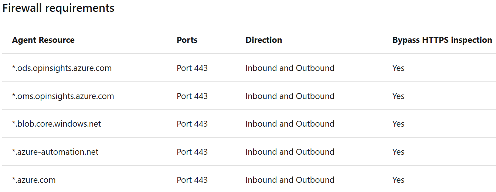
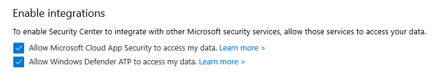
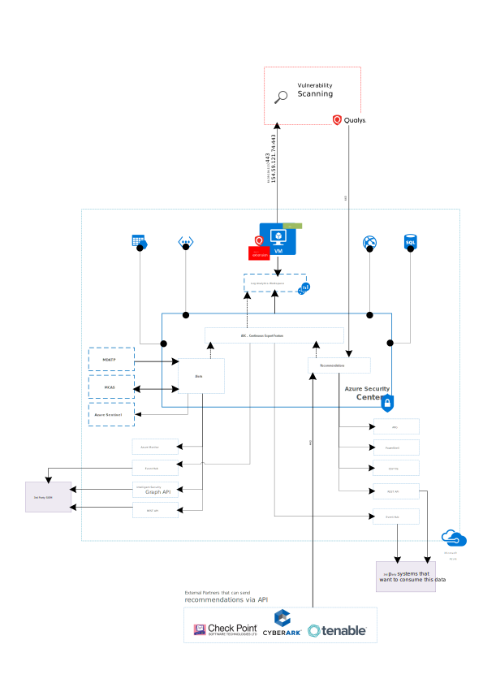

# Azure Security Center Data Flow

Azure Security Center (ASC) is Microsoft’s cloud workload protection platform and cloud security posture management service that provides organizations with security visibility and control of hybrid workloads. The Microsoft Monitoring Agent (MMA) must be installed in Windows and Linux operating systems that you plan on collecting data from. 
We will examine how data flows when using Azure Security Center (ASC), specially the agent collection, central collection of log data, and creation of recommendations and alerts.

## ASC monitored resources

Azure Security Center has two modes: free tier and standard tier. The free tier provides security recommendations for compute, network, storage, identity, IoT and application resources in Azure. The standard tier provides threat detection for those workloads, and in addition to that, it enables you to monitor virtual machines hosted in other cloud providers and on-premises. 
Only the data collected from virtual machines will be stored in a Log Analytics workspace. For your PaaS services such as SQL ATP, there is a “Continuous Export” feature that enables security alerts to be stored in a Log Analytics workspace. You can choose whether you want to use an existing workspace or leave ASC automatically create a default one. Keep in mind that you can gather data from virtual machines running in different subscriptions and store it into a single workspace. [Azure Monitor](https://azure.microsoft.com/en-us/pricing/details/monitor/) Log Analytics workspace can be retained at no charge for up to first 31 days.

## ASC Agent Data Flow: Microsoft Monitoring Agent

The Microsoft Monitoring Agent reads various security-related configurations and event logs from virtual machines via TCP 443. The data collected is going to be reflected in the Azure Security Center dashboard. This data will be transformed into recommendations such as missing updates, misconfigures OS security settings, endpoint protection enablement, health and into alerts of threat detections. Azure Security Center [updates its recommendations](https://docs.microsoft.com/en-us/azure/security-center/security-center-using-recommendations) within 24 hours; OS security configuration recommendations within 48 hours; and Endpoint Protection recommendations within 8 hours.

To have the MMA sending collected data into the Log Analytics workspace, your virtual machines will need Internet access. If you have a firewall implementation in your environment, make sure to set inbound and outbound allowance to the 5 agent resources mentioned in the next diagram that has a broader vision of not only the monitored VMs but also other services that are supported by Azure Security Center: 

If you need to harden the MMA agent URLs in your firewall, you can use the list below: 

## ASC Log Data Flow

1. The Microsoft Monitoring Agent scans and collects security configurations and events from Linux and Windows operating systems. 
2. This information is sent to your Log Analytics workspace.
3. Azure Security Center uses the collected data from the Log Analytics workspace and from other resources in Azure you choose to monitor to do an advanced threat detection analysis:
    * Integrated threat intelligence
    * Behavioral analytics
    * Anomaly detection
4. Azure Security Center generates recommendations (only the ones enabled in Security Policies) and issues alerts based on the analysis.
5. The Azure Security Center dashboard will display recommendations and alerts. 

## Recommendations

ASC periodically analyzes the state of monitored resources to identify potential security vulnerabilities. This information is transformed into recommendations that have a Secure Score impact. This assessment focuses on improving your security hygiene. When a recommendation is remediated, Azure Security Center will update your Secure Score.

Recommendations will have a short description, resources involved and remediation steps to follow. Some include a [Quick Fix feature](https://docs.microsoft.com/en-us/azure/security-center/security-center-remediate-recommendations#quick-fix-remediation) to act easily and promptly. All recommendations from Azure Security Center will be displayed in the ASC dashboard, but can also be reached through PowerShell, ASC REST API, Event Hub, third party change management or security operations systems, and even downloaded as a CSV file. 

At [Ignite 2019](https://techcommunity.microsoft.com/t5/azure-security-center/ignite-2019-releases-for-azure-security-center-and-azure/ba-p/975570), ASC Team announced partnership with Check Point, Tenable and CyberArk that enable these partners to send recommendations to ASC using API. Assuming you have the right license for those products, you could leverage these capabilities to have visibility of security recommendations in ASC dashboard. Recommendations can also be triggered by the built-in (part of ASC Standard Tier) vulnerability assessment integration with [Qualys](https://docs.microsoft.com/en-us/azure/security-center/built-in-vulnerability-assessment#overview-of-the-integrated-vulnerability-scanner).

## Alerts

ASC deploys a variety of alerts, triggered by advanced threat detections, for the monitored resources you set (Azure, on-premises, hybrid cloud environments). They will get assigned a severity to help you prioritize tasks to solve them. Alerts can be seen in ASC dashboard and Azure Monitor Activity Log, but also they can be configured to push information to ASC REST API, Intelligent Security Graph API, Event Hub, and a third party SIEM solution. When the options shown in the figure below are enabled in ASC settings, ASC will also share analytics with [MDATP](https://docs.microsoft.com/en-us/azure/security-center/security-center-wdatp) and MCAS:

For more information on the list of alerts that can be generated by Azure Security Center, read the [Alerts Reference Guide](https://docs.microsoft.com/en-us/azure/security-center/alerts-reference).

## Continue learning more

* [Deep dive into Azure Security Center](https://docs.microsoft.com/en-us/azure/security-center/security-center-intro)
* [Azure Security Center REST](https://docs.microsoft.com/en-us/rest/api/securitycenter/)
* [Azure Security Center digestion of Azure Policy REST API](https://docs.microsoft.com/en-us/azure/security-center/configure-security-policy-azure-policy)
* [Security Alerts in Azure Monitor Activity Log](https://docs.microsoft.com/en-us/azure/security-center/security-center-alerts-overview)
* [Export security alerts and recommendations](https://docs.microsoft.com/en-us/azure/security-center/continuous-export)
* [Connect to the Intelligent Security Graph API](https://www.microsoft.com/security/blog/2018/04/17/connect-to-the-intelligent-security-graph-using-a-new-api/)
* [PowerShell – Azure Security Center module](https://www.powershellgallery.com/packages/AzureRM.Security/0.2.0-preview)

