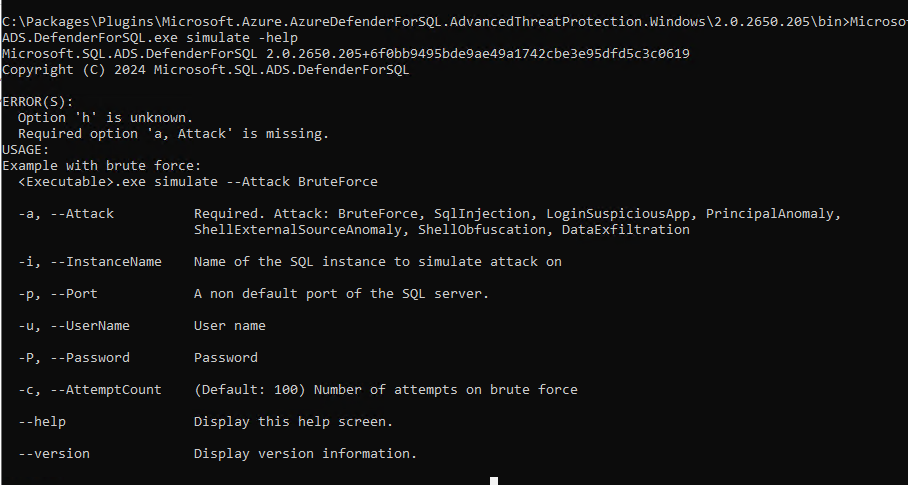
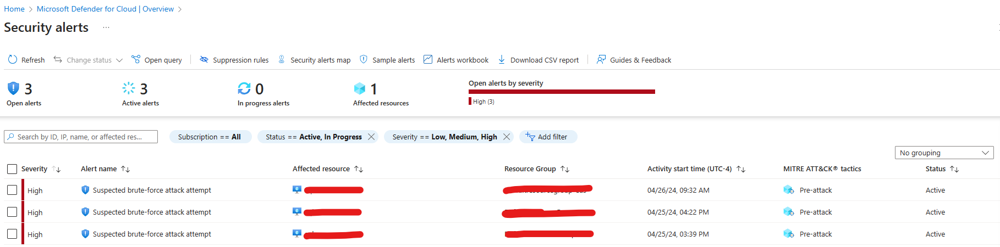

# Module 12 - Microsoft Defender for Cloud database protection

#### 🎓 Level: 300 (Intermediate)
#### ⌛ Estimated time to complete this lab: 60 minutes

## Objectives
This exercise guides you MDC's database protection plans. Database protection in Defender for Cloud contains four flavors, dependong on which database type you are looking to protect. 

1. Defender for SQL Paas (SQL on Azure VM)
  Vulnerability assessment and threat protection is available for this plan. Read more about it [here](https://learn.microsoft.com/en-us/azure/defender-for-cloud/defender-for-sql-introduction). 
2. Defender for SQL on machines (SQL servers hosted on premise, in Azure, AWS or GCP)
 For this plan, Azure Monitoring Agent (AMA) is required, in place of Microsoft Monitoring Agent (MMA). Read more about this [here](https://learn.microsoft.com/en-us/azure/defender-for-cloud/defender-for-sql-usage). Vulnerability assessment and detecting anomalous activities are available to protect your Iaas SQL Servers.
3. Defender for Open-source relational database
  Protect your PostgreSQL, MySQL and MariaDB resources by detecting anomalous activities. Read more about these security alerts [here](https://learn.microsoft.com/en-us/azure/defender-for-cloud/defender-for-databases-introduction).
4. Defender for Cosmos DB (NoSQL)
 Detect potential threats against Cosmos DB accounts like SQL injection, compromised identities or potential exploitation. Read more about CosmosDB protection [here](https://learn.microsoft.com/en-us/azure/defender-for-cloud/concept-defender-for-cosmos). 

### Exercise 1: Create a SQL Server on an Azure VM, enable Defender for SQL servers on machines plan and validate alerts

To enable the Defender plan on a specific subscription:
1.	Sign into the **Azure portal**.
2.	Navigate to **Microsoft Defender for Cloud**, then **Environment settings**.
3.	Select the relevant subscription.
4. Locate **Databases**. 
5.	Click on **Select types** and ensure **SQL servers on machines** is toggled **On**and save.
6.	In the Monitoring Coverage tab, click on **Settings**:
    >It is *strongly* recommended to use the new AMA agent for SQL server on machines experience over the legacy Log Analytics/AMA option.
    1. Ensure that **Azure Monitoring Agent for SQL server on machines** is toggled to **On**.  
    2. (Optional): If you click the **Edit Configuration**, you have the option of configuring which Log Analytic Workspace to use as well as the ability to register Azure SQL server instances by enabling SQL IaaS extension automatic registration.  
7. Click **Apply** and **Save**. 

Now all your existing and upcoming Azure SQL servers on machines are protected and will have AMA installed instead of MMA.

#### Create a SQL Server on a Windows Virtual Machine

First you need to download an ARM template for a SQL server on a Windows VM. 
1.	To deploy, click on the blue **Deploy to Azure** button below:
 

 
You can also deploy the resource by following instructions [here](https://learn.microsoft.com/en-us/azure/azure-sql/virtual-machines/windows/sql-vm-create-portal-quickstart?view=azuresql&tabs=conventional-vm).

2. Fill in all the necessary fields.
 
> Note: If you are using the ARM template, please have desired virtual network, vnet resource group and existing subnet ready for input
 

4. Click **Review and Create** and then when it's ready, click **Create**.
5. Once created, make sure **Defender for SQL on machines** plan is enabled. Give it a few minutes. 
6. Navigate to the virtual machine. Click on **Extensions + applications**. Notice three extensions: `AzureMonitorWindowsAgent`, `MicrosoftDefenderforSQL` and `SqlIaasExtension`. 

#### Validate alerts for Defender for SQL for servers on machines
To validate alerts for Defender for SQL Servers on machines:
1.	Sign into the **Azure portal**.
2.	Navigate to the virtual machine.
3.	Click on the **Connect** dropdown and choose **RDP**
4.	Log into your virtual machine using the username and password from Exercise 1.
5.	Open Command Prompt and navigate to: 
 
C:\Packages\Plugins\Microsoft.Azure.AzureDefenderForSQL.AdvancedThreatProtection.Windows\2.0.2650.205\bin.
 
>As of this writing, 2.0.2650.205 is the version installed. Depending on when you run this lab, the versioning might change. 
6. Run the available attacks as displayed. For example, in the command prompt, you can run:  
 `Microsoft.SQL.ADS.DefenderForSQL.exe simulate --Attack BruteForce`.
  

>Credit to [@Nathan Swift](https://github.com/SwiftSolves) for insight into validating alerts with AMA. 

11. In a few minutes, navigate to **Microsoft Defender for Cloud**, click on **Security Alerts**.
12.	Filter by **Time** or by **Affected resources** and choose your values. 

13.	Notice the alert details pertaining to the SQL server. 

#### View vulnerability assessments
1.	Navigate to the SQL virtual machine resource in the Azure portal. 
2.	Under Security, click on **Microsoft Defender for Cloud**.
3.	There are **Recommendations**, **Security incidents and alerts** and **Vulnerability assessment findings** on this page. 
4.	Under **Vulnerability assessment findings**, choose a finding.  
5.	Take note of vulnerability assessment details.
6.	Under **Affected resources**, click on **resource**. 
7.	Locate and click on **Vulnerability assessment** under **Findings**.
8.	See option to **Add all results as baseline** or **Remove all from baseline**. 

Vulernerability assessment findings come from a knowledge base of best practices built in scanning service in Azure SQL database. It will flag any deviations from best practices like misconfigurations. Read more about this [here](https://learn.microsoft.com/en-us/azure/defender-for-cloud/sql-azure-vulnerability-assessment-overview). Remediate any findings or accept as is. 

### Exercise 2: Enable and protect your Azure SQL Databases using Microsoft Defender for Azure SQL Databases

#### Enable database protection on your Azure SQL Database
A SQL server should have been created earlier in module 1, and it should be labeled as “asclab-sql-[string]”. If so, you should also be able to locate your SQL databased, labeled as “asclab-db”. 

1.	Sign into the **Azure portal**.
2.	Navigate to **Microsoft Defender for Cloud**, then **Environment settings**.
3.	Select the relevant subscription.
4.	To protect all database types, toggle the Databases plan to **On**. 
5.	Select **Select types**.
6.	Make sure **Azure SQL Database** has been toggled to **On**. 
7.	Select **Continue** and **Save**.

Now all your existing (asclab-db from Module 1) and upcoming Azure SQL Databases are protected.

#### Understand vulnerability assessment on your Azure SQL Database
This part of the exercise will leverage "asclab-db". 
1.	Sign into the **Azure portal**. 
2.	Navigate to the SQL server or to database directly by searching **“asclab-db”**. 
3.	Click on **Microsoft Defender for Cloud** under **Security**. 
4.	**Recommendations** and **Vulnerability assessment findings** should be available. 

5. Vulnerability assessment findings come from a knowledge base of best practices built in scanning service in Azure SQL database. It will flag any deviations from best practices like misconfigurations. Read more about this [here](https://learn.microsoft.com/en-us/azure/defender-for-cloud/sql-azure-vulnerability-assessment-overview). Remediate any findings or accept as is. 

### Exercise 3: Enable and protect your OSS RDBs using Microsoft Defender for Open-source relational databases

Defender for Cloud protects PostgreSQL, MySQL flexible servers and MariaDB. 

#### Enable database protection for your open source relational databases

1.	Sign into the **Azure portal**.
2.	Navigate to **Microsoft Defender for Cloud**, then **Environment settings**.
3.	Select the relevant subscription.
4.	To protect all database types, toggle the Databases plan to **On**. 
5.	Select **Select types**.
6.	Make sure **Open source relational Database** has been toggled **On**. 
7.	Select **Continue** and **Save**.

#### Create an Azure database for PostgreSQL flexible server. 

1. To create a PostgreSQL flexible server, follow these instructions [here](https://learn.microsoft.com/en-us/azure/postgresql/flexible-server/quickstart-create-server-portal).  
2. Fill in all the necessary fields.
3. Click **Review and Create** and then when it's ready, click 
**Create**.
4. Once created, navigate to the resource. 
5. Find **Defender for Cloud** under **Security** and make sure the database is **protected**.

#### Understand Azure PostgreSQL protection

1. Navigate to the Azure PostgreSQL or to the resource directly by searching for it in the search box up top. 
2.	Click on **Microsoft Defender for Cloud** under **Settings**. 
4.	**Recommendations** and **Security incidents and alerts** should be available, if applicable.

### Exercise 4: Explore Defender for Azure Cosmos DB 

First use the ARM template to create an Azure Cosmos DB or follow the instructions [here](https://learn.microsoft.com/en-us/azure/cosmos-db/nosql/quickstart-portal)
. 
1.	To deploy, click on the blue **Deploy to Azure** button below: 
 

  
2.  Click **Deploy to Azure**.
3. Fill in all the necessary fields.
4. Click **Review and Create** and then when it's ready, click 
**Create**.

#### Enable database protection on your CosmosDB

1. Sign in to the **Azure portal**.
2. Navigate to **Microsoft Defender for Cloud**, then **Environment settings**.
3. Select the relevant subscription.
4. Select **Database types** and toggle **Azure Cosmos DB** plan to **On**.
5. Select **Continue** and **save**.

Now all your existing and upcoming Azure Cosmos DB accounts are protected.

#### Understand Azure Cosmos DB protection

1. Sign into the **Azure portal**. 
2.	Navigate to the Azure Cosmos DB or to database directly by searching for it in the search box up top. 
3.	Click on **Microsoft Defender for Cloud** under **Settings**. 

4.	**Recommendations** and **Security incidents and alerts** should be available, if applicable. 

### Continue with the next lab: [Module 13: Defender for APIs](https://github.com/Azure/Microsoft-Defender-for-Cloud/blob/main/Labs/Modules/Module-13-Defender%20for%20APIs.md)

