# Module 19 – Defender for Storage  

<p align="left"></p>

#### 💁💁‍♀️ Authors: 
Fernanda Vela [Github](https://github.com/velahuer), [Linkedin](https://www.linkedin.com/in/mfvelah/)

Alex Steele [Github](https://github.com/steelealex2), [Linkedin](https://www.linkedin.com/in/alexsteeles/)

Dick Lake [Github](https://github.com/dickLake-msft), [Linkedin](https://www.linkedin.com/in/richard-lake-b3797394/)

#### 🎓 Level: 200 (Intermediate)
#### ⌛ Estimated time to complete this lab: 2-3 hours
<br />

## Objectives
In these exercises, you will learn how to enable Defender for Storage and leverage its capabilities.

# Table of Contents
- [Exercise 1: Preparing the Environment for Defender for Storage Plan](https://github.com/Azure/Microsoft-Defender-for-Cloud/blob/main/Labs/Modules/Module%2019%20-%20Defender%20for%20Storage.md#exercise-1-preparing-the-environment-for-defender-for-storage-plan)
- [Exercise 2: Create a Storage Account](https://github.com/Azure/Microsoft-Defender-for-Cloud/blob/main/Labs/Modules/Module%2019%20-%20Defender%20for%20Storage.md#exercise-2-create-a-storage-account)
- [Optional Exercise 3: Exclude Folder in Windows Security](https://github.com/Azure/Microsoft-Defender-for-Cloud/blob/main/Labs/Modules/Module%2019%20-%20Defender%20for%20Storage.md#optional--exercise-3-exclude-folder-in-windows-security)
- [Exercise 4: Create EICAR File](https://github.com/Azure/Microsoft-Defender-for-Cloud/blob/main/Labs/Modules/Module%2019%20-%20Defender%20for%20Storage.md#-exercise-4-create-eicar-file)
- [Exercise 5: Upload Malware to a Storage Account](https://github.com/Azure/Microsoft-Defender-for-Cloud/blob/main/Labs/Modules/Module%2019%20-%20Defender%20for%20Storage.md#-exercise-5-upload-malware-to-a-storage-account)
- [Exercise 6: Security Alert](https://github.com/Azure/Microsoft-Defender-for-Cloud/blob/main/Labs/Modules/Module%2019%20-%20Defender%20for%20Storage.md#%EF%B8%8F-exercise-6-security-alert)
- [Exercise 7: Configure Automation to Delete the Malicious File](https://github.com/Azure/Microsoft-Defender-for-Cloud/blob/main/Labs/Modules/Module%2019%20-%20Defender%20for%20Storage.md#-exercise-7-configure-automation-to-delete-the-malicious-file-based-on-security-alert)
- [Exercise 8: Code to Upload Files to Storage Account and Monitor the Blob Index Tag](https://github.com/Azure/Microsoft-Defender-for-Cloud/blob/main/Labs/Modules/Module%2019%20-%20Defender%20for%20Storage.md#-exercise-8-code-to-upload-files-to-storage-account-and-monitor-the-blob-index-tag-itself)
- [Exercise 9: Set up "Send Scan Results to Log Analytics" and Read It](https://github.com/Azure/Microsoft-Defender-for-Cloud/blob/main/Labs/Modules/Module%2019%20-%20Defender%20for%20Storage.md#-exercise-9-set-up-send-scan-results-to-log-analytics-and-read-it)
- [Exercise 10: Function App Based on Event Grid Events](https://github.com/Azure/Microsoft-Defender-for-Cloud/blob/main/Labs/Modules/Module%2019%20-%20Defender%20for%20Storage.md#%EF%B8%8F-exercise-10-function-app-based-on-event-grid-events)
- [Exercise 11: ABAC for users not to read malicious files](https://github.com/Azure/Microsoft-Defender-for-Cloud/blob/main/Labs/Modules/Module%2019%20-%20Defender%20for%20Storage.md#%EF%B8%8F-exercise-11-abac-for-users-not-to-read-malicious-files)
- [Exercise 12: Configure and Test On-Demand Malware Scanning](https://github.com/Azure/Microsoft-Defender-for-Cloud/blob/main/Labs/Modules/Module%2019%20-%20Defender%20for%20Storage.md#-exercise-12-test-on-demand-malware-scanning)
- [Appendix: Grant Storage Blob Data Owner to a User in a Storage Account Container](https://github.com/Azure/Microsoft-Defender-for-Cloud/blob/main/Labs/Modules/Module%2019%20-%20Defender%20for%20Storage.md#-appendix)


## 👩🏽‍🍳Exercise 1: Preparing the Environment for Defender for Storage plan

To enable the Defender for Storage plan on a specific subscription:

1. Sign in to the **Azure portal**.
2. Navigate to **Microsoft Defender for Cloud**, then **Environment settings**.
3. Select the relevant subscription.
4. Toggle the **Storage** plan to **On**.

5. Click on **Settings** located in the Monitoring Coverage column, below **Full**
6. In the **Malware scanning** component, make sure the toggle is **ON** and for the limit of GB scanned per month per storage account, leave the default value of 5000 or click on **Edit configuration**to modify it.

7. In the **Sensitive data discovery** component, make sure the toggle is **ON**.

8. Select **Continue** and in the next screen **Save**.

Now all your existing and upcoming Azure Storage Accounts are protected.

## 📦Exercise 2: Create a Storage Account
1. In the **Azure portal** go in the search bar and type **Storage Account**. Click on **Storage Accounts**.

2. Click on **Create**

3. In the **Basics** tab, choose the **subscription** where you enabled Defender for Storage. Then choose a **Resource group** where the Storage Account will live, if you don't have a resource group, you can click on **Create New**.  

4. In the Instance details, input a **storage account name** of 3 to 24 characters long (can contain only lowercase letters and numbers). Then select the **region** for your storage account. For this exercise, leave the **Performance** and **Redundancy** as default. For more information, visit our [documentation](https://learn.microsoft.com/en-us/azure/storage/common/storage-account-overview).

5. Hit the button **Review** and then **Create**.

The creation of your storage account will take a few seconds. 
> **Note**: by default, when you create a storage account, you get the roles User Access Administrator and Service Administrator. **To enable and configure Malware Scanning, you must have Owner roles (such as Subscription Owner or Storage Account Owner) or specific roles with the necessary data actions**. Learn more about the [**required permissions**](https://learn.microsoft.com/en-us/azure/defender-for-cloud/support-matrix-defender-for-storage).

## (Optional) 📁 Exercise 3: Exclude folder in Windows Security
In Exercise 4 we will create an EICAR file in your computer. If you have an antivirus, you will have to exclude that folder from scanning. In this example, I have in my computer Microsoft Defender Antivirus. 
1. Create a folder
2. Open **Windows Security**.


3. Click **Virus & threat protection**. scroll down to the **Virus & threat protection settings** section and click **Manage settings**.

4. Scroll down until you find **Exclusions** and click **Add or remove exclusions**

5. In **Exclusions** click **Add an exclusion** and select **Folder**

6. Choose the folder you create in step 1. 

## 📝 Exercise 4: Create EICAR File
Now that you have the excluded folder, create a malicious test file (EICAR) for testing purposes in your lab environment. 
1. Open a text editor.
2. Copy/paste the string below. Do not add any other characters in the file. 
    ```
    X5O!P%@AP[4\PZX54(P^)7CC)7}$EICAR-STANDARD-ANTIVIRUS-TEST-FILE!$H+H*
    ```
    
3. Save the file as **eicar.com** in the folder you created. 


## 🦠 Exercise 5: Upload Malware to a Storage Account
1. In the **Azure portal** go in the search bar and type **Storage Account**. Click on **Storage Accounts**.
2. Select the storage account you just created.
3. Verify that Defender for Storage is enabled. Go to the left side, click on **Microsoft Defender for Cloud**. It should look like this: 

4. On the left side, choose **Containers** and then create a new container.

5. Once created, click on it and then **Upload**.

6. A side screen will appear on the right. Click **Browse for files** or drag and drop the files there.

7. Choose the file created in *Exercise 3* and then click **Upload**.


8. Click on the uploaded file to see its settings. 
9. Scroll down until you see **Blob index tags**. The file was detected as **Malicious**.


## ⚠️ Exercise 6: Security Alert
1. Navigate to **Microsoft Defender for Cloud**.
2. Select **Security alerts** on the left panel.

3. Click on the alert **Malicious file uploaded to storage account (Preview)** and then **View full details**.

4. The security alert contains details and context on the file, the malware type, and recommended investigation and remediation steps. 


## 🎮 Exercise 7: Configure automation to delete the malicious file based on security alert
Navigate to the [Defender for Storage documentation](https://learn.microsoft.com/en-us/azure/defender-for-cloud/defender-for-storage-configure-malware-scan#option-1-logic-app-based-on-microsoft-defender-for-cloud-security-alerts) where we have a Logic App template to remove a blob and follow steps 1 and 2. 

## 🤖 Exercise 8: Code to upload files to storage account and monitor the blob index tag itself
In this Python code you will be able to create a benign file and an Eicar file that will be uploaded to a Storage Account. The results will be surfaced in your IDE. 

1. Go to the **Azure portal** and for this exercise, grant your account the **Storage Blob Data Owner** role. This is needed to read the blob index tag in a specific Storage Account container without using a SAS key, rather your Azure AD. Follow the steps documented in this [link](https://learn.microsoft.com/en-us/azure/role-based-access-control/role-assignments-portal#step-2-open-the-add-role-assignment-page) or in the Appendix of this module. 
2. Open your preffered IDE, in this exercise we will use Visual Studio Code.

3. Copy the following code in Visual Studio Code and save it as **antimalware.py**. 


```python
from azure.identity import DefaultAzureCredential
from azure.storage.blob import BlobClient
import time
credential = DefaultAzureCredential()
# Information about our storage account that we will be uploading files to.  
storage_url ="https://ninjasam.blob.core.windows.net" # CHANGE THIS.
container = "contosofinance"                          # CHANGE THIS.
# Info and data for our example of non malware
file1 = "ContosoSecretRecipe.txt"
file1Content = b"The quick brown fox jumps over the lazy dog."
# Info and data for our example of malware
file2 = "TotallyNotMalware.txt"
file2Content = b"X5O!P%@AP[4\PZX54(P^)7CC)7}$EICAR-STANDARD-ANTIVIRUS-TEST-FILE!$H+H*"  #This is an EICAR string.  Any AV solution should be able to detect this.  DO NOT CHANGE THIS.

files = [
    (file1, file1Content), 
    (file2, file2Content)
]

def get_blob_client(blob_name) -> BlobClient:
    return BlobClient(
        account_url=storage_url,
        container_name=container,
        blob_name=blob_name,
        credential=credential
    )

# You can do better error handling here if you'd like
def do_we_trust(tags:dict) -> bool:
    match tags['Malware Scanning scan result']:
        case 'No threats found':
            return True
        case _:
            return False
        
def check_results(blob_client:BlobClient):
    tags = blob_client.get_blob_tags()
    while True:
        if 'Malware Scanning scan result' in tags.keys():
            return do_we_trust(tags)
        else:
            time.sleep(1)
            tags = blob_client.get_blob_tags()

def main(files:list):
    for file in files:
        # Get a blob client
        blob_client = get_blob_client(file[0])
        # Write to our blob
        uploadReturn = blob_client.upload_blob(data=file[1], overwrite=True)
        # Check the tags to see our antimalware scan results tag
        tags = blob_client.get_blob_tags()
        while True:
            if 'Malware Scanning scan result' in tags.keys():
                symbol = '\u2714' if do_we_trust(tags) else '\u2716'
                break
            else: 
                time.sleep(1)
                tags = blob_client.get_blob_tags()
        # Let's look at the results
        print(f"{file[0]} was uploaded to: {storage_url}/{container}: {symbol}")
        print(f"    etag: {uploadReturn['etag']}")
        print(f"    last_modified: {uploadReturn['last_modified']}")
        # If you are following along with the code, notice that the we already have the tags based off our condition check.  If you want to look for all blobs that contain malware in a given client, you can use the find_blobs_by_tags method in the ContainerClient
        print(f"    tags: {tags}")
        print()
        
if __name__ == "__main__":
    main(files)
```
4. Edit lines 6 and 7 with the Storage Account name and Container name you are testing. 
5. Navigate to **View** and select **Terminal**.

6. Run first **pip install azure-common**.
7. Run **pip install azure-core**.
8. Run **pip install azure-identity**.

9. Run **pip install azure-storage-blob**
10. Now, run **Connect-AZAccount**. A prompt will pop up and ask you to login into your Azure environment. 


11. In Visual Studio Code, run **python ./antimalware.py**. Make sure you are in the folder where you have the python file. In this example, the file is located in Downloads. 

12. In the results you will see you have 2 files: "ContosoSecretRecipe.txt" and "TotallyNotMalware.txt". Both files where declared in your code. The first file was a benign one, that's why it shows a checkmark ✅ right next to its path. The second file was an Eicar one that the Malware Scanning scan result identifies as malicious, that's why it has an X ❌ next to its path. In the results you will also have values as: etag, last_modified, and the blob index tags with the scan result and time when the scan was performed. 

## 📖 Exercise 9: Set up "Send scan results to Log Analytics" and read it
1. Go to the **Azure portal** and select one of your Storage Accounts.
2. Once in your Storage Account, in the left pane select **Microsoft Defender for Cloud**.

3. Within that section, click the **Settings** button to open the Defender for Storage configuration for this specific Storage Account. 

4. On the right, first switch **Override Defender for Storage subscription-level settings** to **On**.
5. Then, select the checkbox **Send scan results to Log Analytics**.

6. In the dropbox, select a Log Analytics workspace for the scan results of this Storage Account. If you need to create a workspace first, follow [these instructions](https://learn.microsoft.com/en-us/azure/azure-monitor/logs/quick-create-workspace?tabs=azure-portal#create-a-workspace) and then come back to this exercise. After that, click the **Save** button.

7. Follow the steps of Exercise 5 to upload an Eicar file to your Storage Account. 
8. Go to the Log Analytics workspace where you are sending the scan results and in the left panel select **Logs**.

9. Close the first screen that poped up, and in the query editor write:
    ```KQL
    StorageMalwareScanningResults 
    | sort by TimeGenerated asc
    ```
10. Then click **Run** and let the results show.

11. Whether you uploaded a malicious file or a benign one, the results will appear. If no results appear immediately, refresh the screen and repeat steps 8 and 9.

12. Within the results notice all of the fields available: 
- TimeGenerated [UTC]
- CorrelationId
- OperationName
- StorageAccountName
- BlobUri
- BlobEtag
- ScanFinishedTimeUtc [UTC]
- ScanResultDetails
- Type
- _ResourceId
- TenantId
- SourceSystem

> **Note**: it may take a few minutes for the logs to arrive.

## 🛠️ Exercise 10: Function App based on Event Grid events 
In this exercise we will use an Azure Function App based on Event Grid events. The Azure Function code we will use is going to help you move a malicious blob from the container where you are uploading files, to a different container (quarantine). The Event Grid events come from the Malware Scanning scan results.

1. Create an Event-Grid Topic in Azure. This has to be in the same region as your Storage Account. Every time we get a scan result, this will be sent to the Event-Grid Topic and this will be able to publish it to all the subscribers (Function app in this case).


2. Once you have validaded all fields, click on **Create**.


3. Go to your storage account, click **Microsoft Defender for Cloud** on the left side menu, and then on **Settings**. On the right, a menu will pop-up. First, switch **Override Defender for Storage subscription-level settings** to **On**. Then, you can check the box for **Send scan results to Event-Grid topic** and choose from the dropbox menu, your Event-Grid. 


4. In the **Azure portal** create a Function App. In this example, we will have a .NET code that moves malicious files once they are scanned and found with malware. It will be in the same resource group as my Event-Grid. 


5. In the **Defender for Storage documentation**, you will find a code template [MoveMaliciousBlobEventTrigger.](https://learn.microsoft.com/en-us/azure/defender-for-cloud/defender-for-storage-configure-malware-scan#option-2-function-app-based-on-event-grid-events) Copy the code. **Note:** The code was updated after this lab instructions. You will have to edit the value "InterestedContainer" to the container where you want to apply the Function App.

6. Open **Visual Studio Code** in your computer and create a new function. Use **CTRL + Shift + P** to display the quick menu and look for **Azure Functions: Create Function...**


7. Create a new folder in your computer as soon as the option in Visual Studio Code comes out. 


8. In Visual Studio Code, you'll be requested to input the programming language for the code. In this example we will input C#. 


9. Select the runtime. Here we will put **.NET 6.0 LTS**.


10. Create a new project. Here we will put **Azure Blob storage trigger**.


11. Provide a function name. We will take the one from the code and leave it as "MoveMaliciousBlob". 


12. Provide a namespace. We will input "Company.MoveMaliciousBlob".


13. Sign in to your Azure environment. 


14. Select your subscription.


15. Input the name of one of your storage account containers, solely for the purpose to fill this section. 


16. In this newly created project, paste - in the MoveMaliciousBlob.cs file - the code found in the Defender for Storage documentation called [MoveMaliciousBlobEventTrigger.](https://learn.microsoft.com/en-us/azure/defender-for-cloud/defender-for-storage-configure-malware-scan#option-2-function-app-based-on-event-grid-events) **Note:** The code was updated after this lab instructions. You will have to edit the value **InterestedContainer** = "YourContainerName" to the container where you want to apply the Function App; all files that are uploaded there and have the Malicious tag, will be moved to a new container (also defined in this code).


17. [Optional] Download and install .NET 6.0 SDK so that you can run the code. https://dotnet.microsoft.com/en-us/download/dotnet/6.0 After you do that, close and re-open Visual Studio Code so that changes are applied. 

18. In the local.settings.json file, copy the content between air quotes in line 6 to the air quotes in line 4.


19. Go to the file MoveMaliciousBlob.cs and open a new terminal.


20. Add your missing packages. In this example type: **dotnet add package Azure.Messaging.EventGrid**


21. Then type: **dotnet add package Microsoft.Azure.WebJobs.Extensions.EventGrid**


22. Use F5 to start debugging and make sure you don't have any errors or missing packages. Errors most likely have to do with typos, access to the resources, or missing the .NET 6.0 SDK.


23. Use CTRL + SHIFT + P to deploy this to the function app. Input **Azure functions deploy to function app**.


24. Select the function app in your Azure environment.


25. In the pop-up message select **Deploy**.


26. In the **Azure portal** go to the Event-Grid you created. In the left side menu, go to **Event Subscriptions** and then click **Event Subscription**. 


27. Input a name for your event subscription. In **Endpoint Type** choose **Azure Function** and then click on **Select an endpoint**.


28. In the Function app dropdown, select your function app to have everything else populated automatically. Make sure the in the last dropdown called "Function", the function you created (in your code it is in line 13 in the .cs file) is selected. As soon as everything is validaded, click on **Confirm Selection** and then **Create**.


29. Confirm in your Event Subscription that it appears.


30. Let's test that the Event Grid is working. Create a new Event Subscription. In **Endpoint Type** select **Storage Queues**. Then, click on **Select an Endpoint**. Select from the dropdown your Storage Account that has Event Grid enabled. In the **Queue** section, select **Create new queue** and put any name for this. Click **Create** and then again **Create**.


31. Verify that this new Event Subscription is created. This queue will receive all the events when they are triggered.


32. In Visual Studio Code, click on **Upload settings**. This option is there because you deployed the function app in the step 25. The notification can also be accessed from the bell icon in the bottom right corner. 


33. [Optional] If you have a message that says some settings already exist in your function app, click **Yes to all** to overwrite them. 


34. A message in the right-bottom corner of Visual Studio Code will let you know "Successfully uploaded settings...". 


35. Go to the **Azure portal** and navigate to your function app to add a system assigned managed identity. 

36. In the left side menu, select **Identity**. In the **System assigned** tab, in the Status bundle, select **On** and then click **Save**. This will add a role assignment for this function app to access the Storage Account.


37. Select **Yes** in the message **Enable system assigned managed identity**.


38. An object ID will be created.


39. Navigate to your Storage Account and in the left side menu, select **Access Control (IAM)** and then click **Add** and **Add role assignment**. 


40. In the **Role** tab, in the search bar, look for **Storage Blob Data Contributor**, click on it, and then click **Next**.


41. In the **Members** tab, in **Assign access to**, select **Managed Identity** and then click on **Select members**. A pop-up menu on the right will let you choose your function app. Click **Select**, and then **Review + Assign**.


42. Let's create a new container in the Storage Account to test this out. In the left side of your Storage Account menu, click on **Containers**. Then click on **Container** and put any name. 


43. Upload an EICAR file and a benign file. Your function app might take a few minutes to kick in.


44. [Optional] Let's test everything works. Go to your Event Grid and in the **Event Subscriptions** click on the one for queues. Here we will see that the events are being reported.


45. [Optional] You can go back to the Storage Account and in the left side menu, click on **Queues** and select the queue you created. In the **Overview** tab you will see a list of events of that Storage Account. 


46. [Optional] Test the function app. Go to the function app and in the left menu click on **Functions**. Then click on your function. 


47. [Optional] In the left menu, click on **Monitor** to see if you have any logs.


48. In your EICAR file that was uploaded, when you click on it, you should see a **404** error. This means the function app worked correctly and moved the malicious file to a container called **malware** (defined in the MoveMaliciousBlob.cs code in line 17).


## 👮‍♀️ Exercise 11: ABAC for users not to read malicious files
To make sure that your apps and users can only read non-malicious files, which means that Defender for Storage found without threats, you can implement Azure Based Access Control (ABAC). In this exercise we will explore how you can have roles that have a condition to only read the files that have no threats found. 

1. In the **Azure portal**, navigate to your Storage Account you are testing. 


2. Click on **Access Control (IAM)**, navigate to **Role Assignments** and click on **+ Add** that is on the top.


3. Select **Add role assignment**.


4. In roles, type **Blob data contributor** and select it. Note: make sure to give only the necessary role your users need. In this example I want the user to have read, write and delete access. 


5. Once you selected it, navigate to the next tab **Members**. Select **User, group, or service principal** and then click on **+ Select members**. On the right side of the screen, type your user or group test and select it from the list. 


6. Navigate to the next tab **Conditions (optional)** and click on **+ Add condition**.


7. You can do it in the Visual or in the Code editor type. For this step we will do it using the Visual editor type. In the **Condition** section, click on **+ Add action**.


8. On the right, you will see a screen that has all the actions you can condition. Select **Read blob**. This is the most dangerous action; storage is not compute, which means that a malicious file cannot be invoked in it, so you are not infected. But if a human user or an app reads that file, its game over. This is why we want to restrict this action. 


9. Now, let's build the expression. Navigate to that section and select **+ Add expression**. 


10. In **Attribute source** select **Resource**. Then, the **Attribute** we are looking to condition is **Blob index tags [Values in key]**. In the **Key** make sure to copy and paste **Malware scanning scan result**, this is a caps sensitive. In the **Operator** the **value** should be **StringEqualsIgnoreCase**. And finally, the value should be **No threats found** which is also caps sensitive.


11. Before you save this, you can scroll up and select the **Code** editor type so that next time you want to implement this specific expression, you can do it in a faster way. In the code you can see that the user/group will be able to do blob listing but not read it, unless the condition 'No threats found' is fulfilled. 


12. The generated code is the following:
    ```KQL
    (
        (
            !(ActionMatches{'Microsoft.Storage/storageAccounts/blobServices/containers/blobs/read'} AND NOT SubOperationMatches{'Blob.List'})
        )
        OR 
        (
            @Resource[Microsoft.Storage/storageAccounts/blobServices/containers/blobs/tags:Malware scanning scan result<$key_case_sensitive$>] StringEqualsIgnoreCase 'No threats found'
        )
    )
    ```

13. Click **Save** and then click twice in **Review + assign**. 


14. Wait for a little until this change applies. 


15. To test this out, go to your Storage Account container to upload an EICAR file like in the exercise 5. 


16. Once you upload it and refresh the screen (click on the refresh icon in the Azure portal), you will see a result like this: 


17. If the result was not the one like in the image, you will probably need to navigate to your Storage Account and then click on **Configuration**. As a best practice and for this exercise to work, you have to disable SAS keys and only enable **Default to Azure Active Directory authorization in the Azure portal**. The settings would look like this: 


18. Then, in your **Storage Account container** you would have to change your authentication method to **Azure AD User Account** Active Directory


## 🎮 Exercise 12: Test On-demand Malware Scanning
### Enablement
> **_NOTE:_**  To enable On-demand Malware Scanning, it is a prerequisite to have On-Upload Malware Scanning ON.
1. Go to your storage account
2. Navigate in the left menu to Microsoft Defender for Cloud
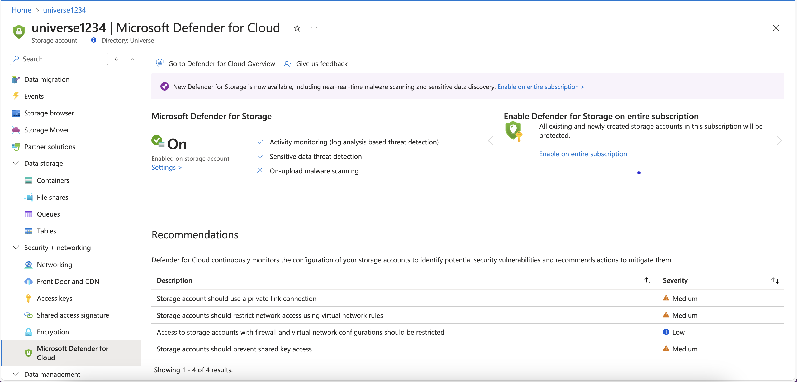
3. Click **Settings** to open the side menu
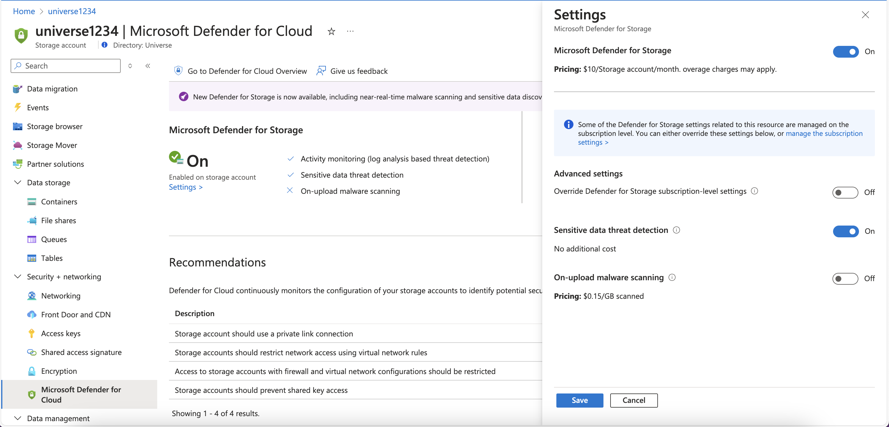
4. Enable On-upload malware scanning and click **Save**
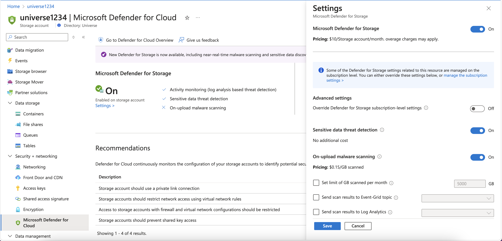
5. The On-demand Malware Scanning menu will appear as soon as the settings are applied
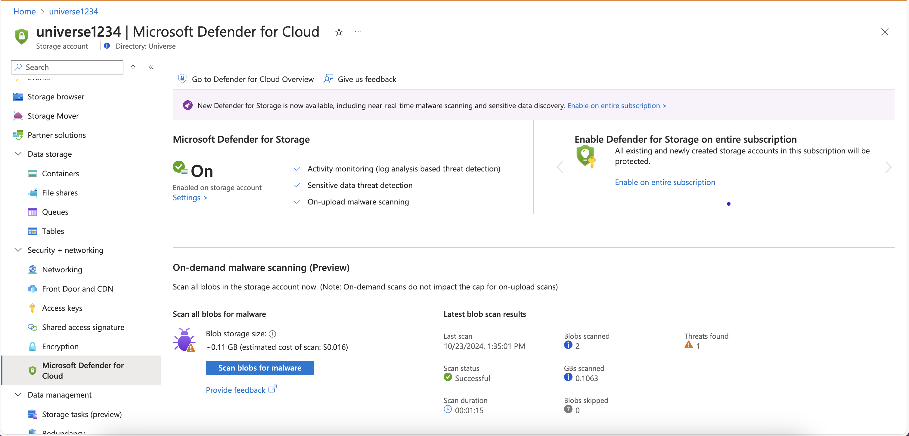
> **_NOTE:_**  The estimate is based on metrics which are updated every few hours, so if the storage account was previously empty, it can show a wrong estimate (size + cost) until the next update.

### Testing it via UI
The On-demand Malware Scanning shows the total number of GBs of your storage account blobs. It also displays the total estimated cost of running the scan across all of those blobs. 

1. If you enabled this in a storage account that already has blobs, click the button **Scan blobs for malware**
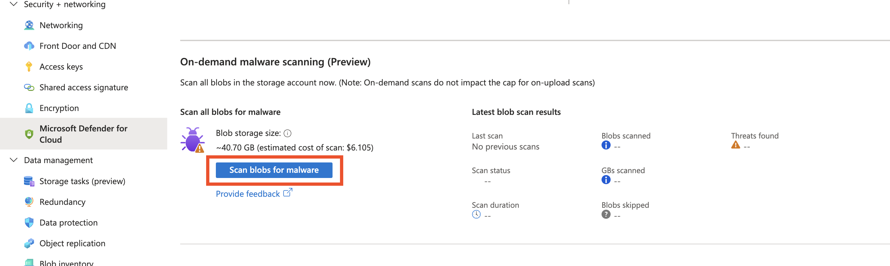

2. Once you click it, the scanning status will appear
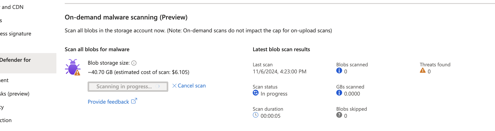

> **_NOTE:_**  Scan cancellation is possible before the scan is in "Waiting for completion" state.
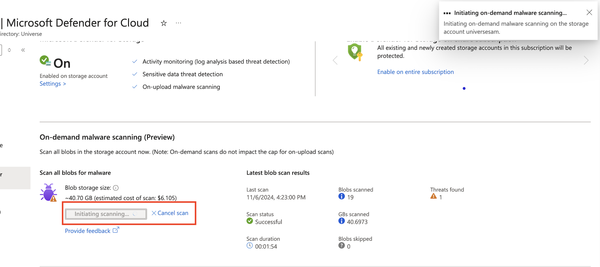

### Testing it via API
[Download](https://github.com/Azure/Microsoft-Defender-for-Cloud/blob/main/Labs/Files/On_Demand_Insomnia_2024-10-14.yaml) our Insomnia collection that has the following APIs:
- Get Scan
- Start Scan
- Cancel Scan

#### Prerequisites
- [Download](https://github.com/Azure/Microsoft-Defender-for-Cloud/blob/main/Labs/Files/On_Demand_Insomnia_2024-10-14.yaml) API collection 
- Install Insomnia
- Import the downloaded template
- Have your Azure Bearer Token for the subscription where you want to use On-demand malware scanning

#### Get Bearer Token
1. Open your terminal
2. Put it PowerShell mode and enter **Connect-AzAccount**
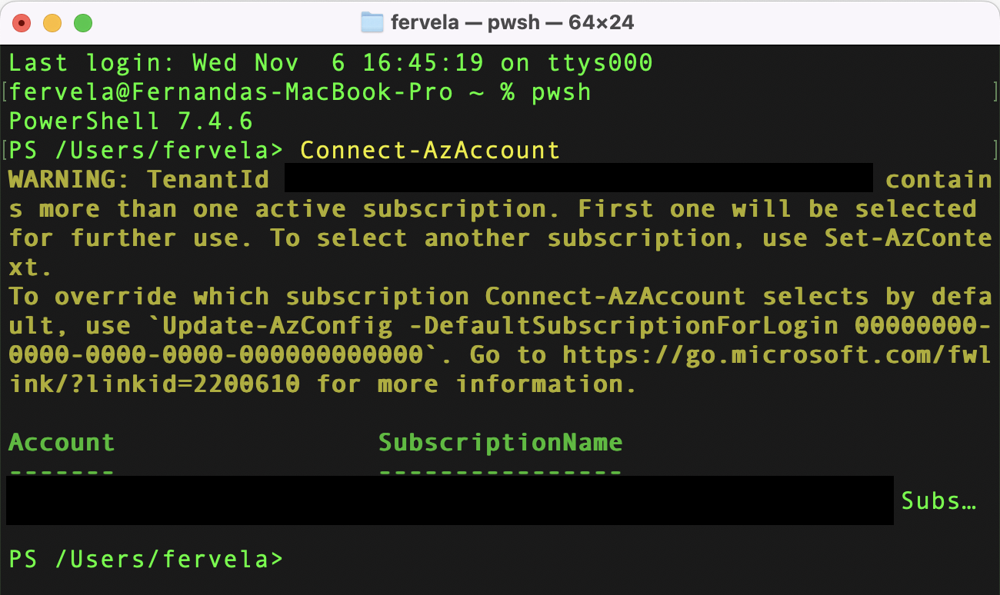
3. Once connected, enter:
```PowerShell
    (Get-AzAccessToken -ResourceUrl "https://management.azure.com").Token
```
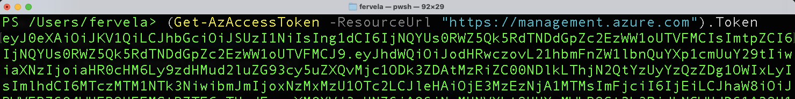
4. Copy it and paste it in the Auth tab in Insomnia


#### Start Scan
1. Go to **Start Scan** 
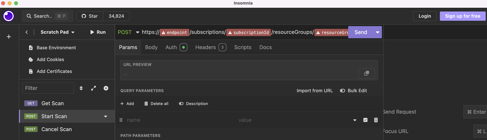 
2. Navigate to **Auth** and choose **Bearer Token**
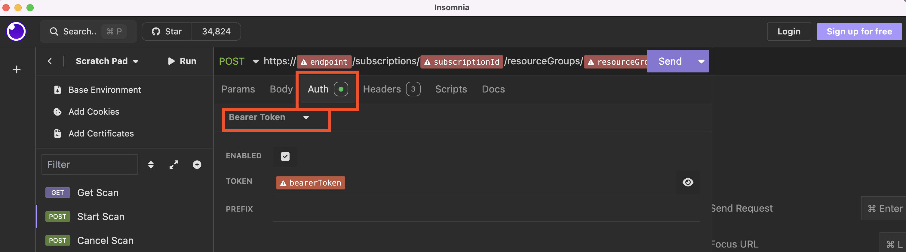
3. Paste your Bearer Token
4. Modify the following parameters in your POST request:
    1. endpoint - **management.azure.com**
    2. subscriptionId - **your sub id**
    3. resourceGroup - **the resource group name where you have your storage account**
    4. settingsName - **current**
    5. apiVersion - **2024-10-01-preview**
    
    
    > **_Sample:_** https://**management.azure.com**/subscriptions/**ab00cde1-ab00-1234-0ab1-0a123b456c78**/resourceGroups/**universe**/providers/Microsoft.Storage/storageAccounts/**storageaccount1234**/providers/Microsoft.Security/defenderForStorageSettings/**current**/StartMalwareScan?api-version=**2024-10-01-preview**

    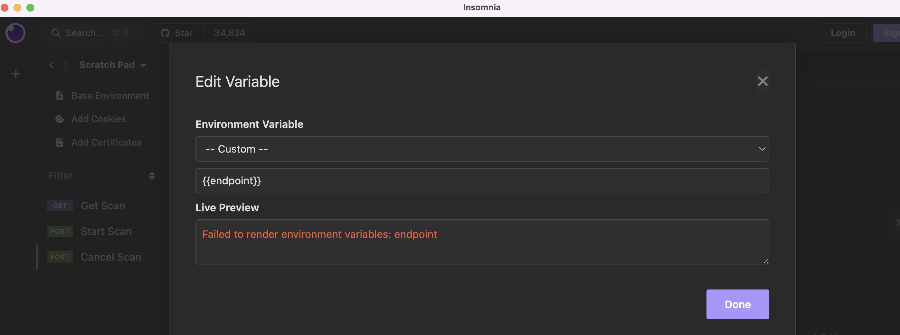
   6. Click **Send** 
   7. The result will appear on the right section
   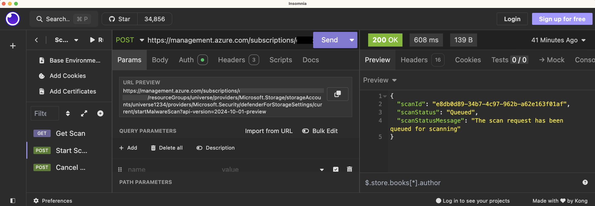

#### Get Scan
1. Go to **Get Scan**
2. Navigate to **Auth** and choose **Bearer Token**
3. Modify the parameters in your GET request
```
https://{{endpoint}}/subscriptions/{{subscriptionId}}/resourceGroups/{{resourceGroup}}/providers/Microsoft.Storage/storageAccounts/{{storageAccountName}}/providers/Microsoft.Security/defenderForStorageSettings/{{settingsName}}/startMalwareScan?api-version=2024-10-01-preview
```
6. Click **Send**. The scan status will be "WaitingForCompletion"
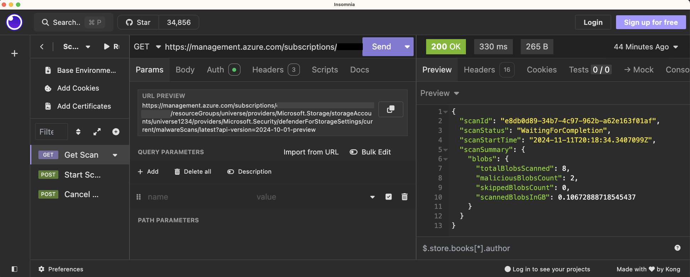
7. The result will appear on the right section. Click **Send** again and the scan status will change "Completed"
   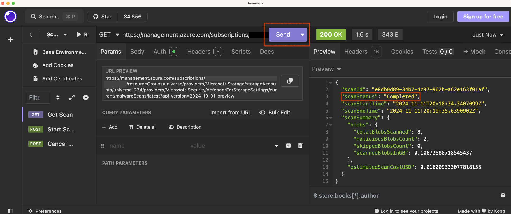

#### Cancel Scan
1. Go to **Cancel Scan**
2. Navigate to **Auth** and choose **Bearer Token**
3. Modify the parameters in your POST request
```
https://{{endpoint}}/subscriptions/{{subscriptionId}}/resourceGroups/{{resourceGroup}}/providers/Microsoft.Storage/storageAccounts/{{storageAccountName}}/providers/Microsoft.Security/defenderForStorageSettings/{{settingsName}}/malwareScans/latest/cancelMalwareScan?api-version=2024-10-01-preview
```
6. Click **Send** 
7. The result will appear on the right section

# 🦉 Appendix
## Grant Storage Blob Data Owner to a user in a Storage Account Container
1. In the **Azure portal** navigate to the Storage Account you are testing and in the left pane, select **Containers**.
2. Select the specific container where you are uploading your files.


3. Click on **Access Control (IAM)**.


4. Click **Add** and then **Add role assignment**.


5. In the **Role** section, type **Storage blob data owner** and click on the first result.


6. In the **Members** section, click **Select members**, type your account and select it.


7. Click **Review + assign**.

