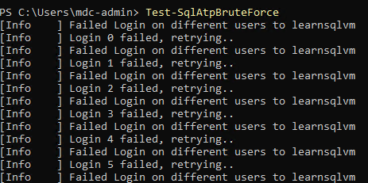
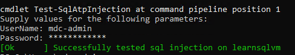
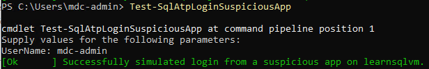
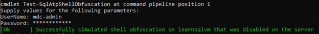
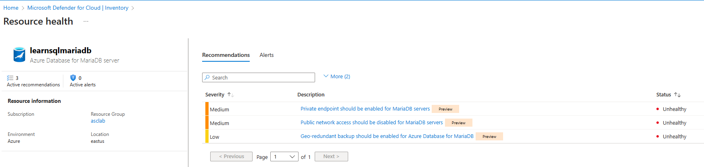

# Module 12 - Microsoft Defender for Cloud database protection

#### 🎓 Level: 300 (Intermediate)
#### ⌛ Estimated time to complete this lab: 60 minutes

## Objectives
This exercise guides you on how to validate and use MDC's database protection plans.

### Exercise 1: Enable Defender for SQL servers on machines plan 

To enable the Defender plan on a specific subscription:
1.	Sign into the **Azure portal**.
2.	Navigate to **Microsoft Defender for Cloud**, then **Environment settings**.
3.	Select the relevant subscription.
4. Locate Databases. 
5.	Click on **Select types** and ensure **SQL servers on machines** is toggled **On**.
6.	Click on **Settings** and ensure Status is toggled **On**.
7. Click **Continue** and **Save**. 

Now all your existing and upcoming Azure SQL servers on machines are protected.

#### Create a SQL VM 
  Create a Sql Server on a Windows Virtual machine 

First you need to download an ARM template for a SQL server on a Windows VM. 
1.	To deploy, click on the blue **Deploy to Azure** button below:

  
2. Click **Deploy to Azure**.
3. Fill in all the necessary fields.
4. Click **Review and Create** and then when it's ready, click **Create**.

#### View vulnerability assessments
1.	Navigate to the SQL virtual machine resource in the Azure portal. 
2.	Under Security, click on **Microsoft Defender for Cloud**.
3.	There are **Recommendations**, **Security incidents and alerts** and **Vulnerability assessment findings** on this page. 
4.	Under **Vulnerability assessment findings**, choose a finding.  
5.	Take note of vulnerability assessment details.
6.	Under **Affected resources**, click on **resource**. 
7.	Locate and click on **Vulnerability assessment** under **Findings**.
8.	See option to **Add all results as baseline** or **Remove all from baseline**. 

#### Validate alerts for Defender for SQL for servers on machines
To validate alerts for Defender for SQL Servers on machines:
1.	Sign into the **Azure portal**.
2.	Navigate to the virtual machine.
3.	Click on the **Connect** dropdown and choose **RDP**
4.	Log into your virtual machine using the username and password from Exercise 1.
5.	Open PowerShell and paste the query below in one line:  
*Import-Module (Get-ChildItem -Path "$Env:ProgramFiles\Microsoft Monitoring Agent\Agent\Health Service State\Resources\" -File SqlAdvancedThreatProtectionShell.psm1 -Recurse).FullName ; Get-Command -Module SqlAdvancedThreatProtectionShell*
6. Run **Test-SqlAtpBruteForce**. This will simulate a brute force attack on the SQL VM

7. Run **Test-SqlAtpInjection**. This will simulate a SQL injection attempt. 

8. Run **Test-SqlAtpLoginSuspiciousApp**. This will simulate a login from a suspicious app. 
9.	Run **Test-SqlAtpShellExternalSourceAnomaly**. This will simulate a Windows command shell accessing an abnormal external source.
10. Run **Test-SqlAtpShellObfuscation**. This will simulate a SQL obfuscation attempt.

11.	Navigate to **Microsoft Defender for Cloud**, click on **Security Alerts**.
12.	Filter by **Time** or by **Affected resources** and choose your values. 
13.	Notice the alert details pertaining to the SQL server. 

**Note: Make sure to use the local username and password (you've assigned this in exercise 1, step 3 when creating the VM) to continue running the tests**

### Exercise 2: Enable and protect your Azure SQL Databases using Microsoft Defender for Azure SQL Databases

#### Enable database protection on your Azure SQL Database

1.	Sign into the **Azure portal**.
2.	Navigate to **Microsoft Defender for Cloud**, then **Environment settings**.
3.	Select the relevant subscription.
4.	To protect all database types, toggle the Databases plan to **On**. 
5.	Select **Select types**.
6.	Make sure **Azure SQL Database** has been toggled to **On**. 
7.	Select **Continue** and **Save**.

Now all your existing and upcoming Azure SQL Databases are protected.

#### Understand database protection on your Azure SQL Database
A SQL server should also have been created, earlier in module 1, and it should be labeled as “asclab-sql-[string]”. If so, you should also be able to locate your SQL databased, labeled as “asclab-db”. 
1.	Sign into the **Azure portal**. 
2.	Navigate to the SQL server or to database directly by searching **“asclab-db”**. 
3.	Click on **Microsoft Defender for Cloud** under **Security**. 
4.	**Recommendations** and **Vulnerability assessment findings** should be available. 

### Exercise 3: Enable and protect your Azure Cosmos DB accounts using Microsoft Defender for Azure Cosmos DB 

#### Enable database protection on your subscription

To enable the database Defender plan on a specific subscription:

1. Sign in to the **Azure portal**.
2. Navigate to **Microsoft Defender for Cloud**, then **Environment settings**.
3. Select the relevant subscription.
4. To protect all database types toggle the **Databases** plan to **On**.
 
5. Use Select types to enable protections for specific database types. Toggle all resource types to **On**.
6. Select **Continue** and **save**.

Now all your existing and upcoming Azure Cosmos DB accounts are protected.

#### Create an Azure Cosmos DB account and protect it using Microsoft Defender for Azure Cosmos DB 

First you need to download an ARM template for an Azure Cosmos DB
. 
1.	To deploy, click on the blue **Deploy to Azure** button below:

  
2.  Click **Deploy to Azure**.
3. Fill in all the necessary fields.
4. Click **Review and Create** and then when it's ready, click 
**Create**.

#### Understand Azure Cosmos DB protection

1. Sign into the **Azure portal**. 
2.	Navigate to the Azure Cosmos DB or to database directly by searching for it in the search box up top. 
3.	Click on **Microsoft Defender for Cloud** under **Settings**. 

4.	**Recommendations** and **Security incidents and alerts** should be available, if applicable. 

### Exercise 4: Enable and protect your OSS RDBs using Microsoft Defender for Open-source relational databases

#### Enable database protection for your open source relational databases

1.	Sign into the **Azure portal**.
2.	Navigate to **Microsoft Defender for Cloud**, then **Environment settings**.
3.	Select the relevant subscription.
4.	To protect all database types, toggle the Databases plan to **On**. 
5.	Select **Select types**.
6.	Make sure **Open source relational Database** has been toggled **On**. 
7.	Select **Continue** and **Save**.

#### Create an Azure database for Maria DB

1.	To deploy, click on the blue **Deploy to Azure** button below:

  
2.  Click **Deploy to Azure**.
3. Fill in all the necessary fields.
4. Click **Review and Create** and then when it's ready, click 
**Create**.

#### Understand Azure Maria DB protection

1. Sign into the **Azure portal**. 
2.	Navigate to **Microsoft Defender for Cloud**
3.	Click on **Inventory** and search for your Azure Maria DB resource. 
4.	**Recommendations** and **Security incidents and alerts** should be available, if applicable.

