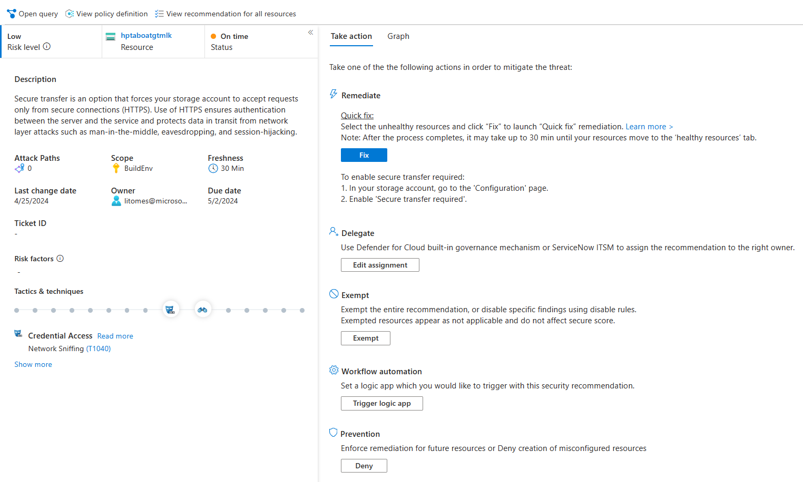

# Module 2 - Exploring Microsoft Defender for Cloud

<p align="left"></p>

#### 🎓 Level: 100 (Beginner)
#### ⌛ Estimated time to complete this lab: 60 minutes

## Objectives
Create a new Microsoft Account enable with Azure Trial Subscription
This section is intended to deploy Azure resources in an automated way to get you started quickly or in case you need to re-provision your environment.

#### Prerequisites
To get started with Microsoft Defender for Cloud, you must have a subscription to Microsoft Azure. If you do not have a subscription, you can sign up for a free account. [Click Here](https://azure.microsoft.com/en-us/free).

### Exercise 1: Understanding Microsoft Defender for Cloud dashboard

1.	Navigate to the **Azure Portal** (https://portal.azure.com) using the credentials you created in the previous module.
2.	From the left navigation pane, click on **Microsoft Defender for Cloud**. You can also navigate to Microsoft Defender for Cloud dashboard by using the top search bar.
3.	On the **Overview** blade notes that it now provides a unified view into the security posture and includes multiple independent cloud security pillars such as **Security posture, Regulatory compliance, Workload protections, Firewall Manager, Inventory, and Information protection (preview)**. Each of these pillars also has its own dedicated dashboard allowing deeper insights and actions around that vertical, providing easy access and better visibility for security professionals.

> ❗ Important: <br>
> It takes few hours for all tiles on the overview page to update.


4.	Note the **top menu** bar which allows to view and filter subscriptions by selecting the **subscriptions button**.
In this lab we will use only one but selecting different/additional subscriptions will adjust the interface to reflect the security posture for the selected subscriptions.

5.	Click on the **What’s new** button – a new tab opens with the latest release notes where you can stay current on the new features, bug fixes and more.

6.	Note the **high-level numbers** at the top menu; This view allows you to see a summary of your subscriptions, active recommendations, security alerts alongside with connected cloud accounts (AWS account and GCP projects – will be discussed in the next modules).


7.	From the top menu bar, **click** on **Azure subscriptions**. This will bring you into the environment settings. Then select **Azure Subscription 1**. 


8.	On the **Defender plans** page, note that your subscription is fully covered – means that your subscription is covered by Microsoft Defender for Cloud. 	


> ⭐ Good to know: <br>
> This page shows a list of subscriptions and their coverage type. You can use this page to find subscriptions that are not covered by Microsoft Defender for Cloud and help you identify “shadow IT” subscriptions.

9.	Go back to the **Overview** page, and look at the **Secure Posture** tile, you can see your current score along with the number of completed controls and recommendations. Clicking on this tile will redirect you to drill down view across subscriptions.


> ⭐ Good to know: <br>
> The higher the score, the lower the identified risk level.

10.	On the **Regulatory Compliance** tile, you can get insights into your compliance posture based on continuous assessment of your both Azure and hybrid cloud environments. Clicking on this tile will redirects you to **Regulatory Compliance** dashboard – where you can add additional standards and explore the current ones.
11.	On the **Workload Protections** tile, you can see the coverage of your connected resources (for the currently selected subscriptions) and the recent alerts, color-coded by severity. Your current resource coverage should be **100% which means full protection**. Clicking on this tile will redirects you Microsoft Defender for Cloud dashboard.
12. On the **Inventory** tile, you are provided with a view of your security posture across all your inventory, including Defender coverage per resource and whether the monitoring agent is installed (which brinhs security protection to those resources).
 
13.	On the right pane, you can find the **Insights** section which offers tailored items for your environments: 

- Upgrade to New Containers plan
- Cost estimation workbook for Containers plan
- Most prevalent recommendations (by resources)
- Controls with the highest potential increase
- Defender for Cloud community
- Most attacked resources
- New security alerts
- Blog post from Microsoft experts [MDC blog](https://techcommunity.microsoft.com/t5/azure-security-center/bg-p/AzureSecurityCenterBlog)
- Link to the [mdc Community repository on GitHub](https://github.com/Azure/Azure-Security-Center)

### Exercise 2: Exploring Secure Score and Recommendations

**Exploring Secure Score**

Previously, we briefly explored the Secure Score tile on the overview page. Now let’s dive into this capability and the associated recommendations. Microsoft Defender for Cloud continually assesses your resources. All findings are aggregated into a single score (Secure Score) which measures your current security posture of your subscription/s; the higher the score, the lower the identified risk level.
Exploring secure score

1.	Go to the **Microsoft Defender for Cloud Overview blade**.
2.	From the left navigation pane, under the **Cloud Security** section, press on the **Secure posture** button.
3.	On the Secure Score page, **review your current overall secure score percentrage**.

> ⭐ Notice: <br>
> Your score is shown as a percentage value, but you can also see the breakdown by cloud environment and criticallity rating. See the following example: <br>
> <br>
> For more information on how the score is calculated, [refer to the secure score documentation page](https://docs.microsoft.com/en-us/azure/security-center/secure-score-security-controls#how-your-secure-score-is-calculated).

4.	On the bottom part, you can see a list of subscriptions and their current score. To view the recommendations behind the score, click on **view recommendations**.

**Exploring Security Controls and Recommendations**

1.	On the recommendations page, pay attention to the first part of the page; the **summary view** which includes a breakdown of recommendations by criticallity, the number of active attack paths, and the number of overdue recommendations.  
2.	On the top menu, click on **Download CSV report** button – this allow you to get a snapshot of your resources, their health status and the associated recommendations. You can use it for pivoting and reporting.
3.	Notice the second part of the page; here you have a **list of all recommendations grouped by criticallity**:

4.	In the search bar, look for the recommendation `Secure transfer to storage accounts should be enabled`.  Click on this recommendation. You will be taken to a page dedicated to presenting the assessment for a particular instance.    Notice that we display the overall risk level, number of active attack paths, the governance owner (if set), due date, ServiceNow Ticket ID,, and compounding risk factors.  
5.	To view all resources that have this applicable recommendation, click `View recommendation for all resources`.  As you can see, this recommendation has the **Quick Fix** available.

> ⭐ Notice: <br>
> Quick Fix allows you to remediate a group of resources quickly when possible with a single click. This option is only available for supported recommendations and enables you to quickly improve your secure score and increase the security in your environment.

6.	On the top section, notice the following:

*	**Deny** (the options are Enforce and Deny buttons on supported recommendations)
*	**Exempt** (which allows you to exempt resources/subscriptions/management groups from being applicable to this recommendation)
*	**View Policy Definition** (which opens the Azure Policy definition for this recommendation)
*	**Open Query** (in Azure Resource Graph)

* Severity indicator: **High**
* Refreshens interval on supported recommendations: **30 Min**


 
7. The next important part is the **Remediation Steps** which contains the remediation logic. Expand **Remediation steps** to see more information.  As you can see, you can remediate the select resource/s either by following the step-by-step instructions, use the provided ARM template or REST API to automate the process by yourself or use the Quick Fix button which triggers the ARM call for you.

* Click on the **Quick Fix Logic**
* Notice the automatic remediation script content (ARM Template):

```json
{
  "properties": {
    "supportsHttpsTrafficOnly": true
  }
}
```

8.	On the bottom part, click on the unhealthy resources tab and **select a resource** and then **click Fix**.

9. On the right pane, review the implications for this remediation and press **Fix 1 resource**.


10. Wait for a notification: ✅ **Fix successful** - Successfully remediated the issues on the selected 
resources. Note: It can take several minutes after remediation completes to see the resources in the 'healthy resources' tab.

11.	Return to recommendations list. Expend the "Manage access and permissions" security control, you can now see **Preview recommendations** which have the flag symbol to the right, under **Insights**. Those with **Preview recommendations** aren’t included in the calculation of your score. They should be still remediated, so that when the preview period ends, they will contribute towards your score.


### Exercise 3: Exploring the Inventory capability

Asset inventory dashboard allows you to get a single pane of glass view to all your resources covered by Microsoft Defender for Cloud. It also provides per-resource visibility to all Microsoft Defender for Cloud’s information and additional resource details including security posture and protection status. Since this dashboard is based on Azure Resource Graph (ARG), you can run queries across subscriptions at scale quickly and easily.

1.	From Microsoft Defender for Cloud’s sidebar or from the Overview tile, select **Inventory**
2.	Hover to the top of the page.
3.	Notice the total number of resources: **15**

> ⭐ Notice: <br>
> The total number of resources are the ones which are connected to Microsoft Defender for Cloud and NOT the total number of resources that you have in your subscriptions/s.

4.	Notice the number of **unhealthy resources: 11** (resources with active recommendations based on the selected filter)
5.	Notice the **unmonitored resources: 0** (indicates if there are resources with Log Analytics agent deployed but with health issues). Since we enabled the auto-provisioning in the previous module, all existing VMs are covered and connected = monitored.
6.	Use the **Filter by name** box to search for **linux**. You should now see a filtered view of the disks in your environments.  Clear the filter.
7.	Open the resource health pane by selecting the resource. Click on **asclab-linux**. 
8.	On the resource health pane for **asclab-linux**, review the virtual machine information alongside with a recommendation list.

9.	Navigate back to the **Inventory page**. From the filter menu, select the **Resource Group** filter and then **asclab-aks**. Using this filter, you can see all resources related to the predefined Kubernetes resources which are monitored with no active recommendations. Clear the filter by selecting **Resource Group** and then **Select all**.

> Notice! The entire grid can be filtered and sorted

10.	From the filter menu, select **Recommendations**, uncheck **select all** option and then select the **Auditing on SQL Server should be enabled**. You can also use the search area within the filter to better find across the list. Clear your filter.
11.	Tag is very common asset management in Azure to do asset management. Using this view, you can assign tags to the filtered resources:

* Filter the **Resource type** column to include only **App Services**.
* **Select** the two app service named as *asclab-fa-xx* and *asclab-app-xx*
* From the top menu, click **Assign tags**
* Assign `Environment` as the name and  `Production` as the value.
* Click **Save**.


12. Click on **Add filter**.Notice the **Security findings** filter – it allows you to find all resources that are vulnerable by a specific vulnerability. You can also search for CVE, KB ID, name and missing update.
13. From the **Resource Group** filter, select **asclab**. From the top menu bar, click on **Download CSV report**. You will get a snapshot to work on it offline already filtered. You can also right click on any of the resource and upgrade to Workload Protections plan (when applicable).
14.	From the top menu, click on **open query**. This will open up the resource graph explorer blade, click on **Run Query**. You should now have the same list of resources and columns like in the previous step. This query can be editable for your needs and here it gets very powerful.
15. Save the query for later use by clicking on **Save as** from the top menu. You can use it to create periodic reports. Name the report as *asc-filtered-query* and select **Save**.

> ⭐ Good to know: <br>
> Inventory dashboard is fully built on top of Azure Resource Graph (ARG) which stores all of MDC security posture data and leveraging its powerful KQL engine.
> It enables you to reach deep insights quickly and easily on top of ASC data and cross reference with any other resource properties.

### Continue with the next lab: [Module 3 - Microsoft Defender for Cloud Security Policy](../Modules/Module-3-ASC-Security-Policy.md)
