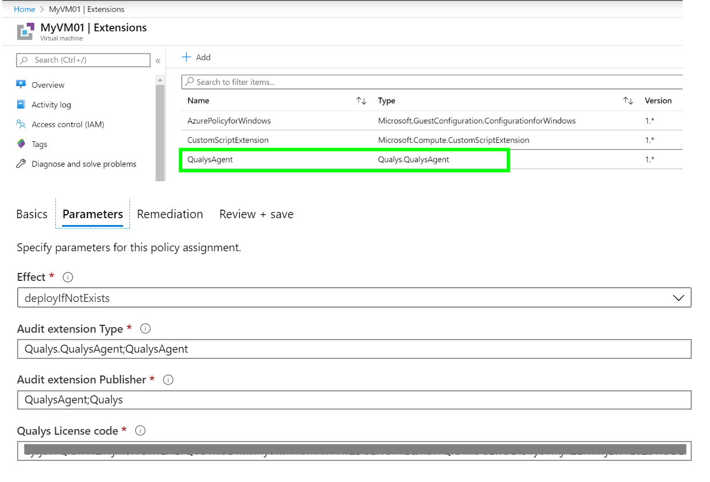

# Audit-Deploy Qualys 3rd party Windows

the policy audits and deploys the Qualys 3rd party extension including the required license key as parameter

## Try on Portal
You can deploy the workbook by clicking on the buttons below:

##

