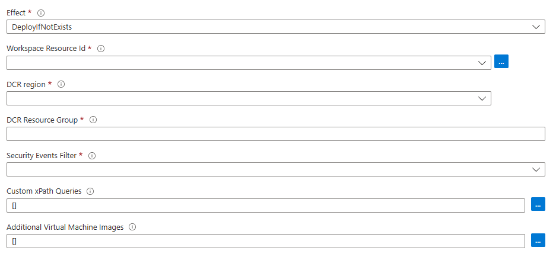

# Microsoft Defender for Servers - Deploy Azure Monitor Agent Data Collection Rule for Security Events collection

| Version | Description | Author | Date |
| ------ | ------ | ------ | ------ |
| 1.0 | Initial release | [Hélder Pinto](https://github.com/helderpinto)| 02/20/2023|

For the full context around this artifact, please read the [accompanying blog post](https://techcommunity.microsoft.com/t5/microsoft-defender-for-cloud/how-to-configure-security-events-collection-with-azure-monitor/ba-p/3770719).

## Description

Although Defender for Servers does not rely on security events collection to provide its protection capabilities, customers may want to collect this valuable data to bring additional context to their server security investigations or alerts. This Azure Policy initiative allows you to create a Data Collection Rule for Security Events collection by Azure Monitor Agents running in your Windows servers.

You must specify an event filter according to the options described [here](https://learn.microsoft.com/en-us/azure/defender-for-cloud/working-with-log-analytics-agent#what-event-types-are-stored-for-common-and-minimal). For custom event filters, see [how to define XPath queries](https://learn.microsoft.com/en-us/azure/azure-monitor/agents/data-collection-rule-azure-monitor-agent?tabs=portal#filter-events-using-xpath-queries).

## Usage

The simplest way to deploy this Policy initiative is by clicking on the "Deploy To Azure" button below. It will take you to the Azure Portal where you'll create a Template Deployment out of the [azuredeploy.json](./azuredeploy.json) ARM template.

For your reference, this Policy initiative is made of two Policy definitions: [DeployAMADCRForSecurityEventsCollection.json](./DeployAMADCRForSecurityEventsCollection.json) (for existing VMs) and [DeployAMADCRForSecurityEventsCollectionVMAssociation.json](./DeployAMADCRForSecurityEventsCollectionVMAssociation.json) (for new VMs).

Once deployed, you can assign the **Configure Data Collection Rule for Security Events collection** Policy initiative at the desired scope, by filling in the required and optional parameters:

* Effect - DeployIfNotExists or Disabled
* Workspace Resource Id - Log Analytics Workspace where to send the Security Events to (must have Defender for Servers Plan 2 enabled)
* DCR Region - the Azure region where you want the Data Collection Rule to be deployed
* DCR Resource Group - the (new or existing) Resource Group name where you want the Data Collection Rule to be deployed
* Security Events Filter - either AllEvents, Common, Minimal or Custom
* Custom xPath Queries - only required if you specify Custom as the filter
* Additional Virtual Machine Images - only required if you have Windows VMs that are not based on Azure Marketplace images

