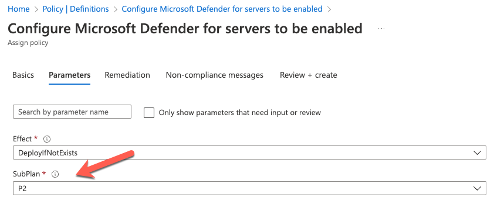

# Enable Microsoft Defender for Servers plans

| Version | Description | Author | Date |
| ------ | ------ | ------ | ------ |
| 1.0 | Initial release | [Tom Janetscheck](https://github.com/tomjanetscheck)| 10/27/2022|
| 1.1 | Fixing template parameter | [Tom Janetscheck](https://github.com/tomjanetscheck) | 11/18/2022 |

This Azure policy definition allows you to enable Microsoft Defender for Servers on your subscriptions and management groups while, at the same time, selecting the Defender for Servers plan (Plan 1 or Plan 2). The policy uses assignment parameters to allow for plan selection:

Note: In case no plan is defined, the policy will enable **Defender for Servers Plan 2** by default.

You can copy the JSON file's content and create a new custom policy definition in your Management Group so you can assign it to any subordinate scope (management group, or subscriptions underneath). To learn more about creating a custom policy definition, see [this tutorial](https://learn.microsoft.com/azure/governance/policy/tutorials/create-custom-policy-definition).
