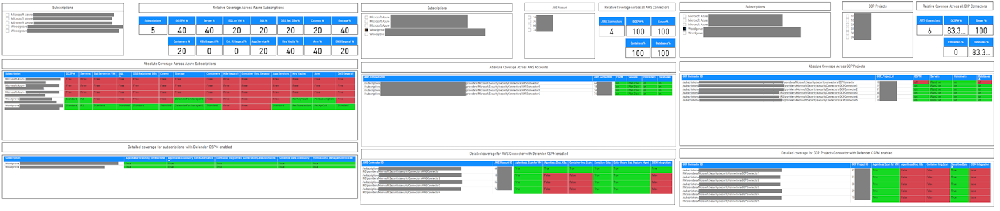

# Power BI Report for MDC Security Plan Coverage

This repository provides a Power BI version of the Microsoft Defender for Cloud (MDC) Security Plan Coverage workbook. The Power BI report is designed to overcome the 1000-record limit often encountered when querying Azure Resource Graph (ARG) programmatically or using tools like Azure Workbook. This limit can restrict detailed analysis in environments with extensive data.

## Key Features

- **Bypassing the 1000-Record Limit:** Leverage Power BI's ARG data connector to access and visualize a comprehensive dataset without the 1000-record constraint.
- **Detailed Visualizations:** The report includes various pre-built visualizations such as tables, charts, and maps to represent Security Plans Coverage across your organization.
- **Customizable:** Tailor the report to include custom metrics and KPIs specific to your organization's security requirements, providing actionable insights.

## Getting Started

1. **Download the Report:** 
   - Clone or download the Power BI report file from this repository.

2. **Connect to Azure Resource Graph:**
   - Open the report in Power BI Desktop.
   - Authenticate with your Azure credentials to connect to your Azure Resource Graph.

3. **Import Data:**
   - The report is configured to query and import the full dataset, bypassing the 1000-record limit.

4. **Customize Visualizations:**
   - Modify the pre-built visualizations or add new ones to suit your specific needs.

By using this Power BI report, you can gain deeper insights into your security posture and make informed decisions to enhance your organization's security management.

