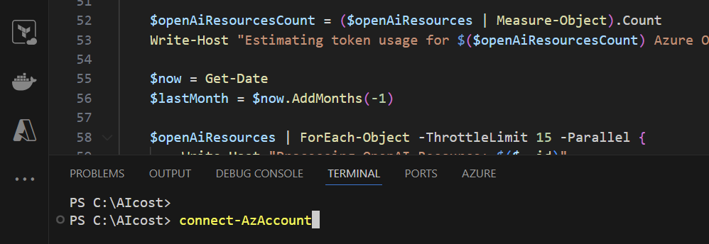
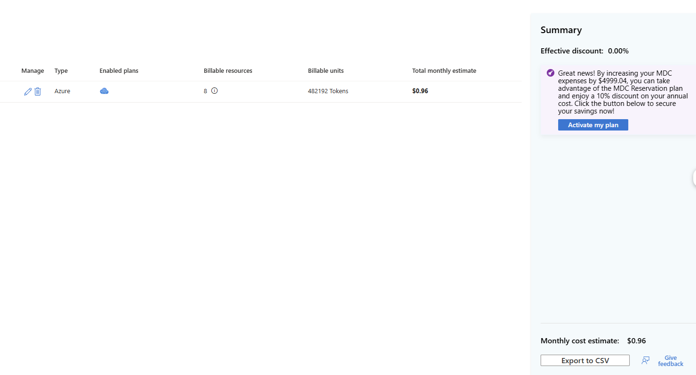

# Microsoft Defender for AI – Price Estimation Scripts

- [Defender for AI Overview](#defender-for-Ai-overview)
- [PowerShell Scripts](#powershell-scripts)
  * [Get-AIOnlyCosts.ps1](#get-aionlycostsps1)
    + [Running the Script](#running-the-script)
    
> [!NOTE]
> Defender for AI Services is billed as shown on the pricing page. 
**Defender for AI services includes a 30 day free trial, capped up to 75 Billion tokens scanned. Billing will commence if cap is reached within the 30 day period. For details about the pricing plans, see [Microsoft Defender for Cloud pricing page](https://azure.microsoft.com/pricing/details/defender-for-cloud/)

 
> **Credits:** [Shay Amar](https://www.linkedin.com/in/shay-amar/), [Niv Azriel](https://www.linkedin.com/in/nivazriel/), [Dick Lake](https://www.linkedin.com/in/richard-lake-b3797394/)

## Defender for AI Overview
Microsoft Defender for Cloud's threat protection for AI services identifies threats to generative AI applications in real time and helps respond to security issues.

Defender for Cloud's AI threat protection works with Azure AI Content Safety Prompt Shields and Microsoft's threat intelligence to provide security alerts for threats like data leakage, data poisoning, jailbreak, and credential theft.

Threat protection for AI services in Microsoft Defender for Cloud protects AI services on an Azure subscription by providing insights to threats that might affect your generative AI applications.

## PowerShell Scripts

These PowerShell scripts allow you to estimate the cost of the Microsoft Defender for AI enabled across the selected scope.

- **Get-AIOnlyCosts.ps1** will get estimated metrics on Azure AI to help estimate costs for Defender for AI 

### Get-AIOnlyCosts.ps1

This script will get estimated metrics on Azure AI to help estimate costs for Defender for AI 
- The metrics used in this script is based on the last 30 days
- The price calculations are based on list price
- The script will output the totals and export the data to a csv file 
- The file needs to be uploaded to the Cost Calculator to view the final estimation.

#### Examples 

##### Get estimates for AI resources in the account
```powershell
.\Get-AIOnlyCosts.ps1
```
### Get-AIOnlyCosts.ps1

You can find the PowerShell script here [Get-AIOnlyCosts.ps1](./Get-AIOnlyCosts.ps1)

This PowerShell script estimates the monthly cost of Microsoft Defender for AI for multiple Azure subscriptions. It calculates the cost based on the number of tokens for each AI resouce in the subscriptions.For each AI resouce, it retrieves the total number of tokens for the last 30 days using the CognitiveServices REST API. The script finally outputs the total Defender for AI cost for all subscriptions and details for each subscription, including the subscription ID, Subscription name, resouce account , BillableUnits, planname, EnvironmentType, to a CSV file named "AzureMDCResourcesEstimation_DATEXX_TIMEYYY.csv".

- **PowerShell version:** This script can be run in -Version 7.0 or higher.
- **PowerShell version:** "Connect-AzAccount, make sure you're connected to the relevant account before excuting the script"
- **Data Retrieval:** The script retrieves data using the Azure PowerShell module (Get-AzSubscription ) and the Azure Cognitive REST API (Invoke-AzRestMethod). It collects information about subscriptions, AI resources, and tokens bilableunits for the last 30 days.

- **Error Handling:** The script includes error handling (try-catch) to manage any errors that may occur during the data retrieval and processing. If an error occurs, it is caught, and an error message is displayed.

- **Output Formatting:** The script formats the output into a CSV file (CostEstimation.csv) using ConvertTo-Csv, which can be easily imported into MDC cost calculator for further analysis. The file is saved in the current directory where the script is executed.

#### Running the Script

1. Click on the [PowerShell script](./Get-AIOnlyCosts.ps1).
      
2. On the right side, click on “Raw”.

4. Copy the code.

4. Paste it in your favorite code tool. In this example we’ll use Visual Studio Code.

    

5. Save it. 
6. Open the terminal. View->Terminal.
   
8. Connect to your Azure account using `Connect-AzAccount -TenantId INSERT_TENANT_ID`
   
6. Run it with VScode 
    
    


13. Open your defender for cloud environment and navigate to environment settings-> cost calculator. Click on the option to Add assets with script and then upload the csv file that you've from the script execution. Click next and check the relevant subscription/s and click next 

 
 

14. Now in the Select Defender Plans mark the AI services :  and press calculate, the Total Monthly estimate will be displayed. 


