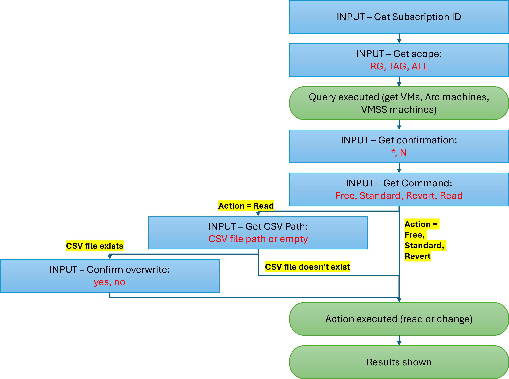

# Defender for Servers activation on resource level

By default, Defender for Servers is enabled as a subscription-wide setting, covering all Azure VMs, Azure Arc-enabled Servers and VMSS nodes at the same time. However, there are scenarios in which it makes sense to downgrade individual machines from Defender for Servers Plan 2 to Plan 1, or only enable Defender for Servers Plan 1 on a subset of machines in a subscription.

This folder contains a [PowerShell script](https://github.com/Azure/Microsoft-Defender-for-Cloud/blob/main/Powershell%20scripts/Defender%20for%20Servers%20on%20resource%20level/ResourceLevelPricingAtScale.ps1) that allows you to select machines based on Azure resource tags, or a resource group to configure them individually rather than using the same plan setting for all machines in a subscription.

The latest version of the script also allows actions on ALL the resources of the specified subscription and exports the status of these resources to a CSV file.

This is the flowchart of the script execution:

To learn more about how to enable Defender for Servers, please read [this documentation](https://learn.microsoft.com/en-us/azure/defender-for-cloud/tutorial-enable-servers-plan).
