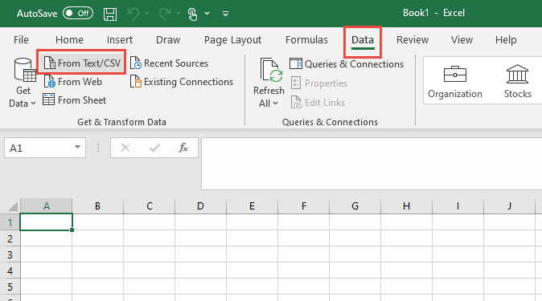
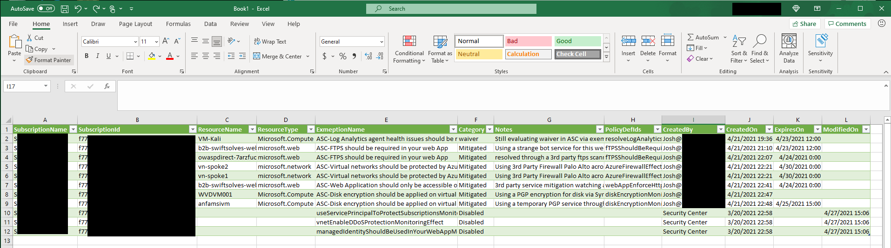

# Generate-ExemptionReport.ps1  
  This script will generate a detailed Azure Policy exemption report and user disabled policies from BuiltInASC at Subscription Scope.
   
## Description  
  This script will leverage the Microsoft.Authorization/policyExemptions API look through all subscriptions for Azure Policy exemptions and will record the exmptions in a CSV report with details, it will also report the disabled policies from BuiltIn Azure Security Center at the subscription scope.

### Prerequisites

##### Required PowerShell modules
  Install-module Az  
  Install-module Az.security
##### Script notes
- It will only record ASCBuiltIn policies disabled from Default only at Subscription Scope, will not work with Management Groups
- After execution of script open Excel, PowerBI, or another program import the ASCExemptionReport_MMyyddhhmmss.csv
- 
- 

##### Credits
   AUTHOR: Nathan Swift - Security CSA  
   LASTEDIT: April 27, 2021 1.00
    - 1.00 change log: Created intial generation exemption report script
    
##### Link
  This script posted and discussed at the folllowing location:  
  [https://github.com/Azure/Azure-Security-Center/tree/master/Powershell scripts](https://github.com/Azure/Azure-Security-Center/tree/master/Powershell%20scripts)