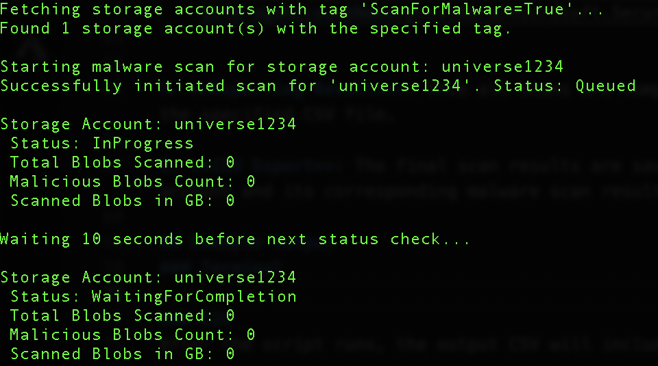
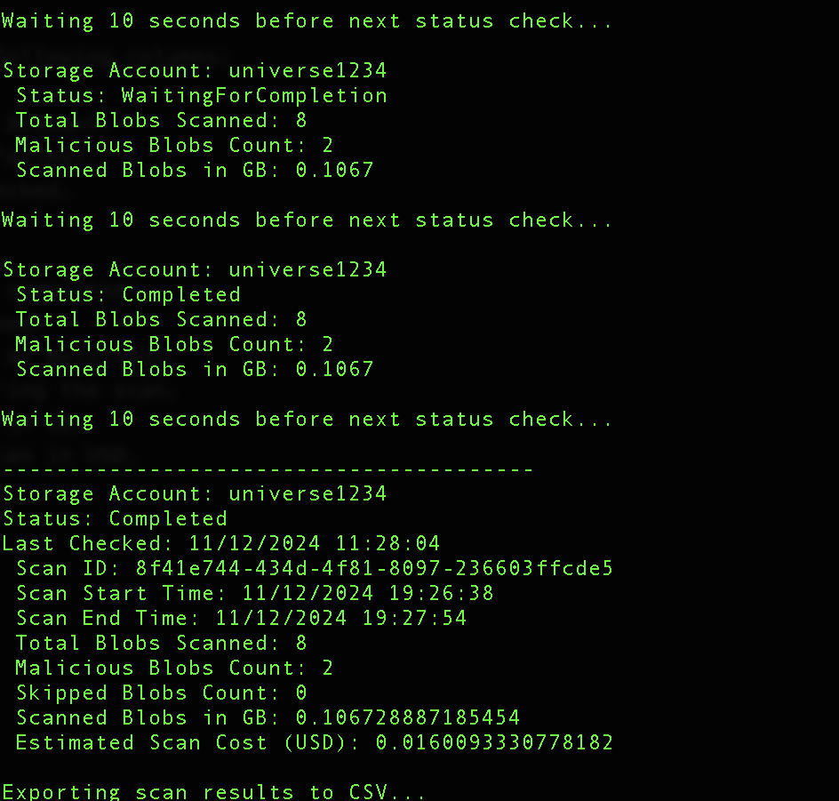

# Azure Storage Account Malware Scan Script

This PowerShell script allows you to initiate and monitor malware scans on **Azure Storage Accounts** that are tagged with a specific key-value pair. The script interacts with **Microsoft Defender for Storage's** feature **on-demand malware scanning**  and uses the **Azure REST API** to trigger malware scans and retrieve scan status.

## Description

This script is designed to:
- Authenticate to Azure using interactive login.
- Search for **Azure Storage Accounts** with a specific tag.
- Initiate malware scans on these storage accounts using Microsoft Defender for Storage.
- Continuously monitor the progress of these scans.
- Export the results to a CSV file for further analysis.

## Requirements

- **PowerShell 7.0** or later.
- **Azure PowerShell module** (`Az` module) installed.
  - To install the module, use the following command:
    ```powershell
    Install-Module -Name Az -AllowClobber -Force -Scope CurrentUser
    ```
- **Azure Subscription** with Microsoft Defender for Storage enabled on the desired storage accounts.
- **On-upload malware scanning** enabled in the storage accounts. **On-demand malware scanning** depends on it. 

## Authentication

This script uses **interactive login** to authenticate to Azure. When the script runs, you will be prompted to log in via a browser. Ensure that the user account has the necessary permissions to access the Azure resources (e.g., **Reader** or **Security Admin** role).

## Parameters

The script accepts the following parameters:

- `-SubscriptionId` (Mandatory): The **Azure Subscription ID** in which the storage accounts reside.
- `-TagKey` (Mandatory): The **key** of the tag used to filter storage accounts.
- `-TagValue` (Mandatory): The **value** of the tag used to filter storage accounts.
- `-OutputCsvPath` (Mandatory): The **path to the CSV file** where the results will be exported.

### Run it:
```powershell
.\MalwareScanScript.ps1 -SubscriptionId "your-subscription-id" `
                        -TagKey "ScanForMalware" `
                        -TagValue "True" `
                        -OutputCsvPath "C:\path\to\output\scanResults.csv"
```
### Example:
```powershell
.\MalwareScanScript.ps1 -SubscriptionId xx00xxx0-xx00-0000-0xx0-0x000x000x00 -TagKey ScanForMalware -TagValue True -OutputCsvPath "/Users/myUsername/Library/Documents"
```

## Script Workflow
1. **Authentication**: The script authenticates using interactive login with the Connect-AzAccount cmdlet. You will be prompted to log in via your browser.

2. **Fetching Storage Accounts**: The script fetches all Azure Storage Accounts under the provided subscription and filters them based on the provided tag (TagKey=TagValue).

3. **Initiating Malware Scans**: For each matching storage account, the script uses the Azure REST API to initiate a malware scan using Microsoft Defender for Storage.
```pwsh
    https://management.azure.com/subscriptions/$SubscriptionId/resourceGroups/$resourceGroupName/providers/Microsoft.Storage/storageAccounts/$storageAccountName/providers/Microsoft.Security/defenderForStorageSettings/current/startMalwareScan?api-version=2024-10-01-preview
```

4. **Monitoring Scan Status**: The script continuously monitors the status of each malware scan, checking every 10 seconds until all scans are either completed or failed.
```pwsh
    https://management.azure.com/subscriptions/$SubscriptionId/resourceGroups/$resourceGroupName/providers/Microsoft.Storage/storageAccounts/$storageAccountName/providers/Microsoft.Security/defenderForStorageSettings/current/malwareScans/latest?api-version=2024-10-01-preview"
```

5. **Exporting Results**: Once all scans are completed, the results (including blob counts, malicious blob counts, scan costs, etc.) are exported to the specified CSV file.

6. **CSV Export**: The final scan results are saved in the specified path (OutputCsvPath), which includes detailed information about each storage account and its corresponding malware scan results.

## Example Output
### Terminal 


### CSV
After the script runs, the output CSV will include the following columns:

- **StorageAccountName**: The name of the Azure Storage Account.
- **Status**: The status of the scan (e.g., Completed, Failed).
- **LastChecked**: The last time the scan status was checked.
- **ScanId**: The ID of the malware scan.
- **ScanStartTime**: The start time of the malware scan.
- **ScanEndTime**: The end time of the malware scan (if completed).
- **TotalBlobsScanned**: The total number of blobs scanned.
- **MaliciousBlobsCount**: The number of blobs detected as malicious.
- **SkippedBlobsCount**: The number of blobs skipped during the scan.
- **ScannedBlobsInGB**: The total size of scanned blobs in GB.
- **EstimatedScanCostUSD**: The estimated cost of the scan in USD.

| StorageAccountName | Status    | LastChecked          | ScanId  | ScanStartTime     | ScanEndTime       | TotalBlobsScanned | MaliciousBlobsCount | SkippedBlobsCount | ScannedBlobsInGB | EstimatedScanCostUSD |
|--------------------|-----------|----------------------|---------|-------------------|-------------------|--------------------|---------------------|-------------------|-------------------|----------------------|
| mystorageaccount   | Completed | 2024-11-12 12:30:00  | abc123  | 2024-11-12 12:00  | 2024-11-12 12:30  | 500                | 10                  | 5                 | 1.2               | 0.25                 |
