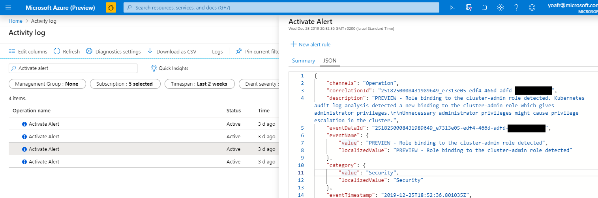

# Security Alerts in Azure Activity log

Azure Security Center audits generated Security alerts as events in [Azure Activity Log](https://docs.microsoft.com/azure/azure-monitor/platform/activity-log-view).

You can easily view the security alerts events in Activity log by searching for the *Activate Alert* event:



The JSON schema of the Activity log event is available in the included [ActivityLogAlert.schema.json](./ActivityLogAlert.schema.json) file. Below is a sample JSON of an Activity Log record for a Security Alert:

```
{
    "channels": "Operation",
    "correlationId": "2518250008431989649_e7313e05-edf4-466d-adfd-35974921aeff",
    "description": "PREVIEW - Role binding to the cluster-admin role detected. Kubernetes audit log analysis detected a new binding to the cluster-admin role which gives administrator privileges.\r\nUnnecessary administrator privileges might cause privilege escalation in the cluster.",
    "eventDataId": "2518250008431989649_e7313e05-edf4-466d-adfd-35974921aeff",
    "eventName": {
        "value": "PREVIEW - Role binding to the cluster-admin role detected",
        "localizedValue": "PREVIEW - Role binding to the cluster-admin role detected"
    },
    "category": {
        "value": "Security",
        "localizedValue": "Security"
    },
    "eventTimestamp": "2019-12-25T18:52:36.801035Z",
    "id": "/subscriptions/SUBSCRIPTION_ID/resourceGroups/RESOURCE_GROUP_NAME/providers/Microsoft.Security/locations/centralus/alerts/2518250008431989649_e7313e05-edf4-466d-adfd-35974921aeff/events/2518250008431989649_e7313e05-edf4-466d-adfd-35974921aeff/ticks/637128967568010350",
    "level": "Informational",
    "operationId": "2518250008431989649_e7313e05-edf4-466d-adfd-35974921aeff",
    "operationName": {
        "value": "Microsoft.Security/locations/alerts/activate/action",
        "localizedValue": "Activate Alert"
    },
    "resourceGroupName": "RESOURCE_GROUP_NAME",
    "resourceProviderName": {
        "value": "Microsoft.Security",
        "localizedValue": "Microsoft.Security"
    },
    "resourceType": {
        "value": "Microsoft.Security/locations/alerts",
        "localizedValue": "Microsoft.Security/locations/alerts"
    },
    "resourceId": "/subscriptions/SUBSCRIPTION_ID/resourceGroups/RESOURCE_GROUP_NAME/providers/Microsoft.Security/locations/centralus/alerts/2518250008431989649_e7313e05-edf4-466d-adfd-35974921aeff",
    "status": {
        "value": "Active",
        "localizedValue": "Active"
    },
    "subStatus": {
        "value": "",
        "localizedValue": ""
    },
    "submissionTimestamp": "2019-12-25T19:14:03.5507487Z",
    "subscriptionId": "SUBSCRIPTION_ID",
    "properties": {
        "clusterRoleBindingName": "cluster-admin-binding",
        "subjectName": "for-binding-test",
        "subjectKind": "ServiceAccount",
        "username": "masterclient",
        "actionTaken": "Detected",
        "resourceType": "Kubernetes Service",
        "severity": "Low",
        "intent": "[\"Persistence\"]",
        "compromisedEntity": "ASC-IGNITE-DEMO",
        "remediationSteps": "[\"Review the user in the alert details. If cluster-admin is unnecessary for this user, consider granting lower privileges to the user.\"]",
        "attackedResourceType": "Kubernetes Service"
    },
    "relatedEvents": []
}
```

The data model of the schema is as follows:
- channels: Constant, "Operation"
- correlationId: The Azure Security Center alert ID
- description: Description of the alert
- eventDataId: See *correlationId*
- eventName: The *value* and *localizedValue* sub-fields contain the alert display name
- category: The *value* and *localizedValue* sub-fields are constant - "Security"
- eventTimestamp: UTC timestamp for when the alert was generated
- id: The fully qualified alert ID
- level: Constant, "Informational"
- operationId: See *correlationId*
- operationName: The *value* field is constant - "Microsoft.Security/locations/alerts/activate/action", and the localized value will be "Activate Alert" (can potentially be localized par the user locale)
- resourceGroupName: Will include the resource group name
- resourceProviderName: The *value* and *localizedValue* sub-fields are constant - "Microsoft.Security"
- resourceType: The *value* and *localizedValue* sub-fields are constant - "Microsoft.Security/locations/alerts"
- resourceId: The fully qualified Azure resource ID
- status: The *value* and *localizedValue* sub-fields are constant - "Active"
- subStatus: The *value* and *localizedValue* sub-fields are empty
- submissionTimestamp: The UTC timestamp of event submission to Activity Log
- subscriptionId: The subscription ID of the compromised resource
- properties: A JSON bag of additional properties pertaining to the alert. These can change from one alert to the other, however, the following fields will appear in all alerts:

  severity: The severity of the attack
  
  compromisedEntity: The name of the comrpomised resource
  
  remediationSteps: Array of remediation steps to be taken
  
  intent: The kill-chain intent of the alert. Possible intents are documented [here](https://github.com/Azure/Azure-Security-Center/tree/master/Powershell%20scripts/Workflow%20automation%20and%20export%20data%20types%20schemas#kill-chain-intent)
  
- relatedEvents: Constnt - empty array
