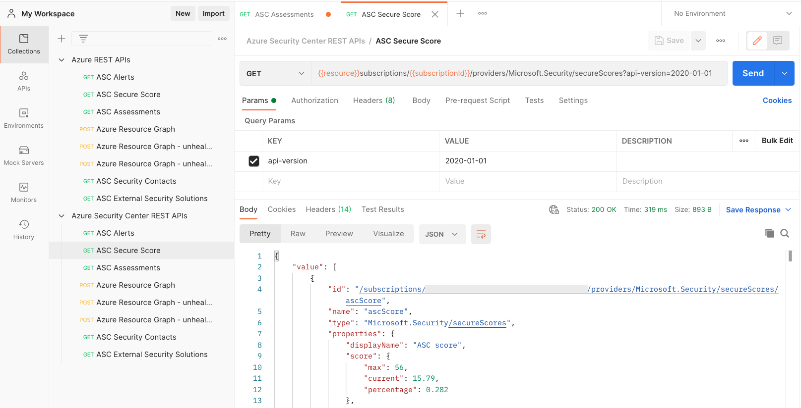

# Azure Security Center REST API samples

Azure Security Center data is accessible not only via Azure Portal, PowerShell, and Azure CLI, but also directly from a variety of REST API operations groups. This folder contains a Postman collection for direct access to several APIs related to Azure Security Center.

## Prepare Postman

In order to use the shared Postman collection, follow these steps:

1. Install [Postman](https://www.postman.com/).
2. Copy this link (https://www.getpostman.com/collections/ddfae8eabfac6a0eb427) and import it as a new Postman collection in your Workspace.
3. Follow the steps outlined in our [Azure REST API documentation](https://docs.microsoft.com/en-us/rest/api/azure/#how-to-call-azure-rest-apis-with-postman) to authenticate Postman against Azure AD.
4. Have fun!

