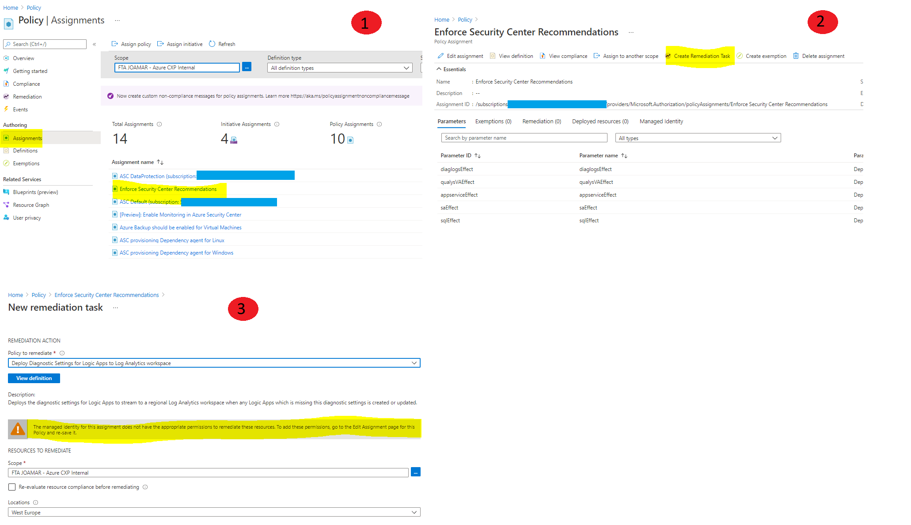
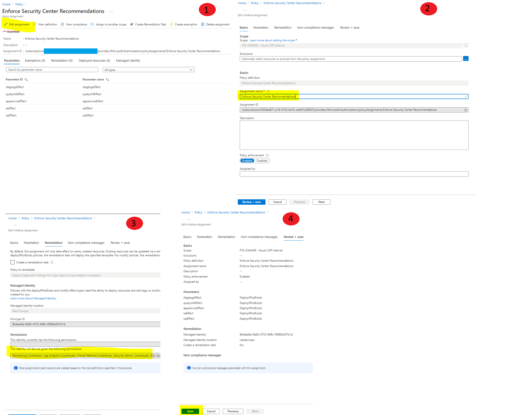

# Security Center Remediation Policies

When you enable Security Center, you get a group os built-in policies assign to your subscription under the Security Center category. The built-in initiative is automatically assigned, regardless of whether you have Azure Defender enabled. This initiative contains only Audit policies. The templates that you find here serve to [enforce those policies](https://docs.microsoft.com/en-us/azure/governance/policy/how-to/remediate-resources#create-a-remediation-task-through-portal), rather then just audit. Through these templates we will create an initiative in your environment with [DeployIfNotExists](https://docs.microsoft.com/en-us/azure/governance/policy/concepts/effects#deployifnotexists) policies that will automatically remmediate some of the recommendations from Azure Security Center.

 

  

Instead of manually remmediate the recommendations after the fact, through these *DeployIfNotExists* policies the remmediation will happen automatically, about 15 minutes after the resource gets created or updated.

There is no ‘one size fits all’ approach to security governance. The approach you eventually adopt will vary. So, we give you the option to select which policies you want to assign. When you are deploying the template, you can select *yes* or *no* according to if you want to assign a specific policy, or not.

If you change your mind after the deployment, you just need to edit the initiative assignment and change the paramenter of that policy.

The current version of the initiative has the following policies: 
| Policy |
| ------ |
| Configure machines to receive the Qualys vulnerability assessment agent |
| Enforce https access for App Services |
| Enforce secure transfer to storage account |
| Deploy Advanced Data Security on SQL servers | 
| Deploy Diagnostic Settings for Logic Apps to Log Analytics workspace | 
| Deploy Diagnostic Settings for Service Bus to Log Analytics workspace | 
| Deploy Diagnostic Settings for Event Hub to Log Analytics workspace | 
| Deploy Diagnostic Settings for Key Vault to Log Analytics workspace | 

 
  
  
 
# Post-Deployment Operations

After you deploy the templates, if you go to *Policy Assignment* -> *Remediation Tasks* you may see this issue:
 

  

 
 

The *DeployIfNotExists* policy requires a managed identity, and through the ARM template we cannot define the right roles for the managed identity. So, you need to **edit the assignment**, without having to change anything, just to give the right roles for the managed identity to perform the remediation tasks.
 

  

 
 

With that he new resources that you deploy will automatically be remediated by the policies. For the existing resources, you will need to [manually create a remediation task](https://docs.microsoft.com/en-us/azure/governance/policy/how-to/remediate-resources#create-a-remediation-task-through-portal).
 
 
# Questions
You can submit any questions or requests [here](https://github.com/Azure/Azure-Security-Center/issues). Please also refer to our [Wiki](https://github.com/Azure/Azure-Security-Center/wiki#resources), as it will provide you with further information.
 
 
# Contributing

This project welcomes contributions and suggestions.  Most contributions require you to agree to a
Contributor License Agreement (CLA) declaring that you have the right to, and actually do, grant us
the rights to use your contribution. For details, visit https://cla.microsoft.com.

When you submit a pull request, a CLA-bot will automatically determine whether you need to provide
a CLA and decorate the PR appropriately (e.g., label, comment). Simply follow the instructions
provided by the bot. You will only need to do this once across all repos using our CLA.

This project has adopted the [Microsoft Open Source Code of Conduct](https://opensource.microsoft.com/codeofconduct/).
For more information see the [Code of Conduct FAQ](https://opensource.microsoft.com/codeofconduct/faq/) or
contact [opencode@microsoft.com](mailto:opencode@microsoft.com) with any additional questions or comments.
