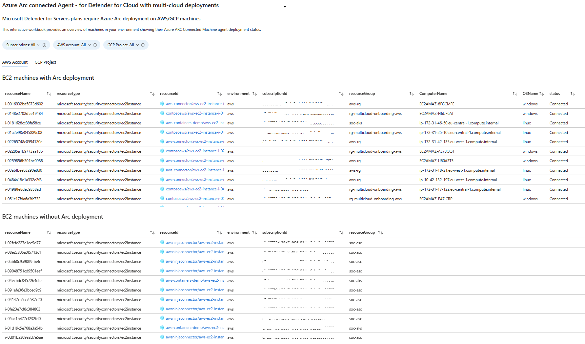

# Microsoft Defender for Servers - Arc deployment on AWS/GCP machines

**Author: Inbal Silis**

Microsoft Defender for Servers plans require Azure Arc deployment on AWS/GCP machines. This interactive workbook provides an overview of machines in your environment showing their Azure Arc Connected Machine agent deployment status.

There are 2 tabs:
*  AWS Account
*  GCP Project

Both of them will present lists:

*  first list - shows machines with Azure Arc Connected Machine agent and the status of the Agent
*  second list - shows machines without Azure Arc Connected Machine agent

Workbook overview:

## Try on Portal
You can deploy the workbook by clicking on the buttons below:

