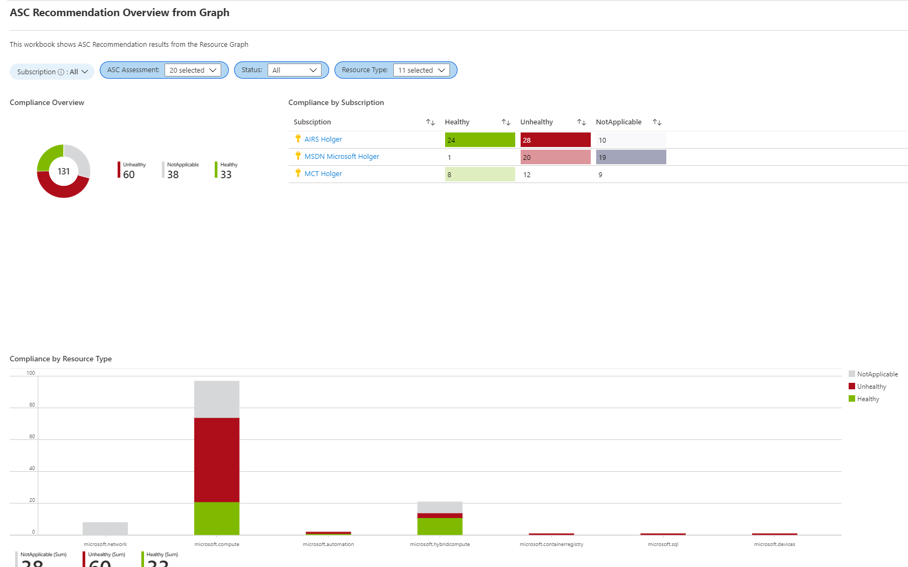

# ASC Recommendations Graph

This workbook displays the Azure Security Center recommendations. A filter set in subscription, available recommendations, resource type and state is possible

## Try on Portal
You can deploy the workbook by clicking on the buttons below:

##

