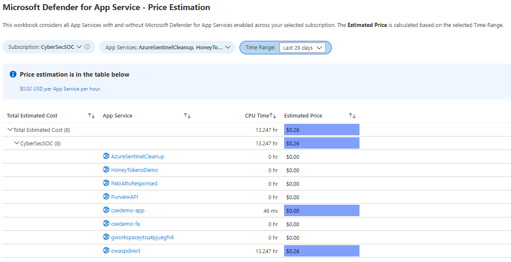

# Microsoft Defender for App Service - Price Estimation Dashboard based on Time Range

This workbook considers all App Services with and without Microsoft Defender for App Services enabled across your selected subscription. The **Estimated Price** is based on the selected Time Range.

## Try it on the Azure Portal
You can deploy the workbook by clicking on the buttons below:

## Overview Tab

Columns:
- **Subscription** 
- **App Services**
- **CPU Time:** metric retrieved based on the Time Range selection and displayed in minutes & hours
- **Estimated Price:** total of CPU Time hours running the App Service within the selected time range and multiplied by 0.02. This doesn't consider discounts. [Price reference](https://azure.microsoft.com/en-us/pricing/details/azure-defender/)

> **Credits:** [Sarah Wendel](https://www.linkedin.com/in/sarahwendel/)
