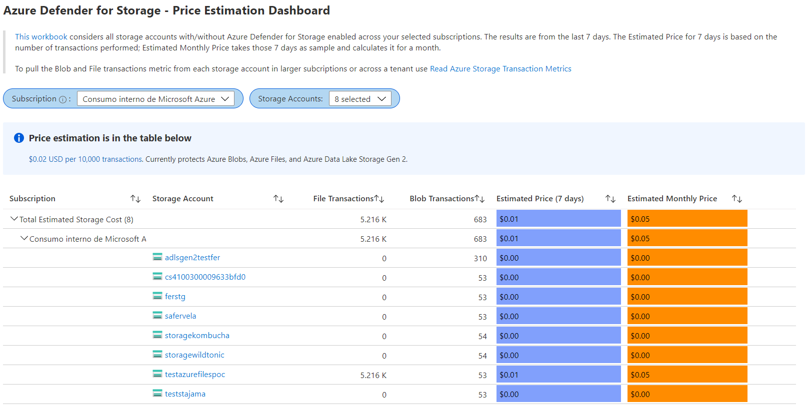

# ASC Defender for Storage - Price Estimation Dashboard 1.0
Azure Defender for Storage currently supports and monitors transactions for Azure Blobs, Azure files, and Azure Data Lake Storage Gen 2. [Learn more here.](https://docs.microsoft.com/en-us/azure/security-center/defender-for-storage-introduction)

[This workbook](https://techcommunity.microsoft.com/t5/azure-security-center/azure-defender-for-storage-price-estimation-dashboard/ba-p/2429724) considers all storage accounts with and without Azure Defender for Storage enabled across your selected subscription. The results are from within the last 7 days. 
- The **Estimated Price for 7 days** is based on the number of transactions performed within that period
- The **Estimated Monthly Price** takes those 7 days as sample and calculates it for a month

> Important!! To pull Blob and File transactions metric from each storage account in larger subscriptions or across a tenant use the PowerShell script [Read Azure Storage Transaction Metrics](https://github.com/Azure/Azure-Security-Center/tree/main/Powershell%20scripts/Read%20Azure%20Storage%20Transaction%20Metrics)

## Try it on the Azure Portal
Learn more about the workbook in [this blog post](https://techcommunity.microsoft.com/t5/azure-security-center/azure-defender-for-storage-price-estimation-dashboard/ba-p/2429724). You can deploy the workbook by clicking on the buttons below:

## Overview Tab

Columns:
- **Subscription** 
- **Storage Account**
- **File Transactions:** metric retrieved from the latest 7 day period
- **Blob Transactions:** metric retrieved from the latest 7 day period
- **Estimated Price (7 days):** total of Blob Transactions of the latest 7 day period plus total File Transactions of the latest 7 day period, divided by 1K and multiplied by 0.02. This doesn't consider discounts. [Price reference](https://azure.microsoft.com/en-us/pricing/details/azure-defender/)
- **Estimated Monthly Price:** total of Blob Transactions of the latest 7 day period plus total File Transactions of the latest 7 day period, divided by the TimeRange, multiplied by 30. The result is divided by 1K and multiplied by 0.02. This doesn't consider discounts. [Price reference](https://azure.microsoft.com/en-us/pricing/details/azure-defender/)

## Known Issues
- Azure Monitor Metrics data backends have limits and probably the number of requests to fetch data across Storage Accounts might time out. To solve this you will need to narrow the scope (reduce the selected Storage Accounts). 
- Errors might reflect by showing 0 transactions in Files and Blobs. To verify this error, go to Edit Mode and the "Timed out" message will be displayed in the query. 

> **Credits:** [Rogério Barros](https://www.linkedin.com/in/rogeriotbarros/), [Hasan Abo-Shally](https://www.linkedin.com/in/hasanaboshally/), [Fernanda Vela](https://www.linkedin.com/in/mfvelah/)
