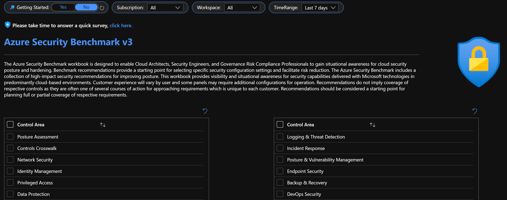
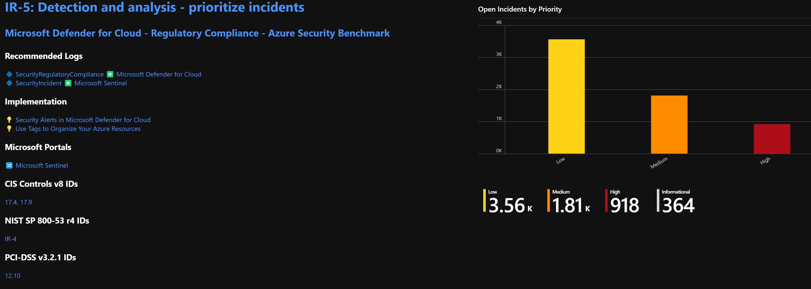

# Overview
---
## Microsoft Defender for Cloud: Azure Security Benchmark v3 Workbook
The Azure Security Benchmark workbook is designed to enable Cloud Architects, Security Engineers, and Governance Risk Compliance Professionals to gain situational awareness for cloud security posture and hardening. Benchmark recommendations provide a starting point for selecting specific security configuration settings and facilitate risk reduction. The Azure Security Benchmark includes a collection of high-impact security recommendations for improving posture. This workbook provides visibility and situational awareness for security capabilities delivered with Microsoft technologies in predominantly cloud-based environments. Customer experience will vary by user and some panels may require additional configurations for operation. Recommendations do not imply coverage of respective controls as they are often one of several courses of action for approaching requirements which is unique to each customer. Recommendations should be considered a starting point for planning full or partial coverage of respective requirements.

## Try on Portal
You can deploy the workbook by clicking on the buttons below:

## Getting Started
This workbook leverages Azure Policy, Azure Resource Graph, and Azure Log Analytics to align directly with the Azure Security Benchmark. A filter set in guide, subscription, workspace, time, and ASB control are available for customized reporting and review. The documentation below provides getting started recommendations for centralizing log analytics data and enabling Microsoft Defender for Cloud Continuous Export. This offering There is telemetry from 25+ Microsoft Security products included in this offering. Common use cases include conducting ASB assessments which custom reporting, time filtering, subscription filtering, workspace filtering, and guides. The report is exportable for print or PDF with the Print Workbook feature. The workbook is organized by ASB control areas, each area has multiple control cards. Control cards include ASB logging over time, current ASB assessment recommendations, ASB status, documentation guides, recommendations, and links to product pages, documentation, and portals for all referenced products. 

### [Recommended Microsoft Sentinel Roles](https://docs.microsoft.com/azure/sentinel/roles) / [Recommended Microsoft Defender for Cloud Roles](https://docs.microsoft.com/azure/defender-for-cloud/permissions#roles-and-allowed-actions)
| <strong> Roles </strong> | <strong> Rights </strong> | 
|:--|:--|
|Security Reader | View Workbooks, Analytics, Security Recommendations |
|Security Contributor| Deploy/Modify Workbooks, Analytics, Apply Security Recommendations |
|Owner| Assign Regulatory Compliance Initiatives|

1️⃣ [Add the Azure Security Benchmark Assessment to Your Dashboard](https://docs.microsoft.com/azure/security-center/update-regulatory-compliance-packages#add-a-regulatory-standard-to-your-dashboard) 
2️⃣ [Continuously Export Microsoft Defender for Cloud Data: SecurityRegulatoryCompliance & SecurityRecommendation Data Tables](https://docs.microsoft.com/azure/security-center/continuous-export) 
3️⃣ [Onboard Microsoft Sentinel](https://docs.microsoft.com/azure/sentinel/quickstart-onboard) 
4️⃣ [Connect Microsoft Sentinel to Azure, Windows, Microsoft, and Amazon services](https://docs.microsoft.com/azure/sentinel/connect-azure-windows-microsoft-services) 

### Feedback
<svg viewBox="0 0 19 19" width="20" class="fxt-escapeShadow" role="presentation" focusable="false" xmlns:svg="http://www.w3.org/2000/svg" xmlns:xlink="http://www.w3.org/1999/xlink" aria-hidden="true"><g><path fill="#1b93eb" d="M16.82 8.886c0 4.81-5.752 8.574-7.006 9.411a.477.477 0 01-.523 0C8.036 17.565 2.18 13.7 2.18 8.886V3.135a.451.451 0 01.42-.419C7.2 2.612 6.154.625 9.5.625s2.3 1.987 6.8 2.091a.479.479 0 01.523.419z"></path><path fill="url(#0024423711759027356)" d="M16.192 8.99c0 4.392-5.333 7.947-6.483 8.575a.319.319 0 01-.418 0c-1.15-.732-6.483-4.183-6.483-8.575V3.762a.575.575 0 01.313-.523C7.2 3.135 6.258 1.357 9.4 1.357s2.2 1.882 6.274 1.882a.45.45 0 01.419.418z"></path><path d="M9.219 5.378a.313.313 0 01.562 0l.875 1.772a.314.314 0 00.236.172l1.957.284a.314.314 0 01.174.535l-1.416 1.38a.312.312 0 00-.09.278l.334 1.949a.313.313 0 01-.455.33l-1.75-.92a.314.314 0 00-.292 0l-1.75.92a.313.313 0 01-.455-.33L7.483 9.8a.312.312 0 00-.09-.278L5.977 8.141a.314.314 0 01.174-.535l1.957-.284a.314.314 0 00.236-.172z" class="msportalfx-svg-c01"></path></g></svg>&nbsp; Please take time to answer a quick survey,
[ click here. ](https://forms.office.com/r/sxvBsuTcmM)

## Disclaimer
This workbook demonstrates best practice guidance, but Microsoft does not guarantee nor imply compliance. All requirements, validations, and controls are governed by respective organizations. This solution provides visibility and situational awareness for security capabilities delivered with Microsoft technologies in predominantly cloud-based environments. Customer experience will vary by user and some panels may require additional configurations for operation. Recommendations do not imply coverage of respective controls as they are often one of several courses of action for approaching requirements which is unique to each customer. Recommendations should be considered a starting point for planning full or partial coverage of respective requirements. 