# Deployment Guide
## For the successful deployment of the dashboard, Azure Defender should be enabled for the subscription and targeted workspace. Continuous export should be enabled too. Below is the stepwise guide along with snapshots.
 
### 1.	Configure subscription settings:
        1.Head to Management -> Pricing & Settings in the left panel. Select required targeted workspace
   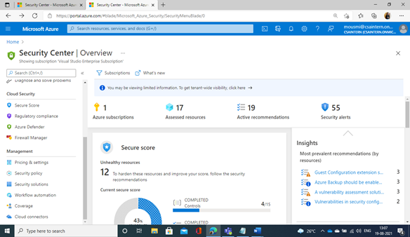    
       2.Select required subscription
   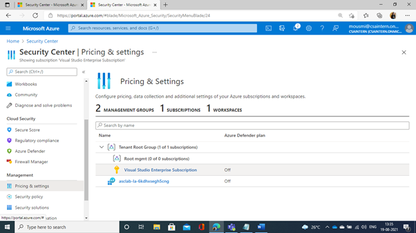  
   
      3.Enable azure defender and save
   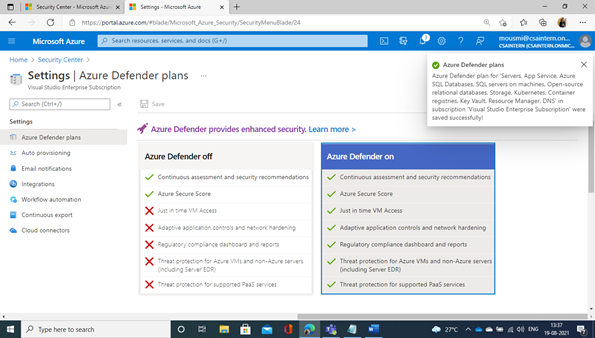  
   
      4.Select “Auto provisioning”  from the left panel. Click “Edit configuration” in “Log Analytics agent Azure VMs"
     
   
      5.Select the required target workspace -> Apply -> Save
   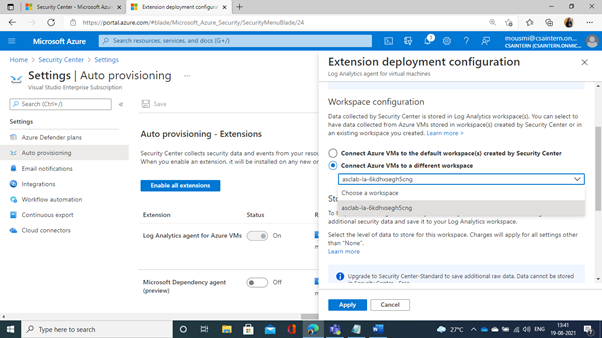  
   
      6.Select “Continuous Export”  from the left panel and head to “Log Analytics workspace” tab
   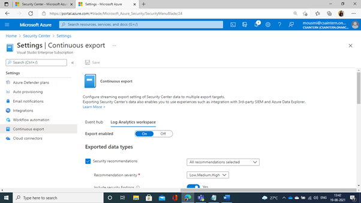  
   
      7.Enable “Export enabled”. Check all the boxes under this tab. Also select the required targeted resource group, workspace and subscription. Click Save
   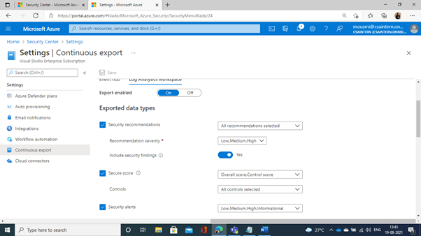  
   
   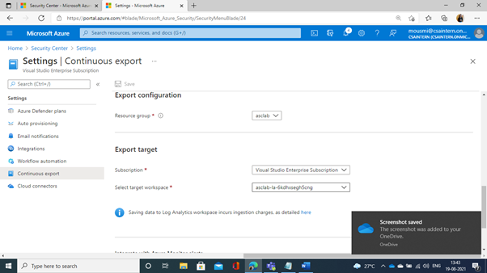  
   
### 2.	Configure targeted workspace settings:
        1.Head to Management -> Pricing & Settings in the left panel. Select required targeted workspace
   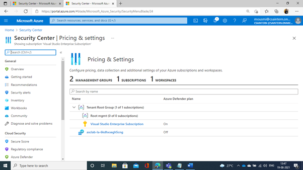  
   
        2.Enable Azure Defender and save
   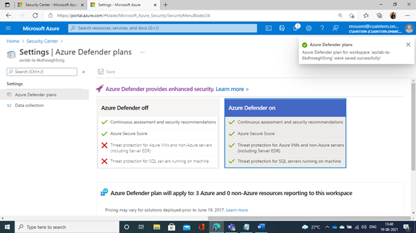  
   
        3.Select “Data collection” from the left panel. Select “All events” and Save
   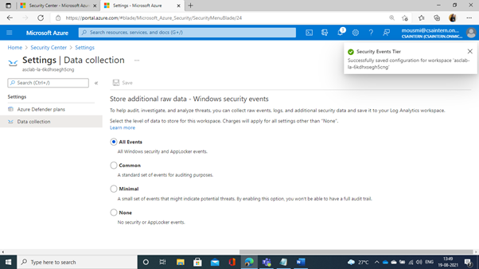  
   
        The pricing and settings tab should look like this now:
     
        
## The environment is finally set for the deployment of the dashboard.

## Snapshots of Dashboard
        1.Overview Tab:
                a.Total resources
                b.Current score
                c.Max score
                d.Percentage secure score
                e.Total recommendations
                f.Total active security alerts
                g.Total unhealthy resources
                h.Current secure score over time
                i.Percentage secure score over time
    
    
    
   
        2.Recommendations Tab:
                a.Total number of recommendations
                b.Total number of affected resources
                c.Resource health per secure control
                Filters: Severity, Health state, Resource name, Recommendations
                d.Count of recommendations
                e.Count of affected resources
                f.Number of resources affected under a recommendation
                g.Recommendations with remediation steps
          
   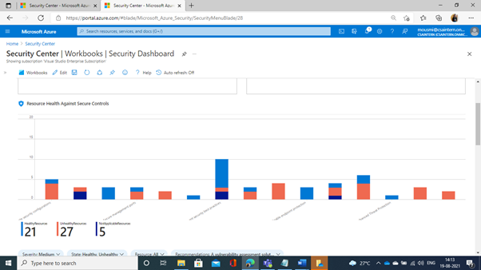 
   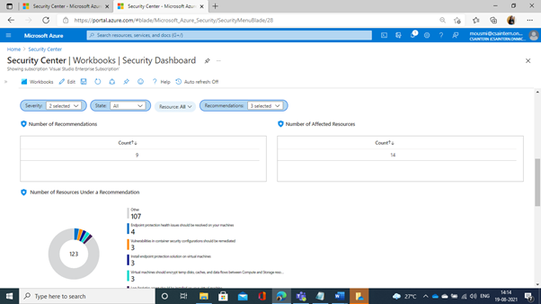 
    
   
        3.Compliance Tab:
                a.Compliance standards for a subscription
                b.Total compliance assessments
                c.Total affected resources
                d.Compliance state per compliance standard (passed, failed, skipped number of controls)
                Filters: Standards, Severity, Resource name, Compliance state, Health state
                e.Count of assessments
                f.Count of affected resources
                g.Control name with remediation steps and recommendation description (a/c filters)
       
    
   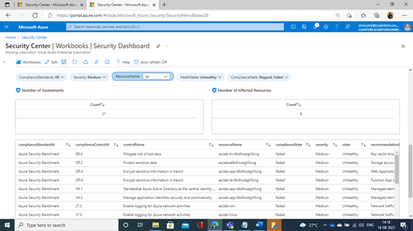 
   
        4.Alerts Tab:
                a.Total number of security active alerts
                b.Total number of affected resources
                Filters: Severity, Resource Name
                c.Count of active security alerts
                d.Count of affected resources
                e.Security alerts with remediation steps
          
    
   
         5.Vulnerabilities Assessments Tab
                a.Unhealthy machines count
                b.Unhealthy containers count
                c.Unhealthy SQL count
                d.Machine vulnerabilities
                e.Container vulnerabilities
                f.SQL vulnerabilities
        
    
   
        6.System Updates Tab
                a.Resource health under system updates
                b.Count of unhealthy machines under system updates
                c.Count of missing system updates by severity 
                Filters: Severity
                d.List of missing system updates with remediation steps
         
   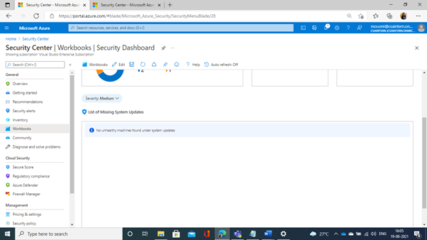 
