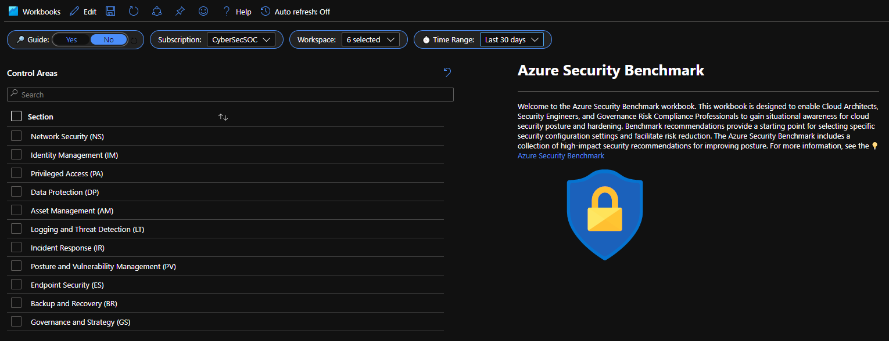
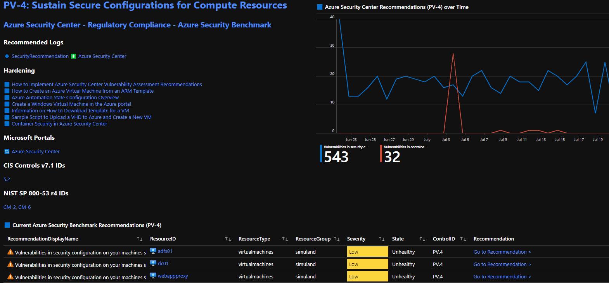

# Azure Security Benchmark Workbook

This workbook displays the Azure Security Benchmark. This offering leverages Azure Policy, Azure Resource Graph, and Azure Log Analytics to align directly with the Azure Security Benchmark. There is telemetry from 25+ Microsoft Security products included in this offering. Common use cases include conducting ASB assessments which custom reporting, time filtering, subscription filtering, workspace filtering, and guides. The report is exportable for print or PDF with the Print Workbook feature. The workbook is organized by ASB control families, each family has multiple control cards. Control cards include ASB logging over time, current ASB assessment recommendations, ASB status, documentation guides, recommendations, and links to product pages, documentation, and portals for all referenced products. We look forward to working with the community on this offering and feel free to submit comments for feedback, thank you!

A filter set in guide, subscription, workspace, time, ASB control family, and ASB control is available for customized reporting and review.

## Try on Portal
You can deploy the workbook by clicking on the buttons below:

## Getting Started
1.	[Add the Azure Security Benchmark Assessment to Your Dashboard](https://docs.microsoft.com/azure/security-center/update-regulatory-compliance-packages#add-a-regulatory-standard-to-your-dashboard) 
2.	[Continuously Export Security Center Data: SecurityRegulatoryCompliance & SecurityRecommendation Data Tables](https://docs.microsoft.com/azure/security-center/continuous-export) 
3.	[Onboard Azure Sentinel](https://docs.microsoft.com/azure/sentinel/quickstart-onboard) 
4.	[Extend Azure Sentinel Across Workspaces and Tenants](https://docs.microsoft.com/azure/sentinel/extend-sentinel-across-workspaces-tenants) 

## Feedback 
Please share your feedback, specifically in the areas below. You can submit your feedback via the [ASB Workbook Feedback Portal](https://forms.office.com/Pages/ResponsePage.aspx?id=v4j5cvGGr0GRqy180BHbR2S7iBSzt7xHgt8hpEjayo1UMlQ0U0JQT1dZQkk0WThJTEVHV1RBNTcxSi4u)
1.	How do you see your organization using the ASB Workbook? 
        a.	Gathering evidence data for controls assessments 
        b.	Hardening cloud workloads and evaluating protection posture 
        c.	Support compliance reporting requirements with auditors/regulators 
        d.	Reporting cloud security metrics for leadership 
        e.	Identify control gaps and security weaknesses 
        f.	Track security incidents and alerting 
        g.	Navigate Microsoft security offerings/tools from a single interface 
2.	Are there any panels which are not operational or working properly during your preview?
3.	Do you feel any control areas or queries are missing from this workbook?
a.	Which control areas or queries do you feel are missing?
4.	Does this best practice guide align with the expectations of ASB?
5.	Do you feel this workbook will save your organization in designing/engineering/operating cloud workloads?
6.	Are there areas we can expand upon to improve this Workbook for both your organization and the information security community?