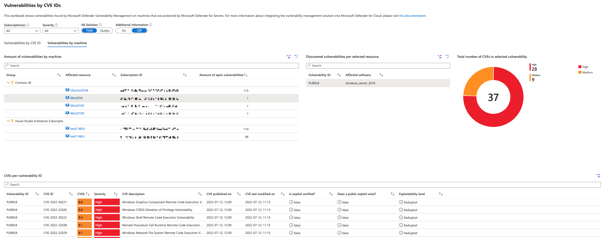

# Microsoft Defender for Servers - CVE Dashboard

| Version | Description | Author | Date |
| ------ | ------ | ------ | ------ |
| 1.0 | Initial release | [Tom Janetscheck](https://github.com/tomjanetscheck)| 8/15/2022 |
| 1.1 | Adding support for EC2 instances and agentless VA scanning | [Tom Janetscheck](https://github.com/tomjanetscheck) | 2/3/2023 |

This interactive workbook provides an overview of machines in your environment that are affected by open vulnerabilities with a focus on CVE IDs. It will show vulnerability findings for either Microsoft Defender Vulnerability Management, or the integrated Qualys VA scanner.

Tab 1 provides an overview about the total amount and details of CVE IDs found in your environment. When selecting one ID from the table, you will be presented with a list of affected machines and software by CVE ID.

Tab 2 has a slightly different focus and will present you with a list of machines that have active vulnerabilities. When selecting a machine from the list, you will see all vulnerabilities that have been detected. Then, when selecting a particular vulnerability, you will see all CVEs that are associated with this vulnerability, including more detailed information.

## Try it on the Azure Portal

You can deploy the workbook by clicking on the buttons below:

