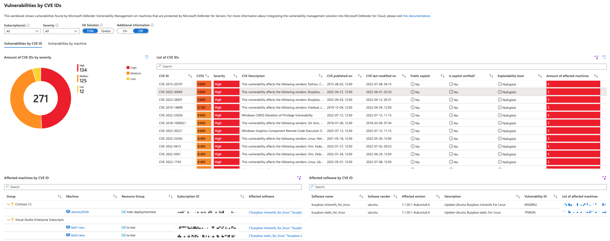
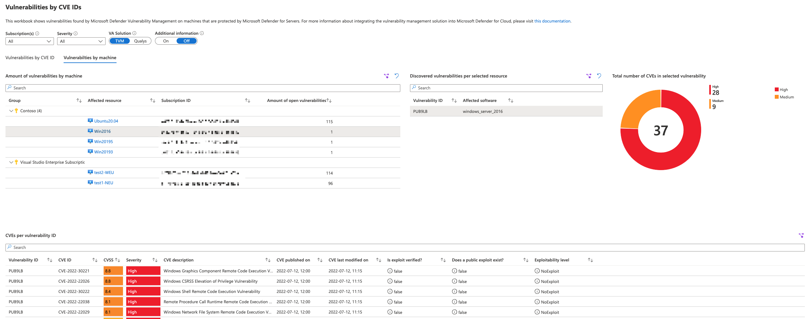

# Microsoft Defender for Servers - CVE Dashboard for Servers

| Version | Description | Author | Date |
| ------ | ------ | ------ | ------ |
| 1.0 | Initial release | [Tom Janetscheck](https://github.com/tomjanetscheck) | 8/15/2022 |
| 1.1 | Adding support for EC2 instances and agentless VA scanning | [Tom Janetscheck](https://github.com/tomjanetscheck) | 2/3/2023 |
| 1.2 | Adding table for total CVEs per machine | [Tom Janetscheck](https://github.com/tomjanetscheck) | 2/7/2023 |
| 1.3 | Updating query to combine MDVM findings from agent-based and agentless scanning | [Tom Janetscheck](https://github.com/tomjanetscheck) | 9/6/2023 |
| 1.4 | Query update to show multicloud resource names when using agentless VA scanning | [Tom Janetscheck](https://github.com/tomjanetscheck) | 4/9/2024 |
| 1.5 | Adding Qualys deprecation notice| [Tom Janetscheck](https://github.com/tomjanetscheck) | 5/6/2024 |
| 1.6 | Adding support for critical severity| [Tom Janetscheck](https://github.com/tomjanetscheck) | 6/10/2024 |
| 2.0 | Migrated from grouped sub-assessments to individual recommendations | Hisashi Nakada | 8/27/2026 |

This interactive workbook provides an overview of machines in your environment that are affected by open vulnerabilities, with a focus on CVE IDs. Version 2.0 uses the Microsoft Defender for Cloud individual recommendations model and shows vulnerability findings from Microsoft Defender Vulnerability Management.

## Individual recommendations support

Microsoft Defender for Cloud deprecated grouped recommendations, also known as sub-assessments, on July 31, 2026. Earlier versions of this workbook queried the `microsoft.security/assessments/subassessments` resource type and no longer return current vulnerability findings.

Version 2.0 queries individual recommendations from the `microsoft.security/assessments` resource type and filters on the `SoftwareUpdate` recommendation category. CVE identifiers are read from `properties.additionalData.CvesDetails`.

> [!NOTE]
> Additional CVE metadata is available from the `microsoft.security/cvedetails` resource type, but queries against that resource type must run at tenant scope. This workbook uses the selected subscription scope and therefore displays data available in the individual assessment payload.

For more information about the schema and query changes, see [Transition from grouped to individual recommendations in Defender for Cloud](https://learn.microsoft.com/azure/defender-for-cloud/transition-grouped-individual-recommendations).

Tab 1 provides an overview about the total amount and details of CVE IDs found in your environment. When selecting one ID from the table, you will be presented with a list of affected machines and software by CVE ID.

Tab 2 has a slightly different focus and will present you with a list of machines that have active vulnerabilities. When selecting a machine from the list, you will see all vulnerabilities that have been detected. Then, when selecting a particular vulnerability, you will see all CVEs that are associated with this vulnerability, including more detailed information.

## Try it on the Azure Portal

You can deploy the workbook by clicking on the button below:

