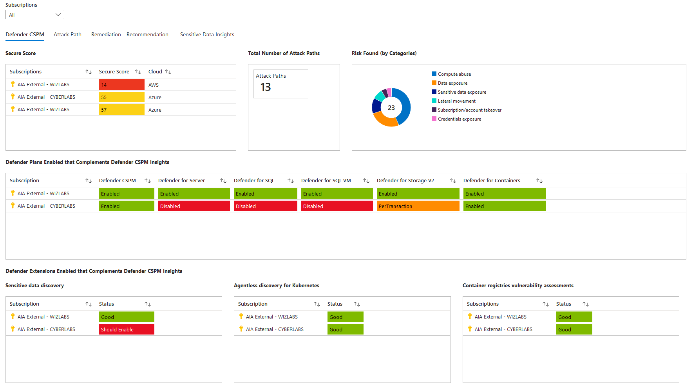

# Defender for Cloud - Defender CSPM Workbook
**Author: Giulio Astori**

The Azure Workbook for Defender CSPM Visualization is a dashboard designed to enhance the visualization and analysis of Defender for Cloud's Defender CSPM (Cloud Security Posture Management) information. This workbook provides a centralized and intuitive single pane of view within the Azure Portal, allowing users to easily access and crucial information related to Defender CSPM.

Defender CSPM capabilities are highly valuable for ensuring the security and compliance of cloud environments. However, the native Azure Portal lacks a consolidated view that offers users a holistic understanding of the Defender CSPM insights. We have developed the Azure Workbook for Defender CSPM Visualization to bridge the divide and empower users with an efficient and informative dashboard.

Key Features

- **Environment Secure Score Overview:** Gain a clear understanding of the overall security posture of your environment through a Secure Score overview.

- **Attack Paths and Insights:** Explore the number of attack paths identified within your cloud infrastructure and delve into related insights. Uncover potential vulnerabilities and take proactive measures to mitigate risks effectively.

- **Complementary Security Plans:** Get insights into additional security plans enabled in conjunction with Defender CSPM. Understand how these plans enhance your overall security posture and implement necessary measures accordingly.

- **Plan Extensions Status:** Keep track of the status of plan extensions, whether they are enabled or disabled. Ensure that all relevant security features are actively protecting your cloud resources.

- **Security Recommendations and Remediation:** Identify security recommendations provided by Defender CSPM and monitor their remediation status. Streamline the process of resolving security issues and enhancing your environment's overall security.

- **Sensitive Data Detection:** Get visibility into sensitive data identified within your cloud environment. Understand the scope of the data exposure and take appropriate measures to protect sensitive information.

## Try it on the Azure Portal

You can deploy the workbook by clicking on the buttons below:

