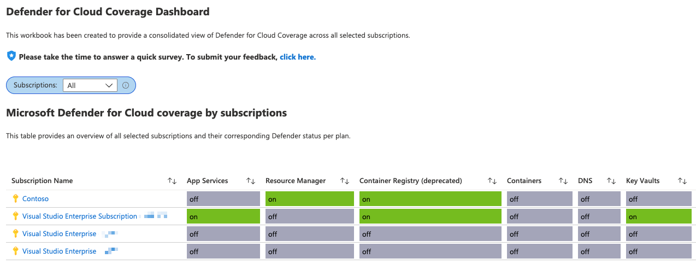

# Microsoft Defender for Cloud - Coverage Dashboard

**Author: Tom Janetscheck**

Microsoft Defender for Cloud plans are enabled per subscription what can make it hard to understand which plan is enabled on which subscription when you are not using policy enforcements.
This workbook provides a consolidated view of Defender for Cloud coverage across all selected subscriptions.

## Try it on the Azure Portal

You can deploy the workbook by clicking on the buttons below:

