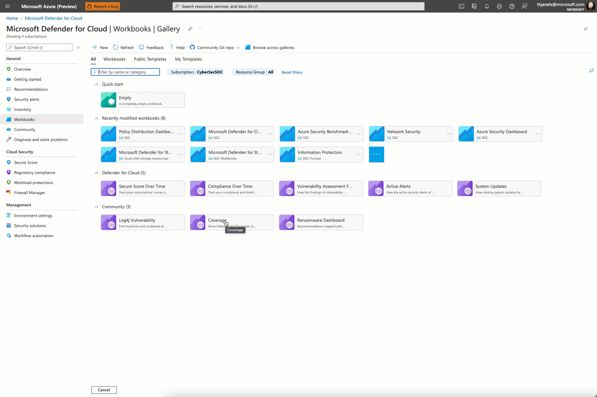

# Microsoft Defender for Cloud - Coverage Workbook

**Author: Tom Janetscheck**

Microsoft Defender for Cloud plans are enabled per subscription and per cloud connector on AWS and GCP, what can makes it hard to understand which plan is enabled on which environment. This workbook has been integrated into Defender for Cloud to provide a consolidated view of Defender for Cloud coverage across all selected subscriptions and multi-cloud connectors.

## Deprecation notice

This workbook template has been removed from the repository as it has been natively integrated into Microsoft Defender for Cloud's workbook gallery. To open this workbook, in Microsoft Defender for Cloud, just click the *Workbooks* option in the left navigation pane.
