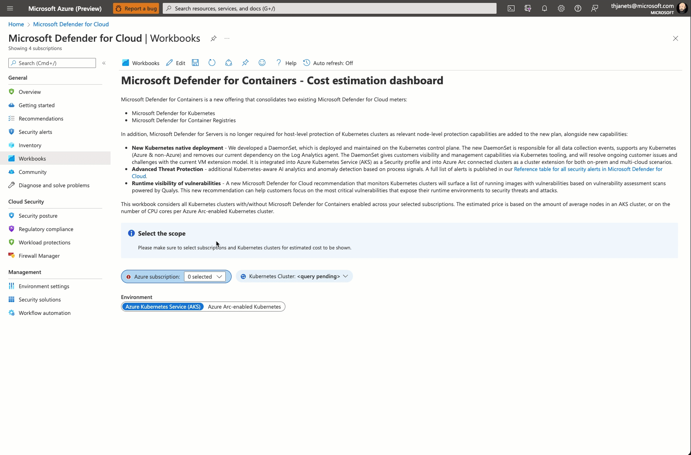

# Microsoft Defender for Containers - Cost Estimation Dashboard

**Author: Tom Janetscheck**

> ## Important note
>  
> We have released another Microsoft Defender for Cloud price estimation workbook that covers all of the following plans:
>
> * Microsoft Defender for App Services
> * Microsoft Defender for Containers
> * Microsoft Defender for Key Vaults
> * Microsoft Defender for Servers
> * Microsoft Defender for Storage
> * Microsoft Defender for Databases
>
> **You can find the new workbook [here](https://github.com/Azure/Microsoft-Defender-for-Cloud/tree/main/Workbooks/Microsoft%20Defender%20for%20Cloud%20Price%20Estimation)**.

Microsoft Defender for Containers is a new offering that consolidates two existing Microsoft Defender for Cloud meters:

* Microsoft Defender for Kubernetes
* Microsoft Defender for Container Registries

In addition, Microsoft Defender for Servers is no longer required for host-level protection of Kubernetes clusters as relevant node-level protection capabilities are added to the new plan, alongside new capabilities:

* **New Kubernetes native deployment** - We developed a DaemonSet, which is deployed and maintained on the Kubernetes control plane. The new DaemonSet is responsible for all data collection events, supports any Kubernetes (Azure & non-Azure) and removes our current dependency on the Log Analytics agent. The DaemonSet gives customers visibility and management capabilities via Kubernetes tooling, and will resolve ongoing customer issues and challenges with the current VM extension model. It is integrated into Azure Kubernetes Service (AKS) as a Security profile and into Azure Arc connected clusters as a cluster extension for both on-prem and multi-cloud scenarios.
* **Advanced Threat Protection** - additional Kubernetes-aware AI analytics and anomaly detection based on process signals. A full list of alerts is published in our [Reference table for all security alerts in Microsoft Defender for Cloud](https://docs.microsoft.com/azure/defender-for-cloud/alerts-reference?WT.mc_id=Portal-fx#alerts-k8scluster).
* **Runtime visibility of vulnerabilities** - A new Microsoft Defender for Cloud recommendation that monitors Kubernetes clusters will surface a list of running images with vulnerabilities based on vulnerability assessment scans powered by Qualys. This new recommendation can help customers focus on the most critical vulnerabilities that expose their runtime environments to security threats and attacks.

This workbook considers all Kubernetes clusters with/without Microsoft Defender for Containers enabled across your selected subscriptions. The estimated price is based on the amount of average nodes in an AKS cluster, or on the number of CPU cores per Azure Arc-enabled Kubernetes cluster.

## Try it on the Azure Portal

You can deploy the workbook by clicking on the buttons below:

## Acknowledgements
Special thanks to **Maya Herskovic**, **Nadav Wolfin** and **Tomer Weinberger** for providing feedback during the deployment process and reviewing the workbook.
