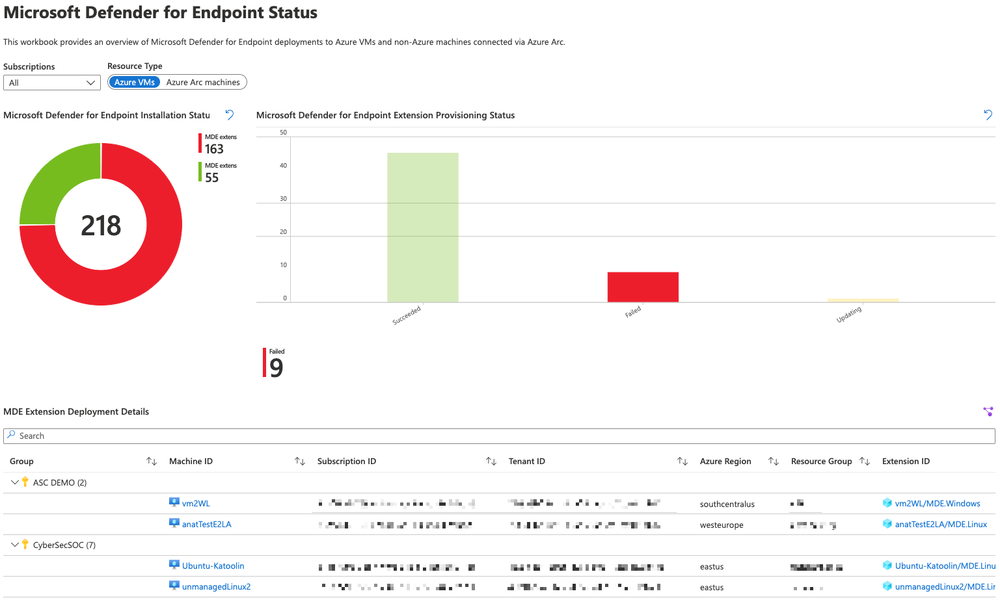

# Microsoft Defender for Servers - Defender for Endpoint Deployment Status

**Author: Tom Janetscheck**

Microsoft Defender for Servers plans offer integration with Microsoft Defender for Endpoint based on Virtual Machine and Azure Arc extensions. This interactive workbook provides an overview of machines in your environment showing their Microsoft Defender for Endpoint extension deployment status.

The pie chart on the upper left shows machines based on the deployment status (extension deployed, or missing). The table next to the pie chart shows the number of machines that have the extension deployed and their particular status (such as succeeded and failed).
When clicking one of these values, you will see all machines that apply to the status you selected.

You can use the toggle switch to see results for Azure VMs and non-Azure machines connected via Azure Arc-enabled servers.

## Try it on the Azure Portal

You can deploy the workbook by clicking on the buttons below:

