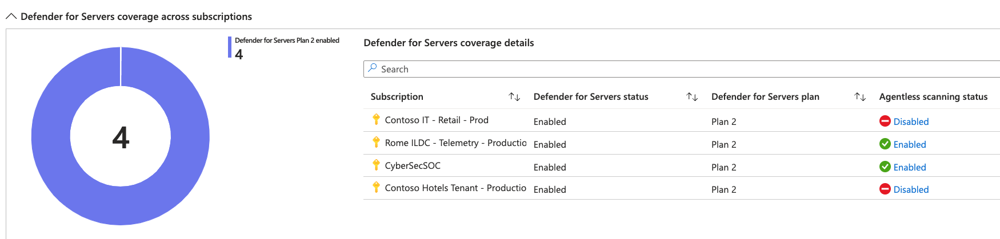
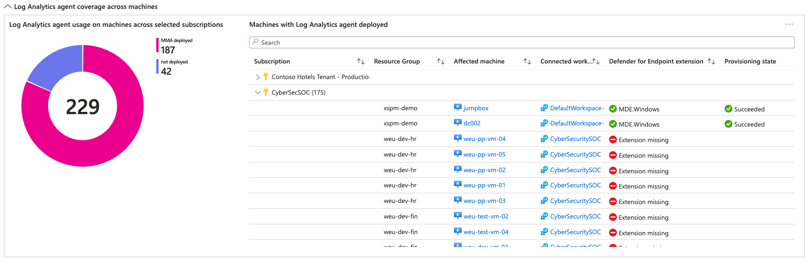
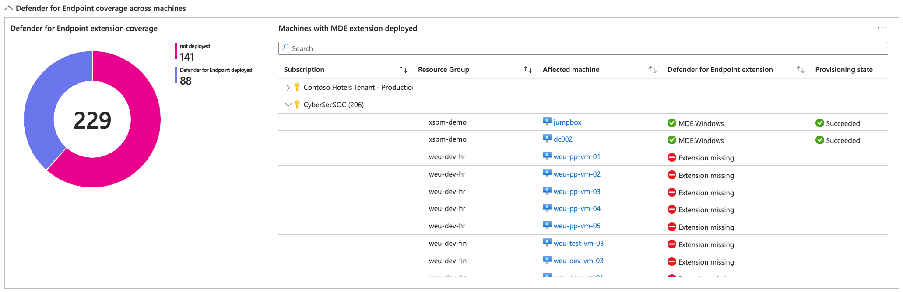
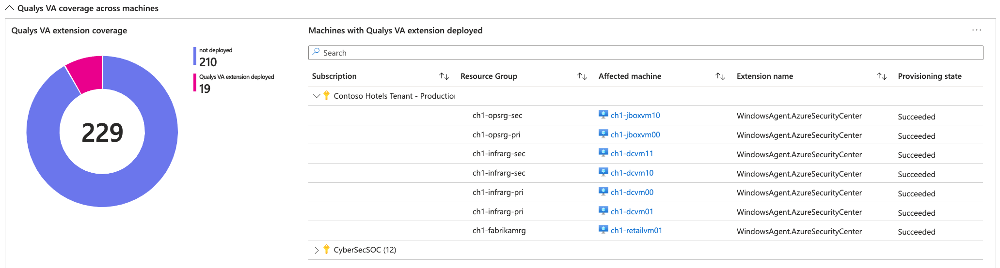

# Defender for Servers Deployment Status

| Version | Description | Author | Date |
| ------ | ------ | ------ | ------ |
| 1.0 | Initial release | [Tom Janetscheck](https://github.com/tomjanetscheck) | 2/9/2024 |

Log Analytics agent and the integrated Qualys vulnerability assessment solution in Defender for Servers Plan 2 will be deprecated by summer 2024. At the same time, we will provide updated server protection capabilities on top of agentless scanning and Microsoft Defender for Endpoint (MDE) as a single security agent. To be prepared for these upcoming changes, Defender for Servers customers should enable both, MDE integration and agentless scanning as part of their Defender for Servers deployments across multicloud environments. This workbook provides insights into the deployment status of agentless scanning, MDE, Qualys VA and Log Analytics agent. Please also see [this blog](https://techcommunity.microsoft.com/t5/microsoft-defender-for-cloud/prepare-for-upcoming-transitions-in-defender-for-servers/ba-p/4098135) for further reference.

**Section 1 - Defender for Servers coverage across subscriptions**  provides an overview of all subscriptions and their Defender for Servers status. In case Defender for Servers Plan 2 is enabled, it also shows if agentless scanning is active.

**Section 2 - Log Analytics agent coverage across machines** gives an overview of machines that still have the Log Analytics agent deployed. In the table, you see all affected machines including the Log Analytics workspace they are connected to, as well as the Defender for Endpoint deployment status.

**Section 3 - Defender for Endpoint coverage across machines** has a slightly different focus and will present you with a list of all machines with their Defender for Endpoint deployment status, regardless if they are still using Log Analytics agent.

**Section 4 - Qualys VA coverage across machines** shows all machines that have the Qualys VA extension deployed.

## Try it on the Azure Portal

You can deploy the workbook by clicking on the button below:

