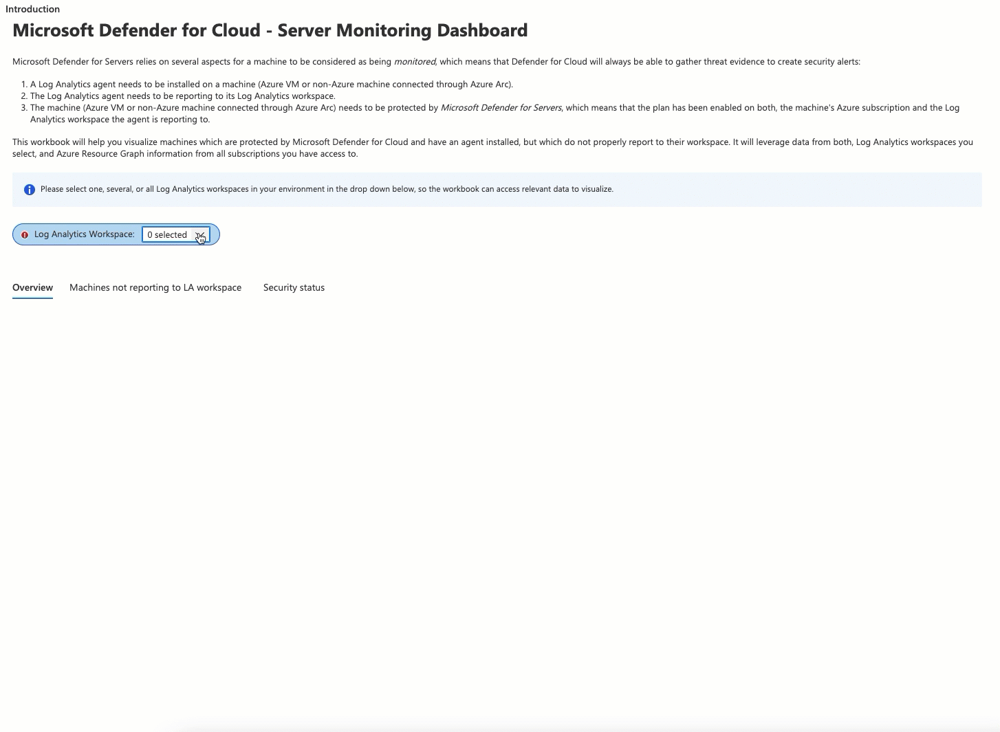

# Microsoft Defender for Servers monitoring dashboard

**Author: Tom Janetscheck**

The new Microsoft Defender for Servers monitoring dashboard is a presentation of all machines, Azure VMs and non-Azure machines (connected through Azure Arc), that are covered by Microsoft Defender for Cloud. Besides Defender for Cloud coverage and Log Analytics agent installation status, this custom workbook also considers if a machine is currently reporting (i.e. if it is connected and sending logs to its workspace).

## Try it on the Azure Portal

To deploy the new workbook into your Microsoft Defender for Cloud console, click on *Deploy to Azure* for Azure Public cloud or *Deploy to Azure Gov* for government cloud.
During the deployment, you must select a subscription and resource group to store the report. Once the workbook is successfully deployed, you can start using it in the Defender for Cloud console.

## Release notes
* Subscription filter added. This filter will be respected by all queries, so filtering by subscriptions will now allow you to focus only on workspaces and resources you are interested in.
* Tables will now additionally show Defender for Servers and Defender for SQL on machines coverage for Log Analytics workspaces
* Added additional information and context to all tabs
* Added a consolidated table showing machines that have not been reporting for more than 15 minutes
* Added VM power state to tables

## Acknowledgements
Special thanks to **Lior Arviv**, **Ortal Parpara**, **Shay Amar**, **Michael Makhlevich** and **Omer Abramovich** for reviewing the artifact and providing feedback during the deployment process.
