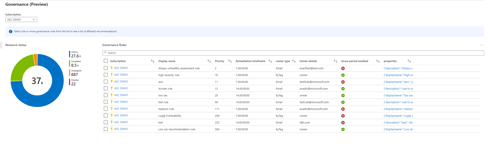
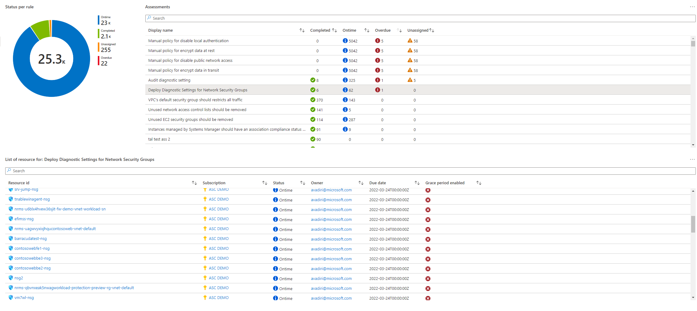

# MDC Governance dashboard

The new Security Governance dashboard for Microsoft Defender for Cloud provides you a full visibility to your Governance rules and current status of assessments managed by Governance rules.
To leverage Security Governance workbook your subscription should be a part of relevant private preview. To file a request to join the private preview please submit a request in the following form https://forms.office.com/Pages/DesignPage.aspx?fragment=FormId%3Dv4j5cvGGr0GRqy180BHbR9bwacli-s5PpITonWQsE35UNVAxN0RQQzZGTjFMVTk3SDNGQzFWRTZQUi4u%26Token%3D0340749dfc874e6bba193b8c8ecd60a4

or contact demizets@microsoft.com. Private preview details are provided under NDA only.

## Try on Portal
You can deploy the workbook by clicking on the buttons below:

##

