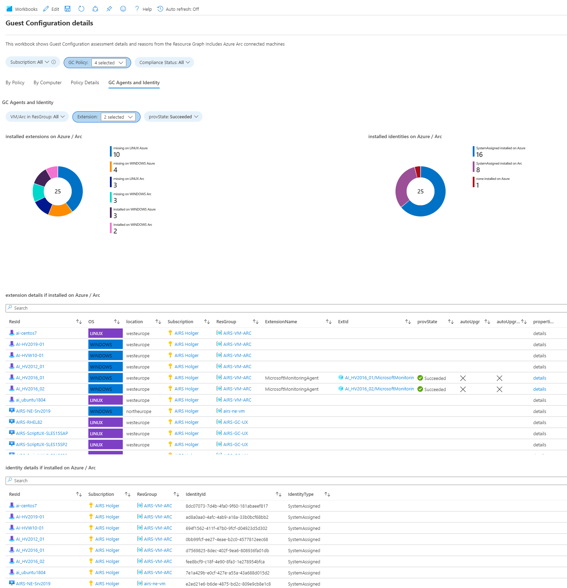

# GuestConfiguration Result

This workbook gives an overview to GuestConfiguration results and machine configruation. Azure Arc is fully included.
All data is queried by the Azure Resource Grapsh (ARG) and has no dependencies to Microsoft Defender for Cloud generated data. The initiative mapping to Defender makes sense :-) but is not required.

The workbook provides different sections:

**By Policy**
*	Compliance by Subscription
*	Comliance by Computer Azure and Arc
*	Computer Details
*	GC Compliance Details, Reason and Reason Code per Checkup 

**By Computer**
* Platform, SKU and Offer Overview
* Compliance by Plattofrm and SKU
* Computer Overview

**Policy Details**
* Definition Details, Standalone or Initative mapped
* Active Assignments

**Agents and Identity**
* Installed Extensions
* Installed Identity

## Try on Portal
You can deploy the workbook by clicking on the buttons below:

##

** **

** **

** **

