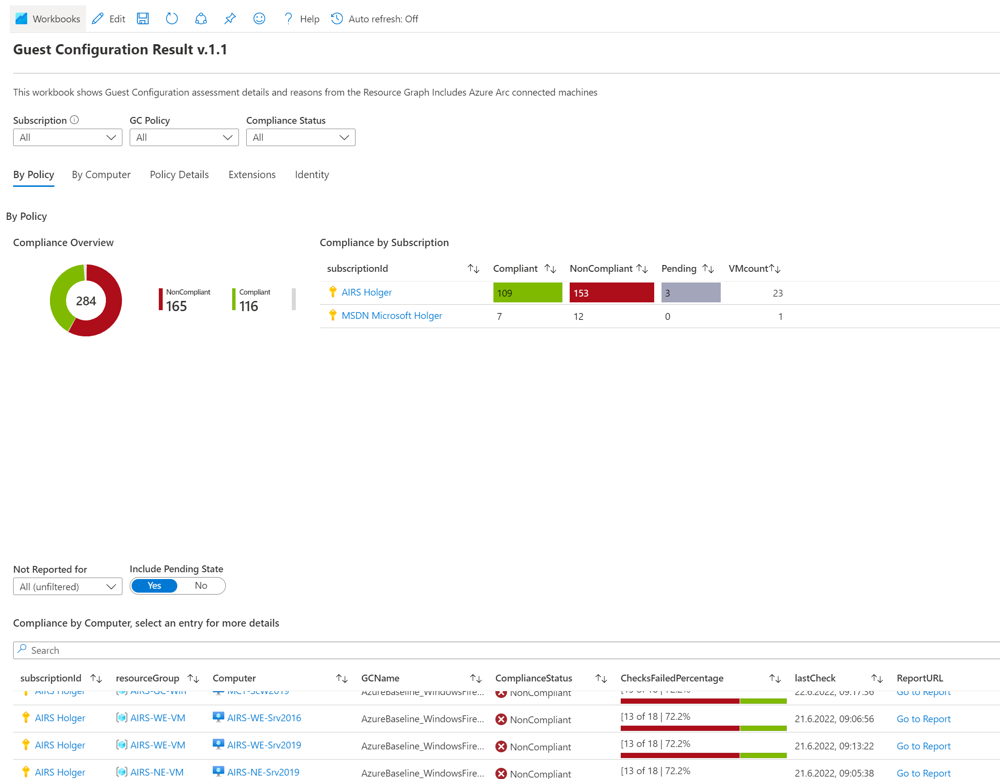
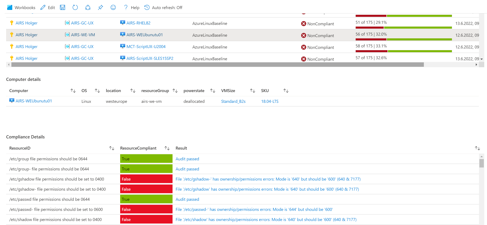
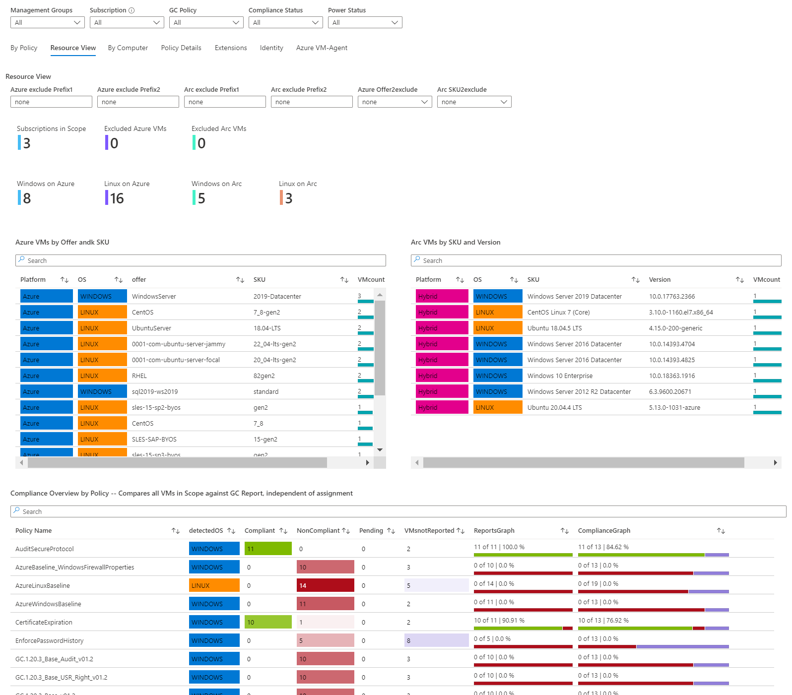
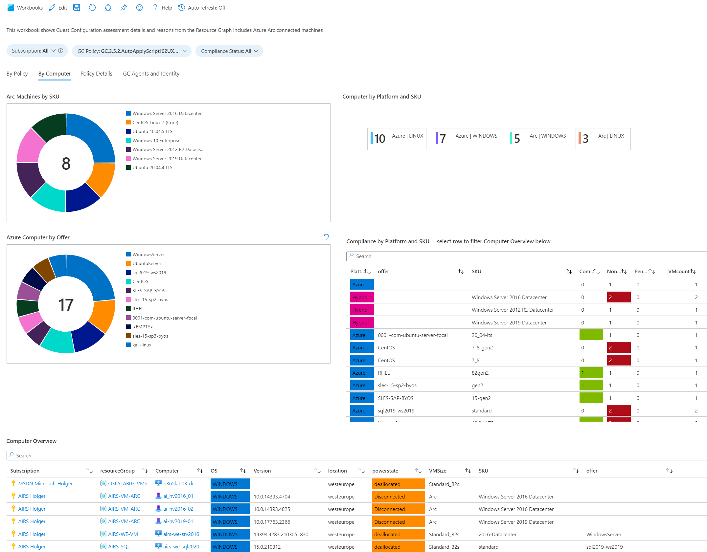
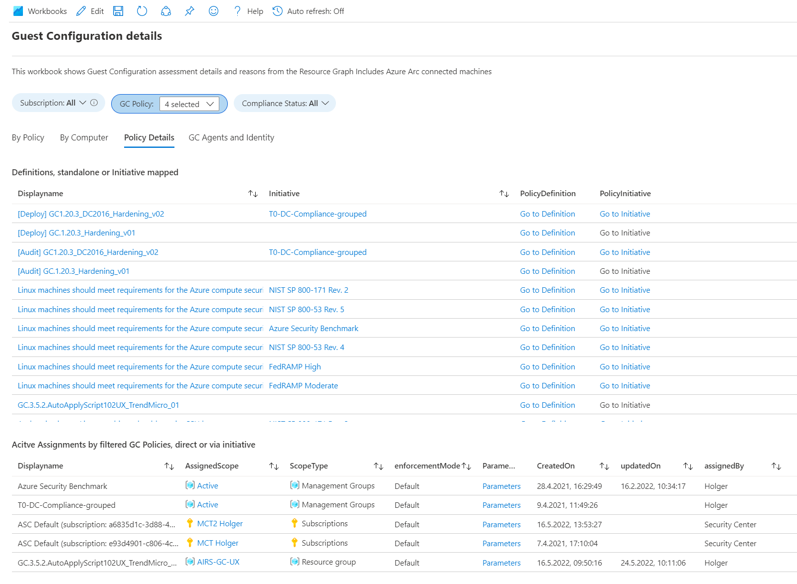
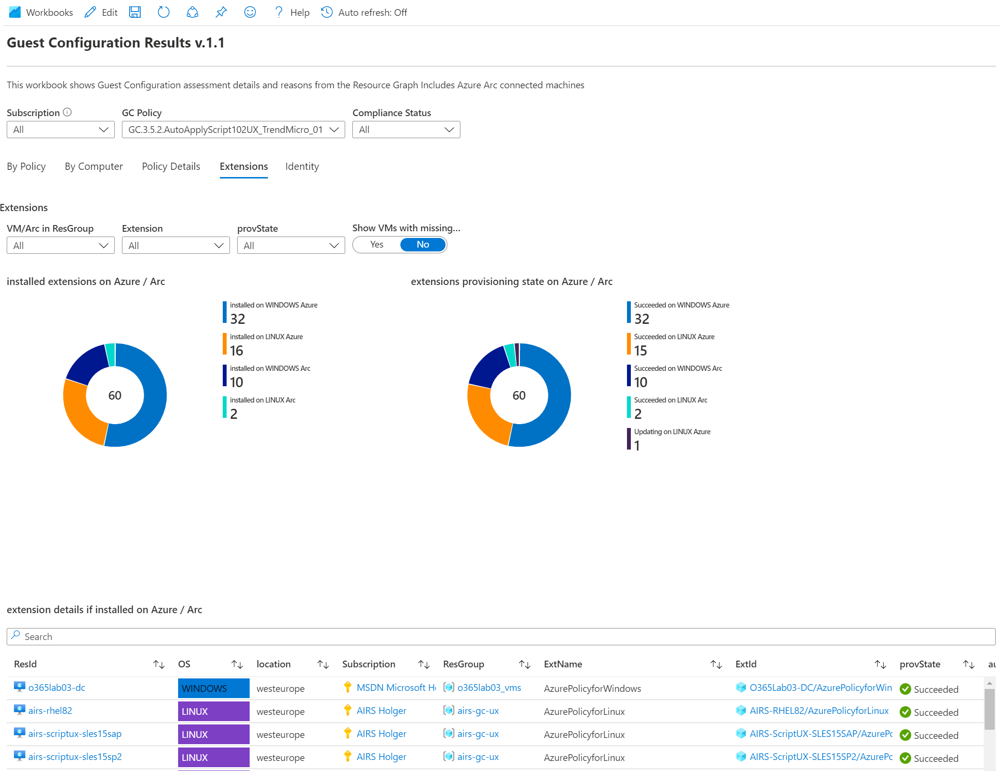
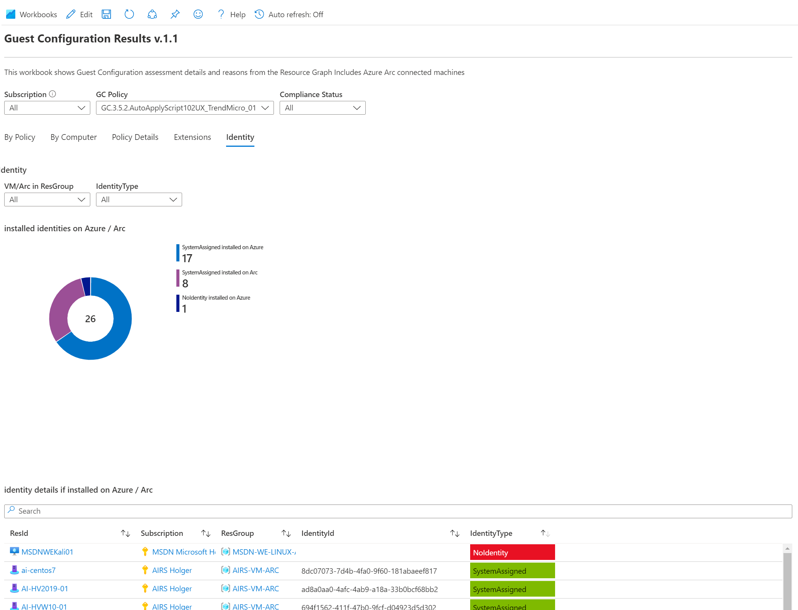

# GuestConfiguration Result v1.10

This workbook gives an overview to GuestConfiguration results and machine configuration. Azure Arc is fully included.
All data is queried by the Azure Resource Graph (ARG) and has no dependencies to Microsoft Defender for Cloud generated data. 

### Change History
---

| Version        | Who      | Date  | What |
| ------------- |-------------| -----| -----|
| v1.4|h.wache|2022-11| added Resource View tab, also show machines that have not reported to GC backend |
| v1.5|h.wache|2022-11| added offer/sku exclude filter to Resource View tab|
| v1.6|h.wache|2023-01| fixed failed query because of added value on GC assignment name, (multiple assignments support availability)|
| v.1.7|h.wache|2023-03| added parameter to filter for Azure VM "timeCreated" attribute in "By Policy" and "By Computer" tab
| v.1.8|h.wache|2023-05| added Tenant filter to include Lighthouse connected Subscriptions
| v.1.9|h.wache|2023-06| added a helper to find correct policy with regards to the jobscript which is assigned in the "localscript" paramter, see _[custom policy solution](https://aka.ms/machineconfig)_
| v.1.10|h.wache|2024-02| fixed policy helper issue, when exceed > 250 entires

---

The workbook provides different sections:

**By Policy**
*	Compliance by Subscription
*	Compliance by Computer Azure and Arc
*	Computer Details
*	Stale Reporting
*	GC Compliance Details, Reason and Reason Code per Check-up 

**Resource View**
* View from a Resource perspective  (independent of GC Result in ARG backend)
* OS/SKU overview by Azure/Arc VMs
* Overview by GC Policy, including VMs not sent a report (no checking whether policy is assigned)

**By Computer**
* Platform, SKU and Offer Overview
* Compliance by Platform and SKU
* Computer Overview

**Policy Details**
* Definition Details, Standalone or Initiative mapped
* Active Assignments

**Extensions**
* Installed and missing Extensions

**Identity**
* Installed and missing Identities

## Try on Portal
You can deploy the workbook by clicking on the buttons below:

##

** **

** **

** **

** **

** **

** **

