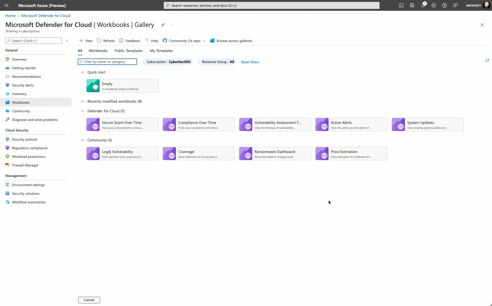

# Microsoft Defender for Cloud - Price Estimation Dashboard

**Author: Future Kortor**

This workbook provides price estimations for various Microsoft Defender for Cloud plans based on usage telemetry in a particular environment. The following plans are covered in the workbook:

* Microsoft Defender for App Services
* Microsoft Defender for Containers
* Microsoft Defender for Key Vaults
* Microsoft Defender for Servers
* Microsoft Defender for Storage
* Microsoft Defender for Databases

## Deprecation notice

This workbook template has been removed from the repository as it has been natively integrated into Microsoft Defender for Cloud's workbook gallery. To open this workbook, in Microsoft Defender for Cloud, just click the *Workbooks* option in the left navigation pane.

## Acknowledgements
Special thanks to **Fernanda Vela**, **Helder Pinto**, **Lili Davoudian**, **Sarah Kriwet**, **Safeena Begum Lepakshi** and **Tom Janetscheck** for contributing their code to this consolidated workbook.
