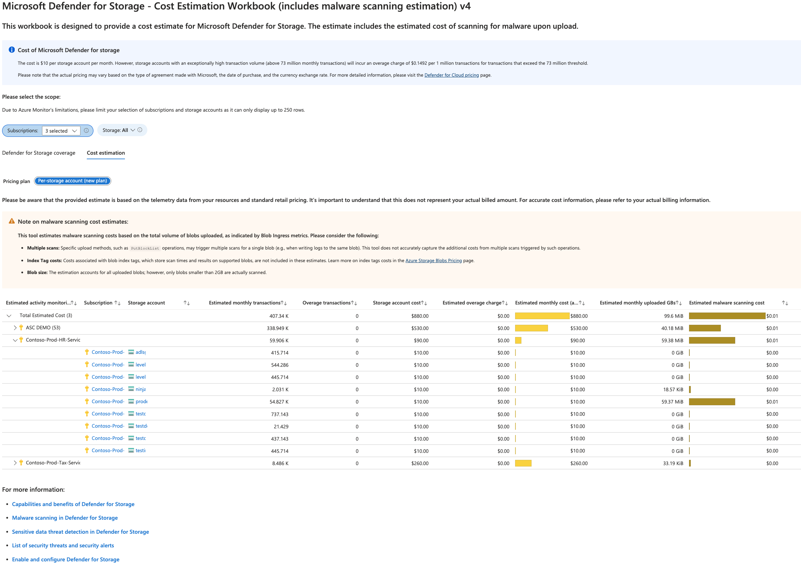

# Microsoft Defender for Storage - Price Estimation Dashboard 4.0

This workbook helps you estimating the cost of enabling Microsoft Defender for Storage and considers all storage accounts with and without Microsoft Defender for Storage enabled across the selected scope. 
The results are derived from data extracted from the past 7 days as a usage-sample and the estimation is for a 30-day cost. This estimation includes the add-on Malware Scanning. 

>To estimate the cost at scale, at the tenant level or if you have a large number of subscriptions and storage accounts, use the following [PowerShell script](https://github.com/Azure/Microsoft-Defender-for-Cloud/blob/main/Powershell%20scripts/Storage%20Price%20Estimation%20Script/DefenderForStorage-CostEstimation-ResourceLevelVisibility.ps1). Note: this script does not include the Malware Scanning add-on; it will in the next couple of weeks.

## Try it on the Azure Portal
You can deploy the workbook by clicking on the button below:

## Overview Tab

## Known Issues

Azure Monitor Metrics data have limits, and the number of requests to fetch data across Storage Accounts might time out. To solve this, narrow the scope by reducing the selected subscriptions or storage accounts. 

> **Credits:** [Eitan Shteinberg](https://www.linkedin.com/in/eitan-shteinberg/), [Fernanda Vela](https://www.linkedin.com/in/mfvelah/), [Shay Amar](https://www.linkedin.com/in/shay-amar/)
