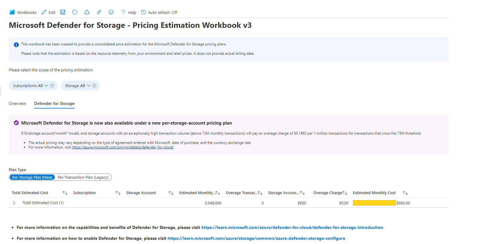

# Microsoft Defender for Storage - Price Estimation Dashboard 3.0

> ## Important note
>  
>A new pricing plan is now available for Microsoft Defender for Cloud that charges you according to the number of storage accounts that you protect (per-storage).
>In the legacy pricing plan, the cost increases according to the number of analyzed transactions in the storage account (per-transaction). The new per-storage plan >fixes costs per storage account, but accounts with an exceptionally high transaction volume incur an overage charge.
>For details about the pricing plans, see [Microsoft Defender for Cloud pricing page](https://azure.microsoft.com/pricing/details/defender-for-cloud/)

> The new per-storage plan is only supported on public clouds.

Microsoft Defender for Storage is an Azure-native layer of security intelligence that detects unusual and potentially harmful attempts to access or exploit your storage accounts. It uses advanced threat detection capabilities and [Microsoft Threat Intelligence](https://go.microsoft.com/fwlink/?linkid=2128684) data to provide contextual security alerts. Those alerts also include steps to mitigate the detected threats and prevent future attacks.

Microsoft Defender for Storage continuously analyzes the transactions of [Azure Blob Storage](https://azure.microsoft.com/services/storage/blobs/), [Azure Data Lake Storage](https://azure.microsoft.com/services/storage/data-lake-storage/), and [Azure Files](https://azure.microsoft.com/services/storage/files/) services. When potentially malicious activities are detected, security alerts are generated. Alerts are shown in Microsoft Defender for Cloud with the details of the suspicious activity, appropriate investigation steps, remediation actions, and security recommendations. [Learn more about the capabilities here](https://docs.microsoft.com/en-us/azure/security-center/defender-for-storage-introduction).

This workbook allows you to estimate the cost for both pricing plans and considers all storage accounts with and without Microsoft Defender for Storage enabled across the selected scope. 
The results are derived from data extracted from the past seven days, and the estimation is for the monthly cost.

>Important
>To estimate the cost at scale, at the tenant level or if you have a large number of subscriptions and storage accounts, use the following [PowerShell script](https://github.com/Azure/Microsoft-Defender-for-Cloud/tree/main/Powershell%20scripts/Storage%20Price%20Estimation%20Script).

## Try it on the Azure Portal
You can deploy the workbook by clicking on the buttons below:

## Overview Tab

## Known Issues

Azure Monitor Metrics data have limits, and the number of requests to fetch data across Storage Accounts might time out. To solve this, narrow the scope by reducing the selected subscriptions or storage accounts. In case this does not help, use the PowerShell script mentioned above to perform the estimation.

> **Credits:** [Eitan Shteinberg](https://www.linkedin.com/in/eitan-shteinberg/), [Fernanda Vela](https://www.linkedin.com/in/mfvelah/), [Shay Amar](https://www.linkedin.com/in/shay-amar/)
