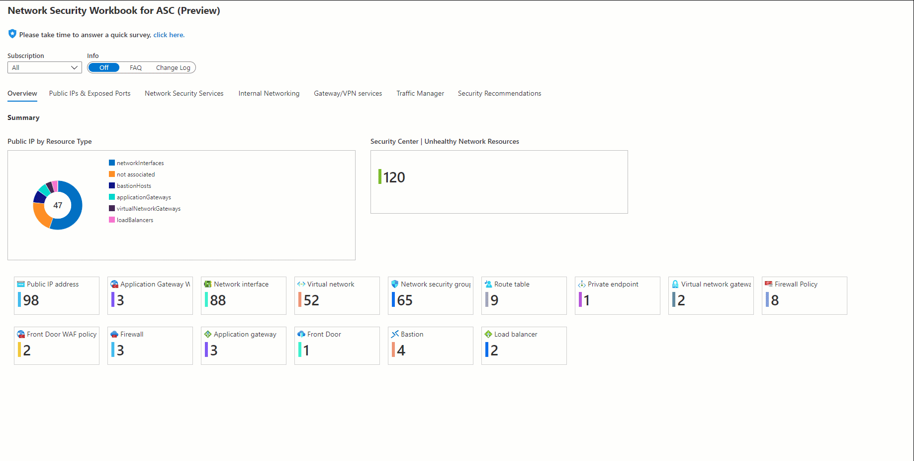

# Network Security Dashboard for Microsoft Defender for Cloud

The new network security dashboard for Microsoft Defender for Cloud provides you a unified view and full visibility to your network security and networking resources in Azure. If you have been actively using Microsoft Defender for Cloud and Network Security features in Azure, this workbook is for you!

Our newly dashboard is based on Azure Resource Graph (ARG) queries and divided to several sections such as:

-	**Overview:** summary view of all your network security and networking resources for selected subscription(s)
-	**Internal Networking:**
    -	Network Interfaces
    -	Network Security Groups
    -	Route Tables
    -	Subnets
    -	Private Links
    -	Peerings
    -	DNS
    -	Private DNS Resolver
    -	Private DNS Zones
    -	IP Forwarding
    -	Route Server
    -	Bastion
- **External Networking:**
    - VPN/ExpressRoute
    - Virtual WAN (vWAN)
    - Traffic Manager
    - Front Door
    - Application Gateway
    - NAT Gateway
    - Public IPs & Exposed Ports 
-	**Network Security Services:**
    -	DDoS protections plans
    -	Azure Firewall and Firewall policies
    -	Azure WAF policies
    -	Network Security Groups
- **PaaS Services:**
    - Databases
    - Storage Accounts
    - Web Apps
    - Key Vaults
    - Event Hubs
    - AKS
-	**Microsoft Defender for Cloud recommendations:**
    -	Filtered view of all Microsoft Defender for Cloud network related recommendations including resource count, severity, and security control
-	**Azure Policy:**
    -	Overall compliance overview / applied policies
  

Informational options: using the action bars at the top section, select FAQ button to show the frequently asked questions. You can also see recent changes documented on the change log option.

## Try it on the Azure Portal

To deploy the new workbook into your Microsoft Defender for Cloud console, click on *Deploy to Azure* for Azure Public cloud or *Deploy to Azure Gov* for government cloud.
During the deployment, you must select a subscription and resource group to store the report. Once the workbook is successfully deployed, hover to Security Center to start using it.

