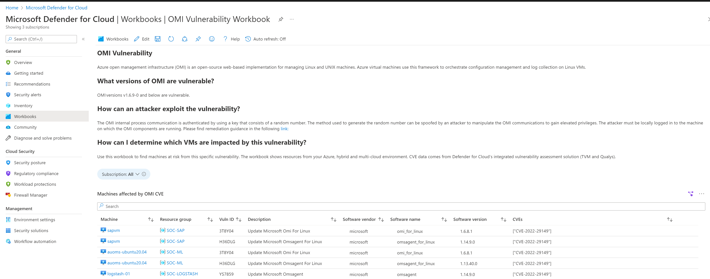

# OMI CVE Vulnerability - Dashboard

**Author: Shay Amar**

This workbook provides an overview of machines in your environment that are affected by OMI vulnerability . It will show vulnerability findings for either Microsoft Defender Vulnerability Management, or the integrated Qualys VA scanner.

## OMI Vulnerability
Azure open management infrastructure (OMI) is an open-source web-based implementation for managing Linux and UNIX machines. Azure virtual machines use this framework to orchestrate configuration management and log collection on Linux VMs.

This dashboard provides an overview about the OMI CVE and details of CVE IDs found in your environment.

## Try it on the Azure Portal

You can deploy the workbook by clicking on the buttons below:

# Acknowledgements
* Special thanks to **Tal Berdah** for the partnership in reviewing and providing feedbacks on the artifact.
* Many thanks to **Yoav Barak** & **Alona Weinstock** & **Amit Aviram** & **Ben Mansheim** & **Hadas Topor Cohen** in supporting this initiative and suggesting feedbacks.  
