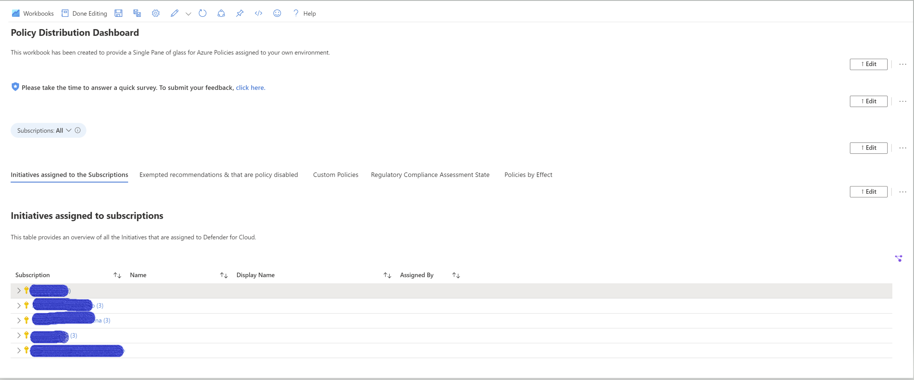

# Policy Distribution Dashboard
**Author: Safeena Begum**

The new Policy Distribution Dashboard for Microsoft Defender for Cloud provides a unified view and deep visibility into the configuration of your overall policy structure in Azure.  
The dashboard is powered by Azure Resource Graph (ARG) queries and divided into different sections. 
The workbook can be edited, and all queries can be modified to meet your needs.

The workbook provides different sections like: 
*	Initiatives that’s assigned to the subscriptions
*	The recommendations that are exempted and that are policy disabled
*	List of Custom policies 
*	Regulatory Compliance Assessment State
*	Policies by effect 
*	Compliance by policy assignment

## Try it on the Azure Portal

You can deploy the workbook by clicking on the buttons below:

 

***

Checkout the blog here to learn more details about this workbook https://techcommunity.microsoft.com/t5/microsoft-defender-for-cloud/policy-distribution-dashboard-for-microsoft-defender-for-cloud/ba-p/3264712

# Acknowledgements
* Special thanks to **Lior Arviv** for the partnership in reviewing and providing feedbacks on the artifact.
* Many thanks to **Rebecca Halla** & **Yuri Diogenes** in supporting my initiative and suggesting feedbacks.  
