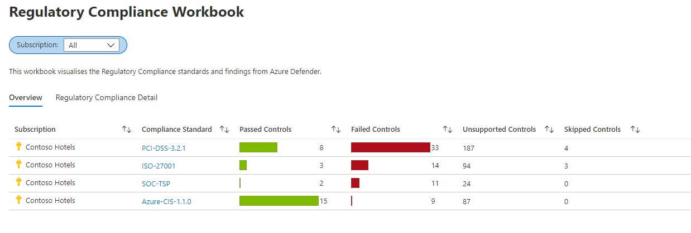
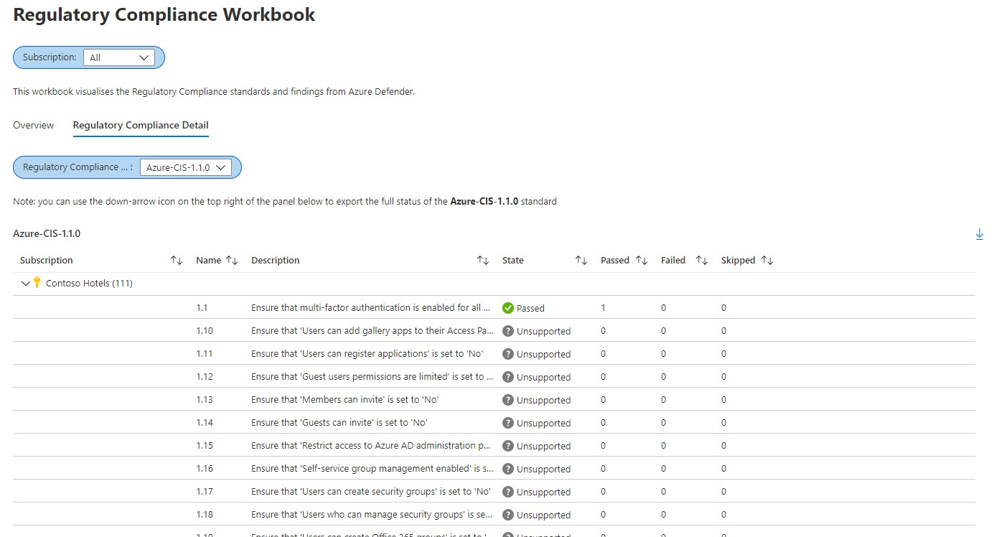

# Azure Defender - Regulatory Compliance
**Author: Vanessa Bruwer | Snr Customer Engineer, [FastTrack for Azure](https://aka.ms/fasttrackforazure)**

This workbook displays the Regulatory Compliance controls from Azure Defender across all subscriptions selected.

**Overview tab**:

**Detail tab**

To deploy the workbook you will need **write permissions** in the subscription where it will be stored. To view the information, you will need **read permissions** of all subscriptions that are in the defined groups. 

# Questions
You can submit any questions or requests [here](https://github.com/Azure/Azure-Security-Center/issues). Please also refer to our [Wiki](https://github.com/Azure/Azure-Security-Center/wiki#resources), as it will provide you with further information.

# Contributing

This project welcomes contributions and suggestions.  Most contributions require you to agree to a
Contributor License Agreement (CLA) declaring that you have the right to, and actually do, grant us
the rights to use your contribution. For details, visit https://cla.microsoft.com.

When you submit a pull request, a CLA-bot will automatically determine whether you need to provide
a CLA and decorate the PR appropriately (e.g., label, comment). Simply follow the instructions
provided by the bot. You will only need to do this once across all repos using our CLA.

This project has adopted the [Microsoft Open Source Code of Conduct](https://opensource.microsoft.com/codeofconduct/).
For more information see the [Code of Conduct FAQ](https://opensource.microsoft.com/codeofconduct/faq/) or
contact [opencode@microsoft.com](mailto:opencode@microsoft.com) with any additional questions or comments.
