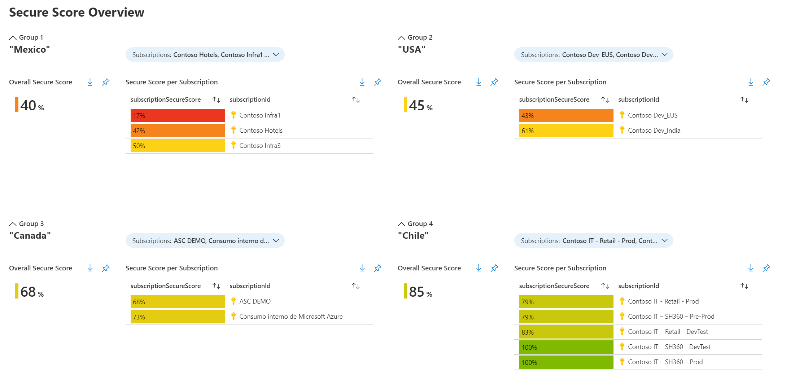

# ASC Secure Score by Groups
**Author: Fernanda Vela | Program Manager, CxE Azure Security Center**

This workbook displays the Azure Security Center overall Secure Score of groups of subscriptions. By default, it will load four groups; in each of them, you select the subscriptions that represent a group. 

To deploy the workbook you will need **writing permissions** in the subscription where it will be stored. To view the information, you will need **reader permissions** of all subscriptions that are in the defined groups. 

## Try on Portal
You can deploy the workbook by clicking on the buttons below:

# Questions
You can submit any questions or requests [here](https://github.com/Azure/Azure-Security-Center/issues). Please also refer to our [Wiki](https://github.com/Azure/Azure-Security-Center/wiki#resources), as it will provide you with further information.

# Contributing

This project welcomes contributions and suggestions.  Most contributions require you to agree to a
Contributor License Agreement (CLA) declaring that you have the right to, and actually do, grant us
the rights to use your contribution. For details, visit https://cla.microsoft.com.

When you submit a pull request, a CLA-bot will automatically determine whether you need to provide
a CLA and decorate the PR appropriately (e.g., label, comment). Simply follow the instructions
provided by the bot. You will only need to do this once across all repos using our CLA.

This project has adopted the [Microsoft Open Source Code of Conduct](https://opensource.microsoft.com/codeofconduct/).
For more information see the [Code of Conduct FAQ](https://opensource.microsoft.com/codeofconduct/faq/) or
contact [opencode@microsoft.com](mailto:opencode@microsoft.com) with any additional questions or comments.
