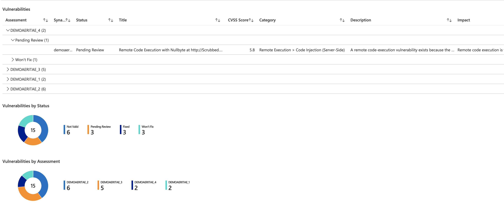
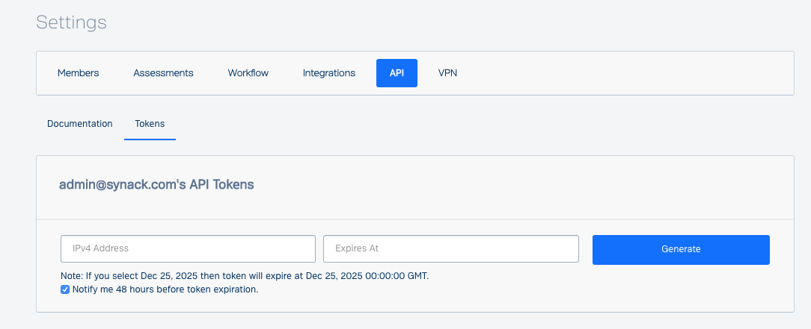

# Synack Vulnerabilities Workbook

**Author: Synack Inc.**

The Synack Vulnerabilities workbook provides an overview of the Synack Vulnerabilities data within the Azure Security Center. 

## Try it on the Azure Portal

To deploy the new workbook into your Azure Security Center, click on *Deploy to Azure*.
During the deployment, you must select a subscription and resource group to store the workbook. Once the workbook is successfully deployed, navigate to Security Center -> Workbooks to start using it.

During the deployment you have to specify some template parameters:
- **Synack Api Url** Set this to `https://api.synack.com`
- **Synack Api Token** Generate Api Token on Synack Portal. After logging into the Synack Client Portal as an admin user, navigate to Settings. Click on API and open the Tokens page.  Please use this IP address to generate the API token: 35.194.80.100. This token will only be used for requests that will be fired from Synack’s Azure integration backend application. It is hosted on a trusted location on Synack premises.
  Please also define an expiration date for this token.
  Click generate and copy the token. If you lose the token, you can always navigate to this page to copy it again.

