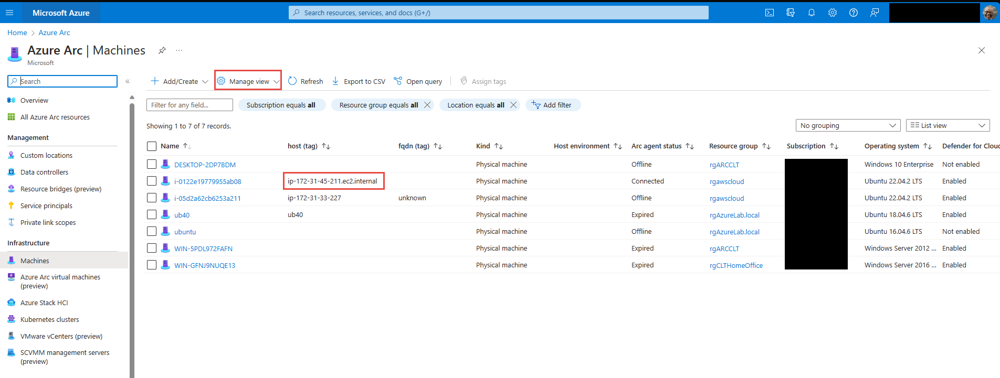
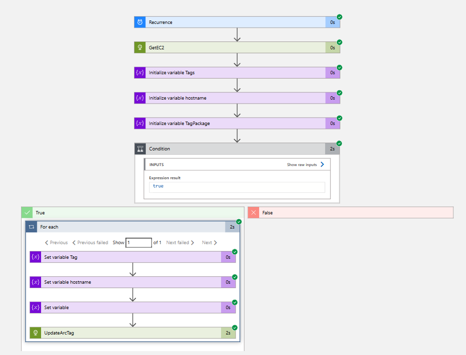

# Add-HostNameTagEC2Arc

author: Nathan Swift

Some cloud admin teams want to filter and search in the Aure Portal and MDC via AWS EC2 hostname rather than by instance name. This Logic App can be set to run daily,weekly. Upon scheduled trigger it will search the Azure Resource Graph for AWS Arc Connected EC2 instances that are connected within the last 3 days and that do not have a Azure Tag for Host name. This will add the EC2 instance host name and fqdn as an additional tag. The tag can then be used in Defender for Cloud Inventory view to filter by hostname. The tag also can be used to search and filter in the Arc - Connected Servers blade of the Arc service. 

**Additional Post Install Notes:**

The Logic App creates and uses a Managed System Identity (MSI) to authenticate and authorize against management.azure.com to obtain azure arc resource information and add a Azure tag to the Arc server.

Assign RBAC 'Reader' role to the Logic App at the MG or Subscription level.

Assign RBAC 'Tag Contributor' role to the Logic App at the MG or Subscription level.

## Logic App Workflow
