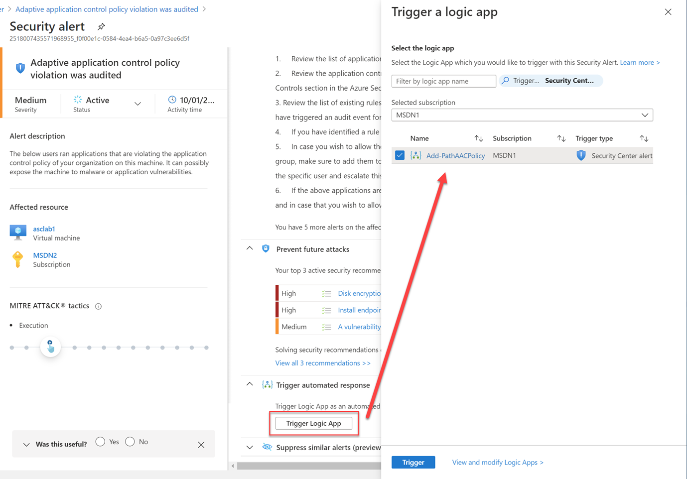
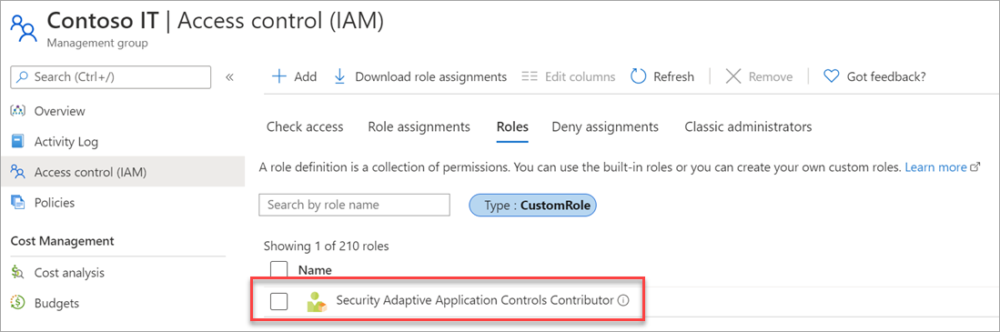

 # Add a new file path as allow list rule when an ASC alert is triggered/created for AAC policy
### Author: Lior Arviv

### Overview
Adaptive application controls are an intelligent and automated solution for defining allow lists of known-safe applications for your machines.
When you've enabled and configured adaptive application controls, you'll get security alerts if any application runs other than the ones you've defined as safe.
By using this Logic App automation, you can quickly respond to **Adaptive application control policy violation was audited** security alert.
The automation extracts a security alert and add the file path as a new allow list rule into the relevant VM/s group.

The ARM template will create the Logic App automation and the related API connection to Azure Security Center alert.
To be able to deploy the resources, your account needs to have at least *Contributor* rights on the target Resource Group.
The Logic App also uses a System-Assigned Managed Identity to access API endpoints.



### Instructions

To make this Logic App work, you can have to choose between two options:

* Grant *Security Admin* (built-in role) to the Logic App's Managed Identity on all subscriptions or management groups you want to monitor and manage resources in using this Logic App
* Create a new custom role based on the principle of least privilege access so it can only read subscriptions list alongside with VMs group policy and modify them where needed without having high privileges as the Security Admin - see additional details on "Create a custom role for least privilege access" below.

> Notice that you can assign permissions only if your account has been assigned as Owner or User Access Administrator roles.

1. Click on the **Deploy to Azure** button to create the Logic App in a target resource group.

<a href="https://portal.azure.com/#create/Microsoft.Template/uri/https%3A%2F%2Fraw.githubusercontent.com%2FAzure%2FAzure-Security-Center%2Fmaster%2FWorkflow%2520automation%2FAdd-PathAACPolicy%2Fazuredeploy.json" target="_blank">
</a>

<a href="https://portal.azure.us/#create/Microsoft.Template/uri/https://portal.azure.com/#create/Microsoft.Template/uri/https%3A%2F%2Fraw.githubusercontent.com%2FAzure%2FAzure-Security-Center%2Fmaster%2FWorkflow%2520automation%2FAdd-PathAACPolicy%2Fazuredeploy.json" target="_blank">
</a>

2. Go to the subscription/management group page.
3. Click **Access Control (IAM)** on the navigation bar.
4. Click **+Add** and **Add role assignment**.
5. Select the respective role - **Security Admin** (built-in) or **Security Adaptive Application Controls Contributor** (custom).
6. Assign access to Logic App.
7. Select the subscription where the logic app was deployed and then select `Add-PathAACPolicy` Logic App.
8. Click **Save**.

### Create a custom role for least privilege access
1. Download the `aac-custom-rbac-role.json` file to your machine.
1. Modify the JSON file to include the relevant assignable scopes. Save the file.
> 💡 You can specify subscription/s, management group or both.

```json
  "AssignableScopes": [
    "/providers/Microsoft.Management/managementGroups/contoso-mg",
    "/subscriptions/00000000-0000-0000-0000-000000000000"
  ]
```
3. Run the following PowerShell command to deploy the new custom role on a desired scope:

```powershell
New-AzRoleDefinition -InputFile "C:\CustomRoles\aac-custom-rbac-role.json"
```
4. Validate that your new custom role definition is deployed on the selected scope/s. The recommended approach is to select a management group.

