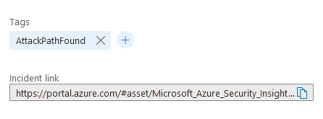
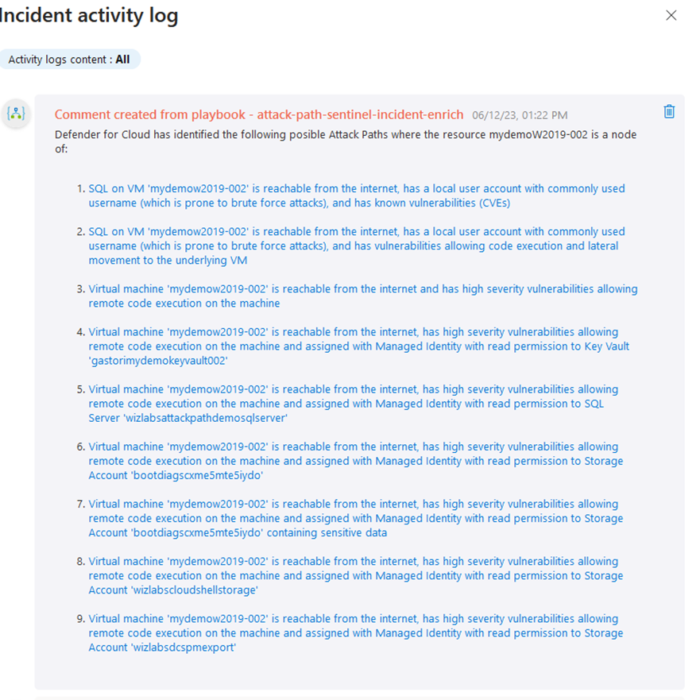
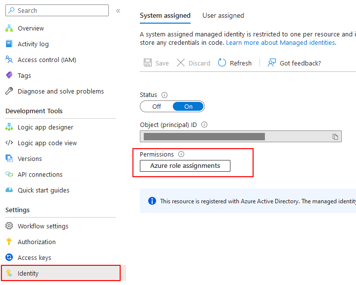
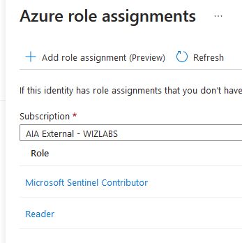
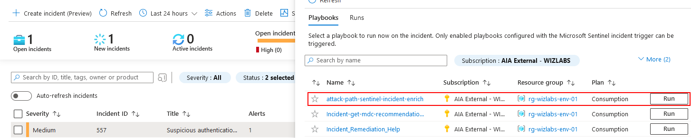

## Enhancing Incident Triage Efficiency with Microsoft Defender for Cloud Attack Path Analysis and Microsoft Sentinel Integration
### Introduction
If you are actively involved in the process of responding to cybersecurity incidents or work in a capacity that deals with incident response, you understand the criticality of promptly identifying and mitigating security breaches in cloud environments. Timely and accurate incident triaging is crucial to minimize the impact of potential breaches and ensure a proactive security posture. However, in many cases, security analysts are overwhelmed by the sheer volume of incidents and the manual effort required to investigate and prioritize them. To address this challenge, we have developed a solution leveraging Microsoft Defender for Cloud Attack Path Analysis into Microsoft Sentinel to streamline computer’s cyber security incident triaging and improve response times.

### Problem Statement
Traditionally, incident triaging in cloud environments has been a time-consuming and error-prone process. Security analysts often struggle to determine the attack paths used by threat actors, leading to delayed incident response and potential oversight of critical security breaches. Furthermore, the lack of automated integration between Microsoft Defender for Cloud and Microsoft Sentinel hinders the seamless flow of information, requiring manual effort to enrich incident data

### Solution
To overcome these challenges, we have developed an Azure Logic App that serves as an automated Microsoft Sentinel playbook, enhancing the incident triaging process when the incident contains Computer Entities. The Logic App executes automatically whenever an incident involving virtual machines (VMs) is triggered. The playbook   leverages the powerful capabilities of Microsoft Defender for Cloud's Attack Path Analysis feature to identify the attack paths associated with the VM involved in the incident.
Upon execution, the playbook enriches the incident by adding a tag that confirms the VM has been identified by Microsoft Defender for Cloud's Attack Path Analysis. 

Additionally, detailed comments are added to the incident, listing the specific attack paths identified and providing a link to the actual attack path.

  
This integration enables security analysts to quickly access relevant information, facilitating incident triaging and improving response efficiency.

### Importance and Benefits
The integration of Microsoft Microsoft Defender for Cloud and MicrosoftMicrosoft Sentinel through the automated Logic App playbook offers several significant advantages for incident triaging and response:
1.	Time-saving Automation: By automatically enriching incidents with Microsoft Microsoft Defender for Cloud's attack path analysis, the Logic App reduces manual effort and accelerates the incident triage process. Security analysts can quickly identify the attack paths associated with VMs involved in incidents, enabling them to prioritize and respond to threats effectively.
2.	Improved Incident Prioritization: The inclusion of attack path information within the incident details provides security analysts with valuable insights into the severity and potential impact of the incident. Armed with this contextual information, analysts can prioritize their response efforts based on the criticality of the attack paths identified, thereby reducing response time and minimizing the risk of further exploitation.
3.	Enhanced Collaboration: The Logic App's automated enrichment of incident data promotes collaboration among security analysts and other stakeholders. By consolidating the attack path information and providing a link to the actual attack path, the Logic App enables seamless knowledge sharing and facilitates effective communication between teams responsible for incident response.
4.	Proactive Security Posture: With the ability to quickly identify and assess attack paths associated with incidents, organizations can take proactive measures to address vulnerabilities and close security gaps. This integration empowers security teams to leverage Microsoft Defender for Cloud's insights and strengthen their overall security posture.

### Configuration post Deployment
After the successful deployment of the Azure Logic App, proceed to access the newly created instance. Navigate to the "Identity" section within the Azure Logic App configuration. Here, you will find the "Azure role assignments" option. It is essential to assign the appropriate roles to ensure smooth functioning of the integration.

Firstly, assign the "Reader" role to the Logic App for all the subscriptions from which you need to retrieve Attack Paths. This role allows the Logic App to read the necessary information without making any changes.

Secondly, assign the "Microsoft Sentinel Contributor" role to the Logic App for the subscription where your Microsoft Sentinel instance is located. This role provides the required permissions for the Logic App to integrate and interact effectively with Microsoft Sentinel.

By configuring these role assignments, you enable the Logic App to access the relevant resources and retrieve Attack Paths seamlessly, contributing to the successful enrichment of incidents and improving the incident triaging process.

After completing the role assignments for the Azure Logic App, you have two options to execute it automatically or on-demand:

Option 1: Configure Microsoft Sentinel Playbook to Execute the Logic App Automatically:
You can set up a Microsoft Sentinel Playbook to trigger the Azure Logic App automatically whenever specific incident rules are met. This approach ensures a streamlined and automated incident triaging process. By configuring the incident rule to execute the Logic App, you can leverage its capabilities to enrich incident data and facilitate efficient incident response. 

Option 2: Execute the Logic App as Needed from the Incident:
Alternatively, you have the flexibility to manually trigger the Azure Logic App from the incident whenever required. This option is suitable for scenarios where you want to perform the triage manually or for incidents that require immediate attention and cannot rely on automated execution. By running the Logic App on-demand, you can still benefit from its functionality in enriching incidents and reducing the time needed for incident triaging.

The choice between these options depends on your organization's specific requirements and incident response workflows. Automating the execution of the Logic App through a Microsoft Sentinel Playbook offers a more streamlined and hands-off approach, while manually triggering it provides greater control and flexibility.

By leveraging either of these options, you can effectively utilize the Azure Logic App as a powerful tool for incident enrichment and expedite the incident triaging process, ultimately improving the overall incident response capabilities in your cloud environment.

### Conclusion
By automating the enrichment of incident data with attack path analysis, organizations can streamline their incident response processes, reduce manual effort, and improve response times. This solution empowers security analysts to prioritize their efforts, collaborate effectively, and maintain a proactive security posture, ultimately safeguarding critical assets and minimizing the impact of potential breaches.

**Use the below "Deploy to Azure Link to deploy the solution into your Subscription**

