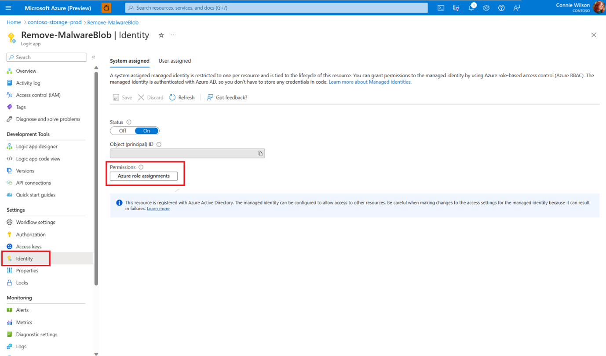
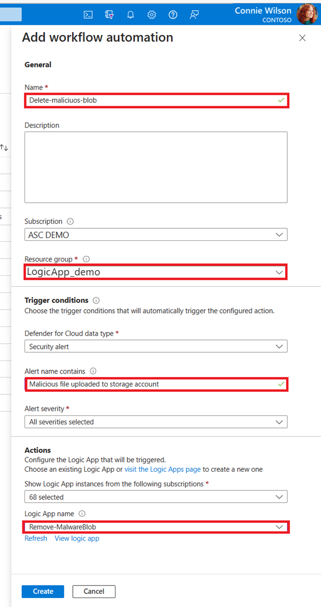

# Logic App based on Microsoft Defender for Cloud security alerts

The ARM template DeleteBlobLogicApp will create a LogicApp that removes malicious files that trigger the security alert "Malicious file uploaded to storage account".

## Instructions
1. Deploy the DeleteBlobLogicApp Azure Resource Manager (ARM) template using the Azure portal.
    

2. Select the Logic App you deployed.

3. Add a role assignment to the Logic App to allow it to delete blobs from your storage account:

    1. Go to **Identity** in the side menu and select **Azure role assignments**.
    
    2. Add a role assignment in the subscription level with the **Storage Blob Data Contributor** role.
    3. Create workflow automation for Microsoft Defender for Cloud alerts:
        1. Go to Microsoft Defender for Cloud in the Azure portal.
        2. Go to Workflow automation in the side menu.
        3. Add a new workflow: In the Alert name contains field, fill in Malicious file uploaded to storage account and choose your Logic app in the Actions section.
        4. Select Create.
           
        

