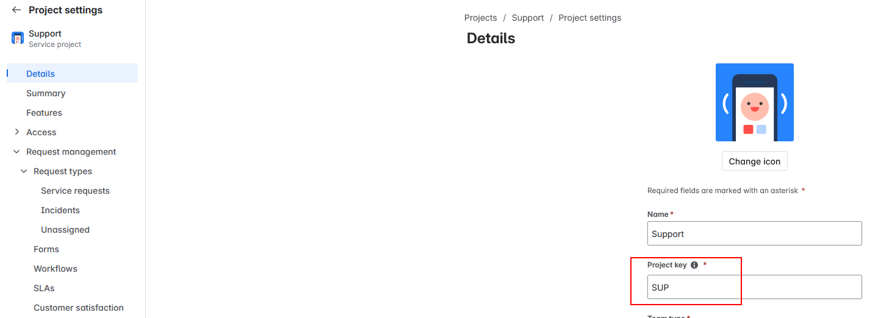
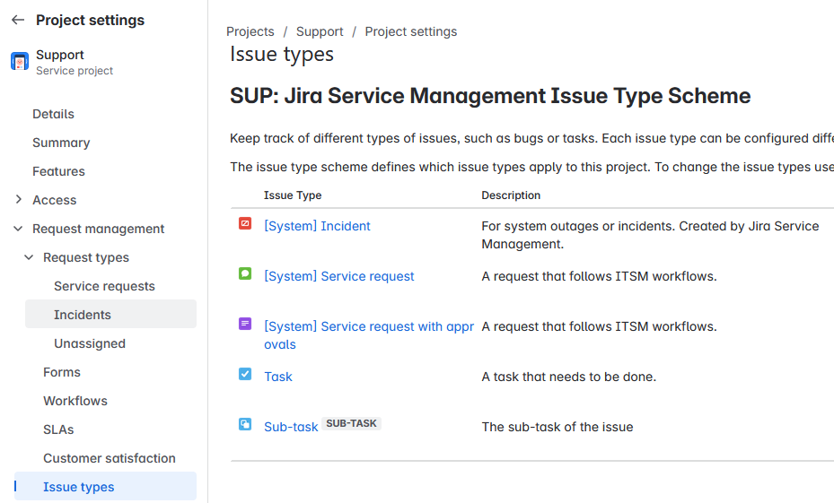
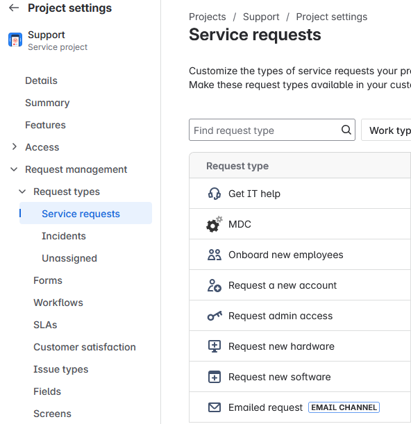
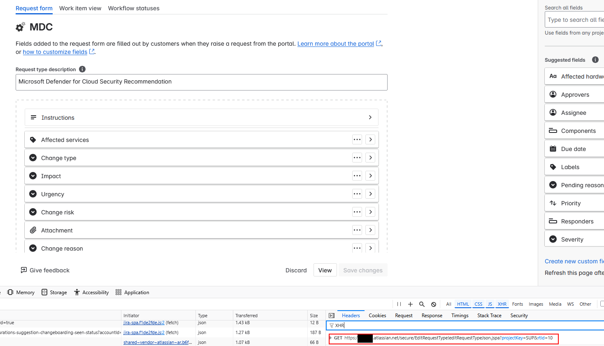
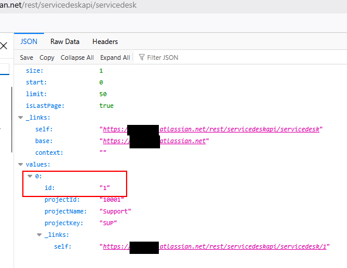

# Jira - Create a Service Request

Author:  
Giulio Astori  
Ivano Dibenedetto  
Antonio Formato  

This is a custom soltuion to provide the option for creating a Service Request whitin Jira Service Management, based on Defender for Cloud Security Recommendations.

Architecture Overview  

The system adopts a serverless, event-driven architecture using Azure services. The core principles guiding the architecture are:

- Serverless Computing: Leverage Azure Functions and Logic Apps to minimize operational overhead and maximize scalability and cost-efficiency.
- Loose Coupling: Decouple components through the use of Azure Functions for specific tasks, promoting maintainability and reusability.
- Asynchronous Processing: Use Logic Apps for workflow orchestration, enabling asynchronous processing of events.
- API-Driven Integration: Rely on APIs for communication between components and external systems (Jira, MDC).
- Security by Design: Integrate security considerations into every architectural layer.

The high-level architecture consists of the following main components:

- MDC Workflow Automation: Initiates the process upon MDC recommendation generation.
- Azure Logic App: Orchestrates the entire workflow, calling Azure Functions and external services.
- Azure Functions: Handles Jira Service Request Creation.
- Jira Service Management: The target system for creating and managing service requests.
- Microsoft Defender for Cloud (MDC) API: Used for updating MDC recommendations delegation/assignment.

## Deployment Guidance

The following is a guide that walks you through deploying, and configuring the Python Function App on Linux via ZIP, with secure secret management using Azure Key Vaul, and the Logic App used to orchestrate the end-end request.

## 1. Prerequisites

- **Azure CLI** installed and logged in (`az login`)
- **Functions Core Tools** (optional, for streamlined publish)
- **jq** (optional, for JSON parsing)
- Local Function App project structured as:

```plaintext
jira-azure-function/
├─ host.json
├─ requirements.txt
├─ CreateServiceRequest/
│    ├─ function.json
│    └─ __init__.py
└─ otherFunction/
     ├─ function.json
     └─ index.py
```

## 2. Infrastructure Setup

1. **Create a Resource Group**

```bash
az group create \
  --name rg-jira \
  --location eastus
```

2.**Create a Storage Account** (required for Consumption plan)

```bash
az storage account create \
  --name myfuncstorageacct \
  --resource-group rg-jira \
  --location eastus \
  --sku Standard_LRS
```

3.**(Recommended for storing Jira account and access token) Create a Key Vault**

```bash
az keyvault create \
  --name MySecretsVault \
  --resource-group rg-jira \
  --location eastus
```

## 3. Function App Provisioning

4.**Create the Linux‑based Function App**

```bash
az functionapp create \
  --resource-group rg-jira \
  --name JiraFuncApp \
  --storage-account myfuncstorageacct \
  --consumption-plan-location eastus \
  --os-type Linux \
  --runtime python \
  --runtime-version 3.11 \
  --functions-version 4
```

5.**Enable Oryx Build for Azure Functions**

The script configures your Azure Function App to use Oryx for remote builds during deployment:

```bash
az functionapp config appsettings set \
  --resource-group rg-jira \
  --name JiraFuncApp \
  --settings SCM_DO_BUILD_DURING_DEPLOYMENT=true ENABLE_ORYX_BUILD=true
```

When you set `SCM_DO_BUILD_DURING_DEPLOYMENT=true` and `ENABLE_ORYX_BUILD=true`, you're telling Azure to:

1. **Use Oryx build system** - Oryx is Microsoft's build system that can detect and build applications in various languages (Python, Node.js, .NET, etc.)

2. **Build your code remotely** - Instead of packaging all dependencies locally, you can upload just your source code, and Azure will install the dependencies on the server

3. **Simplify your deployment process** - You don't need to include the virtual environment or installed packages in your ZIP file, making your deployment package much smaller

This approach is particularly useful when:

- You have complex dependencies that are difficult to package locally
- You want to ensure dependencies are built for the exact runtime environment
- You want to reduce the size of your deployment package
- You're working on multiple platforms and want consistent builds

5.**Enable System‑Assigned Managed Identity**

```bash
az functionapp identity assign \
  --resource-group rg-jira \
  --name JiraFuncApp
```

6.**Grant Key Vault Access**

```bash
az keyvault set-policy \
  --name MySecretsVault \
  --object-id <principalId> \
  --secret-permissions get list
```

You can also use Azure Portal to enable the System‑Assigned Managed Identity and assign the role (**Key Vault Secrets User**). This role grants permission to read secret contents. This is the minimum role needed to retrieve the actual values of secrets stored in the Key Vault.

## 4. Secrets Management and set the App Settings

7.**Import Secrets into Key Vault**

```bash
az keyvault secret set \
  --vault-name MySecretsVault \
  --name "JIRA-Api-Token" \
  --value "<your‑token>"

az keyvault secret set \
  --vault-name MySecretsVault \
  --name "JIRA-User-Email" \
  --value "gastori@duck.com"
```

8.**Reference Secrets in App Settings**

```bash
TOKEN_URI=$(az keyvault secret show \
  --vault-name MySecretsVault \
  --name "JIRA-Api-Token" \
  --query id -o tsv)

EMAIL_URI=$(az keyvault secret show \
  --vault-name MySecretsVault \
  --name "JIRA-User-Email" \
  --query id -o tsv)

az functionapp config appsettings set \
  --resource-group rg-jira \
  --name JiraFuncApp \
  --settings \
    JIRA_API_TOKEN="@Microsoft.KeyVault(SecretUri=${TOKEN_URI})" \
    JIRA_USER_EMAIL="@Microsoft.KeyVault(SecretUri=${EMAIL_URI})" \
    JIRA_BASE_URL="https://myjurasm-instance.atlassian.net" \
    ## use your own Project Key Service Request value
    JIRA_PROJECT_KEY_SERVICE_REQUEST="SUP" \
    ## use your own issue type name for the service request
    JIRA_ISSUE_TYPE_NAME_SERVICE_REQUEST="[System] Service request" \
    ## use your own request type name - recommended to create and use some like MDC or Defender for Cloud
    JIRA_REQUEST_TYPE_NAME_MDC_RECOMMENDATION="MDC" \
    ## use your own request type ID 
    JIRA_REQUEST_TYPE_ID_MDC_RECOMMENDATION="10" \
    ## use your own service desk id
    JIRA_SERVICE_DESK_ID="1"
```

### How to retrieve the values for the JIRA related settings to configure in the Function App

#### 1. JIRA_PROJECT_KEY_SERVICE_REQUEST

This is the unique key for your Jira Service Management project.

- Go to your Jira Service Management portal in a web browser and log in.
- Navigate to your specific Service Management project (e.g., the "Support" project you've been using).
- The Project Key is usually displayed prominently on the project's main page, often near the project name or logo.
- Alternatively, go to Project settings (usually in the sidebar or under a gear icon). The Project Key is typically displayed on the "Details" or "Summary" page within Project Settings.
- **Value format**: A short, uppercase string (e.g., SUP, JSM, ITSUPPORT). Use this exact key.


#### 2. JIRA_ISSUE_TYPE_NAME_SERVICE_REQUEST

This is the name of the specific Issue Type that Service Requests in your project are based on. In Service Management projects, this is often a standard Issue Type like "Service Request" or "Task".

- Go to your Jira Service Management project in the portal.
- Go to Project settings.
- In the left-hand menu of Project settings, find and click on Issue types.
- Look for the Issue Type that is used for your Service Request tickets. The name will be listed here. For Service Management, there's often a primary issue type linked to the service desk workflow.
- **Value format**: The exact name as it appears in the "Issue types" list (e.g., Service Request, Task, [System] Service request). Pay attention to capitalization and spacing.


#### 3. JIRA_REQUEST_TYPE_NAME_MDC_RECOMMENDATION

This is the display name of the specific Request Type you created for MDC Recommendations.

- Go to your Jira Service Management project on the portal.
- Go to Project settings.
- In the left-hand menu of Project settings, find and click on Request types and open the Service Requests.
- Find your custom Request Type in the list (the one you named something like "Request a change - MDC Recommendation").
- **Value format**: The exact display name of the Request Type as it appears in this list (e.g., Request a change - MDC Recommendation, MDC Recommendation Ticket). Pay close attention to capitalization, spacing, and any punctuation.


#### 4. JIRA_REQUEST_TYPE_ID_MDC_RECOMMENDATION

This is the internal, numerical ID associated with your specific Request Type. Jira Service Management API often requires the ID rather than the name for creating requests.

This is the trickiest one to find directly in the UI. The most reliable method is often by inspecting network requests in your browser's developer tools or using the Jira API directly.

#### Method (Recommended - Using Browser Developer Tools)

1. Go to your Jira Service Management project in the portal.
2. Go to Project settings -> Request types->Service Request and click to open the Request Type.
3. Open your web browser's Developer Tools (usually by pressing F12).
4. Go to the Network tab in the Developer Tools.
5. Refresh the "Request types" page in Jira (or click on your specific "Request a change - MDC Recommendation" Request Type to view its details).
6. In the Network tab, look for API requests that are made. You might need to filter by "XHR" or "Fetch/XHR". Look for URLs that contain `/rest/servicedeskapi/requesttype` or similar.
7. Click on one of the relevant network requests.
8. Examine the Response tab. Look for JSON data in the response that lists the Request Types in your project. Find your "Request a change - MDC Recommendation" Request Type within this JSON data. It should have an `id` property.
9. Copy the numerical value of the `id` property. This is your Request Type ID.

- **Value format**: A numerical string (e.g., "10001", "12345").



#### 5. JIRA_SERVICE_DESK_ID

This is the internal, numerical ID of your Jira Service Management project (often different from the Project Key). This ID is used by the Service Management REST API endpoint you are calling.

This is also the trickiest one to find directly in the UI. Best option is to use the URL `https://yourJiraInstanceName.atlassian.net/rest/servicedeskapi/servicedesk`. A page JSON page should open and the ID should be there.

- **Value format**: A numerical string (e.g., "1", "10002").



## 5. Deploy the ZIP file jira-azure-function.zip

Download the file locally and then execute:

```bash
az functionapp deployment source config-zip \
  --resource-group rg-jira \
  --name JiraFuncApp \
  --src ./jira-azure-function.zip
```

> This automatically sets `WEBSITE_RUN_FROM_PACKAGE=1`

## 6. Finalization & Verification

1. **Restart the Function App** (if needed)

```bash
az functionapp restart \
  --resource-group rg-jira \
  --name JiraFuncApp
```

2.**Verify from the portal that the function is up and running**

- **Functions** blade: verify your functions appear
- **Configuration → Application settings**: confirm Key Vault references

## 7. Troubleshooting & Best Practices

- **Missing Modules**: ensure you pre‑package dependencies or enable `SCM_DO_BUILD_DURING_DEPLOYMENT`.
- **Read‑only App Files**: Run‑From‑Package enforces an immutable filesystem—make changes locally and re‑zip.
- **Secret Rotation**: update Key Vault secrets; your Function App will automatically fetch the latest values.
- **Local Testing**: use `func start` locally and a matching `local.settings.json` (never deploy it).

---

## 8. Deploy Azure Logic App

Once done deploying and configure the Azure Function App you can deploy the Logic App by using the button below

[](https://portal.azure.com/#create/Microsoft.Template/uri/https%3A%2F%2Fraw.githubusercontent.com%2FAzure%2FMicrosoft-Defender-for-Cloud%2Fmain%2FWorkflow%20automation%2FJira-Service-Management-Request-Connector%2Fazuredeploy.json)

Once deployed ensure to enable System‑Assigned Managed Identity for the Logic App and assign the role of Azure Security Admin.
