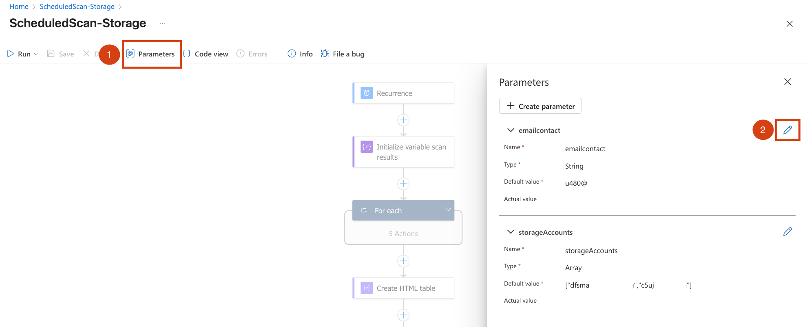

# Scheduled OnDemand Malware Scan - Storage

Authors: [Fernanda Vela](https://www.linkedin.com/in/mfvelah/) and [Nathan Swift](https://www.linkedin.com/in/swiftsolves/)

The Logic App uses a scheduler and a Managed System Identity (MSI) to authenticate and execute an on-demand malware scan on the storage accounts. The results are sent via email using the Outlook connector. By default, it runs every Monday.

## How To Deploy and Configure

1. Click the button **Deploy to Azure**.
2. Fill in the information:
    - **Resource Group**: where the Logic App will be located.
    - **Region**: the Logic App's region.
    - **Logic App Name**: choose a new name or leave the default one.
    - **Username**: email address that will send the emails with the OnDemand Malware Scan results.
    - **Send To Email**: email address that will receive the OnDemand Malware Scan results.
    - **Storage Accounts**: input the storage account names where you want to run this scheduled OnDemand Malware Scan.
    
3. Click the button **Review + create**.
4. Click the button **Create**.
5. When the deployment gets completed, click **Go to the resource group**.

6. Wait until you see these two resources created in your resource group.

7. Assign RBAC **'Reader'** and **'Security Admin'** role to the Logic App at the Management Group or Subscription level. To do so, click on the Logic App. Then, under **Settings** on the left menu, go to **Identity**. After that, on **System assigned** click the button **Azure role assignments**. Click on **+ Add role assignment** and select the scope.

8. On the left menu, under **Development Tools** click on **API Connection**, and then on **office365**. This will take you to the side menu that lets you authorize the email address that will send the scan results.

## How To Test It Out

1. Open the Logic App and click **Run**.
2. In the Overview page the status will show Succeded or Failed.

3. If the run was successful, an email like this one should reach your mailbox:

## How To Change The Recurrency

1. Open the Logic App and click on **Edit** in the overview page.
2. Click on the first block named **Recurrence** and modify the Frequency.
3. Click **Save**.

## How To Modify The Email Body

1. Open the Logic App and click on **Edit** in the overview page.
2. Click on the last block named **Send an email (V2)** and modify the Body.
3. Click **Save**.

## How To Change The Email That Receives The Results

1. Open the Logic App and click on **Edit** in the overview page.
2. On the top menu, click **[@] Parameters** and in the **emailcontact** click the pencil to change it.
3. Click **Save**.

